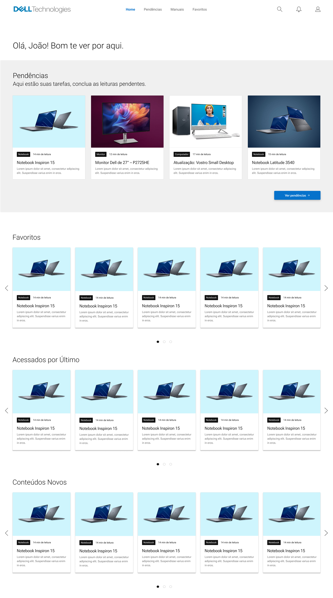
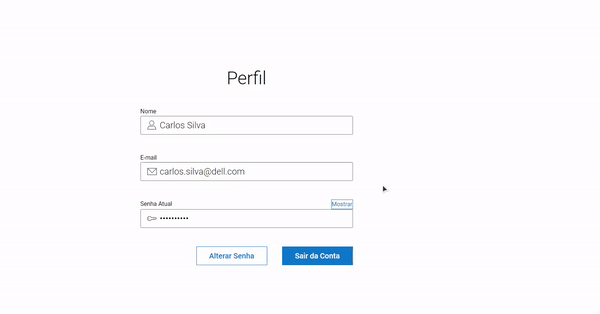

<div align="center">

</div>

# WAD - Web Application Document - Módulo 2 - Inteli

**_Os trechos em itálico servem apenas como guia para o preenchimento da seção. Por esse motivo, não devem fazer parte da documentação final_**

## Grupo Dellta

<div align="center">
<table>
  <tr>
    <td align="center">
      <a href="https://www.linkedin.com/in/gabriel-martins-alves/">
        <br>
        <sub>
          <b>Gabriel Henrique Martins Alves</b>
        </sub>
      </a>
    </td>
    <td align="center">
      <a href="https://www.linkedin.com/in/guilhermelopescarvalho/">
        <br>
        <sub>
          <b>Guilherme Lopes de Carvalho</b>
        </sub>
      </a>
    </td>
    <td align="center">
      <a href="https://www.linkedin.com/in/isabellymaia/">
        <br>
        <sub>
          <b>Isabelly Maia Montalvão</b>
        </sub>
      </a>
    </td>
  </tr>
</table>
</div>
<div align="center">  
<table>
  <tr>
    <td align="center"> 
      <a href="https://www.linkedin.com/in/mirella-borim-a2b32a278/">
        <br>
        <sub>
          <b>Mirella Borim Lima</b>
        </sub>
      </a>
    </td>
    <td align="center">
      <a href="https://www.linkedin.com/in/paulo-henrique-ribeiro-5b8794243/">
        <br>
        <sub>
          <b>Paulo Henrique Ribeiro</b>
        </sub>
      </a>
    </td>
    <td align="center">
      <a href="https://www.linkedin.com/in/thiagogomesalmeida/">
        <br>
        <sub>
          <b>Thiago Gomes de Almeida</b>
        </sub>
      </a> 
    </td>
  </tr>
</table>
</div>

## Sumário

[1. Introdução](#c1)

[2. Visão Geral da Aplicação Web](#c2)

[3. Projeto Técnico da Aplicação Web](#c3)

[4. Desenvolvimento da Aplicação Web](#c4)

[5. Testes da Aplicação Web](#c5)

[6. Conclusões e trabalhos futuros](#c6)

[7. Referências](#c7)

[Anexos](#c8)

<br>


# <a name="c1"></a>1. Introdução

&ensp;O parceiro de projeto, Dell, enfrenta um desafio na eficiência de consulta de manuais por parte dos funcionários das linhas de montagem. Isso se deve à diversidade de produtos e suas respectivas instruções de montagem, além da constante atualização de tais manuais. Para superar essa dificuldade, desenvolvemos uma aplicação web de suporte que concentra todos os materiais técnicos necessários. 

&ensp;Esta solução permite aos funcionários revisarem os processos de montagem de maneira personalizada e atualizada, o que resulta em uma maior eficiência, menor incidência de erros e maior segurança desses dados. Os principais aspectos de valor do produto incluem a centralização das informações, a customização do aprendizado, a atualização contínua e o aumento da eficiência, oferecendo uma abordagem integrada e eficaz para o treinamento dos colaboradores e alinhando-se com as expectativas do parceiro.

# <a name="c2"></a>2. Visão Geral da Aplicação Web

## 2.1. Escopo do Projeto

### 2.1.1. Contexto da indústria

&ensp;A indústria de Tecnologia da Informação e Comunicação (TIC) abrange empresas que desenvolvem, fabricam e prestam serviços relacionados a computadores, software, redes e infraestrutura de tecnologia. A Dell é uma figura proeminente nesse setor, oferecendo uma ampla gama de produtos e serviços para atender às demandas tecnológicas globais.

&ensp;Concentra-se na fabricação e comercialização de hardware e software, como computadores, servidores, armazenamento de dados e soluções de segurança. Além disso, fornece serviços de consultoria em TI, suporte técnico e soluções empresariais personalizadas, atendendo tanto ao mercado corporativo, quanto às pessoas físicas.

&ensp;Com uma presença mundial, a empresa de tecnologia atende clientes em diversos países e sua atuação abrange desde indivíduos até grandes empresas e organizações governamentais, oferecendo soluções adaptadas às necessidades específicas de cada cliente. A Dell mantém sua posição de destaque na indústria por meio de uma combinação de inovação tecnológica, qualidade de produtos e serviços, além de uma sólida rede global de operações e suporte.

### 2.1.2. Modelo de 5 Forças de Porter

&ensp;As Cinco Forças de Porter representam um marco analítico desenvolvido por Michael Porter em 1979, com o propósito de examinar as dinâmicas competitivas que moldam uma indústria. Essas forças abarcam o poder de negociação dos fornecedores e dos compradores, a ameaça de novos entrantes e de produtos substitutos, e a intensidade da rivalidade entre os competidores já estabelecidos. Ao fornecer uma estrutura sólida para análise estratégica, este modelo capacita as empresas a tomar decisões embasadas e as posicionar de forma melhor no mercado.

&ensp;Partindo desse princípio, no nosso projeto fizemos uma análise completa sobre a indústria de fabricação de computadores pessoais e dispositivos eletrônicos utilizando o modelo de Porter e explicando como cada uma das 5 forças funcionam nesse segmento.

<div align="center">
<sub>Figura 1 - Cinco Forças de Porter</sub>

<sup>Fonte: Material elaborado pelos autores (2024).</sup>
</div>

**Rivalidade entre concorrentes**

&ensp;A rivalidade entre concorrentes no setor de fabricação de computadores pessoais e dispositivos eletrônicos é uma característica marcante, impulsionada por diversas frentes de competição:

- Empresas, como Dell, HP, Lenovo, frequentemente se envolvem em disputas de preços, oferecendo descontos e promoções para atrair consumidores, especialmente durante períodos-chave de vendas, que objetivam desafiar a posição dos concorrentes no mercado, levando a uma dinâmica de preços mutável e competitiva.

- Inovação de produtos é uma das grandes áreas de rivalidade, com as empresas lançando constantemente novos modelos com recursos aprimorados para conquistar a preferência do cliente. Por exemplo, a Apple com seus chips computacionais potentes, desafiando outras empresas a responderem com produtos igualmente inovadores, impulsionando a busca pela liderança em termos de especificações técnicas e desempenho.

- As empresas investem pesadamente em aspectos de *branding* e *marketing* para diferenciar seus produtos e criar uma forte identidade de marca. Enquanto a Lenovo se destaca em seu *marketing* direcionado para o público corporativo, a Apple se concentra em criar uma imagem de marca exclusiva. Isso influencia as percepções dos consumidores e afeta a lealdade à marca e as decisões de compra.

- Por fim, a qualidade do serviço ao cliente e o suporte pós-venda também acrescentam muitos pontos nessa competição. Empresas como a Dell são reconhecidas por seu suporte técnico eficiente e personalizado, buscando oferecer uma experiência positiva que aumente a satisfação e a retenção dos clientes.

**Ameaça de novos entrantes**

&ensp;A ameaça de novos entrantes no setor é baixa visto que envolve grandes barreiras que podem dificultar a entrada de novas empresas.


- Os altos investimentos necessários em pesquisa, desenvolvimento, fabricação, *marketing* e distribuição são uma barreira significativa para novas empresas. A Dell possui uma base sólida de recursos e experiência, conferindo-lhe uma vantagem competitiva em escala e alcance, tornando difícil para novos concorrentes alcançarem seu nível.

- O acesso a tecnologias patenteadas e a fornecedores também é uma barreira importante. Por exemplo, a Apple possui tecnologias proprietárias e parcerias estratégicas consolidadas que podem ser difíceis de replicar para novos entrantes. Sem acesso a esses recursos, empresas iniciantes podem enfrentar dificuldades para desenvolver produtos inovadores e competitivos ou para garantir a oferta de componentes essenciais para a fabricação de seus produtos.

- Empresas estabelecidas, como HP e Lenovo, conquistaram a confiança dos consumidores ao longo dos anos. Novos competidores enfrentam o desafio de estabelecer essa mesma confiança em um mercado já competitivo e saturado.

**Poder de barganha dos fornecedores**

&ensp;Com relação ao poder de barganha dos fornecedores, pode-se concluir que é alto:

- O fato de que os componentes são essenciais para a produção dos produtos das empresas do setor e não possuem substitutos facilmente disponíveis confere aos fornecedores um poder de barganha alto. Por exemplo, a dependência das empresas de tecnologia de empresas como a TSMC para a fabricação de chips semicondutores avançados ilustra essa questão.

- Para as empresas do setor, mudar de fornecedor pode ser demorado e complexo. Por exemplo, a Dell enfrentaria desafios ao considerar a troca de fornecedores de chips gráficos para seus laptops de alto desempenho, dada a necessidade de adaptar seus processos de produção e garantir a compatibilidade e desempenho dos novos componentes. 

**Poder de barganha dos clientes**

&ensp;A respeito do poder de barganha dos clientes, é possível classificar como moderado:

- Os clientes têm acesso a uma ampla variedade de marcas e produtos no mercado de tecnologia. Com a rápida evolução da indústria, novos produtos são constantemente lançados, oferecendo aos consumidores uma ampla gama de escolhas. Isso aumenta o poder de barganha dos clientes, já que eles podem facilmente mudar de marca ou produto se não estiverem satisfeitos com a oferta atual.

- Os clientes são frequentemente sensíveis ao preço, especialmente em segmentos de produtos mais acessíveis, como notebooks e smartphones de entrada. No entanto, em segmentos de produtos exclusivos, como dispositivos de alta performance e produtos de marca reconhecida, os clientes podem estar dispostos a pagar um preço mais elevado pela qualidade, inovação e status associados à marca.

**Ameaça de produtos substitutos**

&ensp;Analisando a ameaça de produtos substitutos, conclui-se que é alta em razão de um mercado com uma alta volatilidade de novas tendências:


- A introdução de novas tecnologias emergentes, como realidade virtual, realidade aumentada e inteligência artificial, também pode criar novas oportunidades para produtos substitutos. Por exemplo, dispositivos de realidade virtual como Oculus Rift e HTC Vive oferecem experiências imersivas de computação que podem competir com os tradicionais PCs para certos tipos de aplicativos e entretenimento. 

- Dispositivos híbridos, como tablets com teclados destacáveis, estão se tornando cada vez mais populares, oferecendo uma combinação de funcionalidades de laptop e tablet em um único dispositivo, oferecendo alternativas aos laptops tradicionais.

- A crescente preocupação com a mobilidade e a conveniência pode levar os consumidores a preferir dispositivos mais portáteis, como laptops ultraleves e tablets, em detrimento dos computadores desktop tradicionais.

&ensp;Essas informações foram importantes para a equipe analisar e criar as principais funcionalidades que cumpram as demandas e perfil do mercado de forma eficaz, além de guiar a estratégia e desenvolvimento do produto, garantindo que estejam alinhados com as necessidades dos envolvidos e capazes de enfrentar a intensa concorrência do setor.


### 2.1.3. Análise SWOT

&ensp;A matriz *SWOT* é uma ferramenta de planejamento estratégico que analisa fatores internos (forças e fraquezas) e externos (oportunidades e ameaças) de uma empresa. Seu objetivo é identificar pontos de influência, proporcionando clareza sobre os fatores controláveis e não controláveis.

&ensp;Essa análise informa estratégias para capitalizar vantagens competitivas e mitigar riscos do ambiente externo. Por exemplo, enfrentar as ameaças é mais fácil pela mitigação das fraquezas, ao passo que a exploração mais eficiente das oportunidades é viabilizada pela potencialização das forças. Essa relação intrínseca simplifica a tomada de decisões, proporcionando ideias para a alocação mais produtiva de recursos e a determinação de prioridades.

<div align="center">
<sub>Figura 2 - Análise SWOT</sub>

<sup>Fonte: Material elaborado pelos autores (2024).</sup>
</div>

#### **Forças:**

- Reconhecimento de Marca: A Dell é uma marca bem estabelecida e reconhecida globalmente no mercado de tecnologia.
- Personalização: A capacidade de personalizar produtos de acordo com as necessidades do cliente é uma vantagem significativa.
- Eficiência Operacional: A Dell possui uma cadeia de suprimentos eficiente e processos de fabricação otimizados.
- Foco em Inovação: A empresa investe em pesquisa e desenvolvimento para permanecer inovando no que tange à tecnologia.
- Ampla gama de produtos e serviços: Além de computadores, a Dell tem referência na produção de monitores, servidores, dispositivos de armazenamento e equipamentos de rede, entre outros.
- Solidez financeira: No acumulado do ano fiscal de 2024, a companhia teve lucro líquido de US$ 3,19 bilhões, alta de 32%. A receita foi de $88,4 Bilhões. Além disso, as ações (D1EL34) sobem 31% (01/04/2024), aproximando-se de um patamar recorde.
- Socialmente responsável: Compromisso com práticas comerciais éticas, sustentabilidade ambiental e responsabilidade social fortalece a reputação da Dell.

#### **Fraquezas:**

- Dependência de Fornecedores: a Dell depende de terceiros para fornecer componentes essenciais para seus produtos.
- Custos altos de pesquisa e desenvolvimento: investimentos substanciais podem pressionar as margens se os produtos não atenderem às expectativas de mercado ou inovação.
- Redução de força de trabalho: A Dell anunciou recentemente um corte significativo em seu quadro global de funcionários, com uma redução de 13.000 funcionários.
- Falta de otimização no treinamento dos funcionários: a falta de otimização no modo pelo qual os funcionários da Dell são treinados surge como sua principal demanda, uma vez que sua cadeia produtiva baseia-se nessa produção, que está em constante atualização.

#### **Oportunidades:**

- Demanda contínua: A estabilidade na demanda por produtos do setor de Tecnologia da Informação e Comunicação representa uma grande oportunidade para a empresa.
- Integração da tecnologia em nuvem aos produtos: Oportunidade de oferecer soluções em nuvem escaláveis e eficientes.
- Integração da I.A. na produção e produtos: Inovação em soluções de Inteligência Artificial reforça a liderança tecnológica, ampliando a oferta de produtos e serviços diferenciados.
- Vantagem competitiva nos preços: Estratégias de preços competitivos consolidam a posição de liderança, atraindo clientes e fortalecendo a participação de mercado.
- CAC (custo por cliente) baixo: Eficiência na aquisição de clientes reduz custos operacionais, maximizando o retorno do investimento em marketing e impulsionando o crescimento sustentável.

#### **Ameaças:**

- Rápida obsolescência devido ao avanço exponencial das tecnologias: Desafio para manter a relevância dos produtos em um mercado de tecnologia dinâmico.
- Desafios na segurança cibernética de serviços e produtos: Garantir a proteção de dados dos clientes e a integridade dos sistemas é um desafio para manter a confiança e a reputação da marca.
- Regulamentações governamentais: Adaptação às regulamentações globais em constante mudança é essencial para operações comerciais e conformidade legal em todos os mercados, especialmente no que tange aos impostos cobrados.
- Concorrência acirrada: Necessidade de diferenciar-se em um mercado altamente competitivo, destacando-se por meio de inovação, qualidade e serviço ao cliente.
- Exposição à volatilidade cambial: Flutuações nas taxas de câmbio podem impactar os custos de produção e os preços dos produtos Dell em mercados internacionais, exigindo estratégias de mitigação de risco.
- Crescimento do setor *mobile*: o aumento da demanda por dispositivos cada vez mais portáteis em detrimento da preferência por desktops tradicionais e laptops menos portáteis, pode representar uma ameaça para a empresa.

&ensp; Com a análise *SWOT*, foi possível observar características internas importantes, tais como a eficiência operacional e a personalização de produtos. Associados a esses pontos, destacam-se algumas oportunidades, como o contínuo crescimento do mercado e a alta vantagem competitiva. Além disso, pode-se notar que uma das fraquezas demonstradas pela empresa é a falta de otimização no treinamento de seus funcionários. Nesse contexto, a aplicação web foi desenvolvida com o objetivo de potencializar ainda mais os pontos fortes e aproveitar as oportunidades emergentes, além de sanar uma das fraquezas existentes.


### 2.1.4. Solução: 

**Problema a ser resolvido:**

&ensp;Os funcionários da Dell que trabalham na linha de montagem não possuem uma plataforma de fácil acesso aos manuais de montagem, que possuem instruções sigilosas e de grande importância para o negócio da Dell. Este problema impacta diretamente na eficiência de montagem dos computadores.

**Dados disponíveis:**

&ensp;A empresa Dell não forneceu nenhum dado adicional para o projeto.

**Solução proposta:**

&ensp;Uma plataforma web de treinamento para os funcionários da linha de montagem que conteria todos os treinamentos e materiais necessários, incluindo os manuais de montagem mencionados anteriormente. Além disso, a plataforma web também organizaria e acompanharia os estudos do colaborador, permitindo visualizar quantos treinamentos ainda precisam ser concluídos, e um campo para documentos favoritos selecionados pelo usuário.

**Como a solução proposta deverá ser utilizada:**

&ensp;Os colaboradores deveriam fazer *login* na plataforma via intranet para acessar os treinamentos. Ao entrar na plataforma, o funcionário poderia seguir o plano de treinamento proposto pelo seu supervisor, responsável pelo controle dos materiais de treinamento da linha de produção, ou buscar por outros tipos utilizando a ferramenta de busca do site.

**Benefícios trazidos pela solução proposta:**

&ensp;A concentração de todas as informações importantes no processo de montagem dos computadores torna fácil a localização e busca por manuais que auxiliarão os montadores no momento da montagem, tornando os processos mais eficientes, além da qualificação dos trabalhadores.

**Critério para avaliar o sucesso:**

&ensp;A métrica ideal para validar este projeto seria a agilidade no acesso dos manuais. Caso o processo fique mais rápido, comprovará a eficiência e eficácia da implementação desta plataforma.

### 2.1.5. Proposta de Valor

&ensp;Na indústria de tecnologia, a Dell, líder global, prioriza a otimização dos processos de montagem para garantir qualidade e satisfação do cliente. A proposta de uma aplicação web de treinamento atende à necessidade de capacitação contínua dos funcionários, abordando suas demandas específicas e contribuindo para a eficiência operacional e a redução de erros na linha de produção. A partir da análise do Canvas de Proposta de Valor (figura 3), elabora-se que a solução oferece acesso facilitado a materiais técnicos, atualizações regulares nos manuais de montagem e ferramentas de controle para gestores. Ao focar nas atividades do cliente, a aplicação facilita o aprendizado tanto para novos funcionários quanto para os mais antigos. <br>

<div align="center">
<sub>Figura 3 - Canvas de Proposta de Valor</sub>
 <br>
<sup>Fonte: Material elaborado pelos autores (2024).</sup>
</div>

&ensp;Conforme a imagem, a aplicação web de treinamento proposta atende às demandas dos funcionários em aprender e se manterem atualizados e promove a eficiência operacional e de produção da Dell. Ao oferecer acesso fácil a materiais técnicos atualizados, uma plataforma eficiente de treinamento e o monitoramento controlado do acesso aos manuais de montagem, a solução tem a capacidade de reduzir erros, aumentar a produtividade e garantir a adaptação ágil às mudanças nos processos. <br>

### 2.1.6. Matriz de Riscos

&ensp;A matriz de risco é uma ferramenta que auxilia a equipe a identificar, avaliar e priorizar os riscos de um projeto, destacando suas chances de ocorrer e seus possíveis impactos e classificando-os de acordo com sua ordem de grandeza. Isso permite que a equipe concentre esforços de mitigação e aloque recursos de maneira eficiente. 

&ensp;Por outro lado, a matriz de oportunidades complementa a matriz de risco ao organizar e avaliar as oportunidades potenciais no projeto, permitindo que a equipe identifique e priorize ações para aproveitar ao máximo essas oportunidades.

&ensp;A partir dessas ferramentas, nossa equipe analisou todos os possíveis riscos e oportunidades do projeto: 

<div align="center">
<sub>Figura 4 - Matriz de riscos</sub>
 <br>
<sup>Fonte: Material elaborado pelos autores (2024).</sup>
</div>

<div align="center">
<sub>Figura 5 - Matriz de oportunidades</sub>
 <br>
<sup>Fonte: Material elaborado pelos autores (2024).</sup>
</div>

&ensp;Os riscos mencionados têm potencial para impactar significativamente o projeto da aplicação web de treinamento, principalmente considerando os problemas na intranet do cliente. Se a infraestrutura necessária não estiver disponível ou houver problemas na intranet do cliente, isso pode causar atrasos no desenvolvimento, testes e entrega da aplicação. Além disso, falhas na integração de materiais podem resultar em funcionalidades defeituosas ou incompletas, exigindo retrabalho. 

&ensp;Se a equipe não ter acesso aos documentos de manuais do cliente, isso pode levar a decisões erradas de design e implementação, afetando a qualidade da aplicação. Outros fatores, como conteúdo desatualizado, escalabilidade inadequada, problemas de usabilidade e requisitos mal definidos, podem comprometer a eficácia e aceitação da aplicação pelos usuários. 

&ensp;Esses riscos podem causar aumento de custos, prazos estendidos e insatisfação dos clientes, impactando negativamente o projeto como um todo. Por outro lado, a partir da matriz de oportunidades é possível enxergar aberturas para vários tipos de aprimoramento do projeto como a personalização, elementos de gamificação e função de filtros avançados, tudo isso visando uma melhor experiência ao usuário.

&ensp;
Com base nos potenciais riscos existentes, nossa equipe desenvolveu um plano de ação abrangente para mitigar essas preocupações e garantir o sucesso do projeto. Este plano visa identificar, avaliar e responder proativamente aos riscos em cada etapa do desenvolvimento da aplicação web de treinamento.

<div align="center">
<sub>Tabela 1 - Plano de ação</sub>


| Risco | Plano de Ação |
|-------|---------------|
| **Indisponibilidade da Infraestrutura Necessária:** | Identificar fornecedores alternativos, estabelecer plano de contingência e manter comunicação regular com os provedores. |
| **Problemas na Intranet do Cliente:** | Realizar análise detalhada, colaborar com equipe de TI do cliente e implementar soluções alternativas de acesso. |
| **Falta de Acesso aos Materiais pela Equipe Desenvolvedora:** | Estabelecer processo claro de compartilhamento, implementar sistemas de gerenciamento de documentos e realizar treinamentos regulares. |
| **Escalabilidade Inadequada:** | Realizar testes de carga e desempenho, implementar estratégias de dimensionamento automático e monitorar regularmente a utilização da aplicação. |
| **Falhas na Integração de Diferentes Tipos de Materiais:** | Estabelecer padrões de integração claros, realizar testes de integração abrangentes e colaborar com fornecedores de materiais. |
| **Risco de Conteúdo Desatualizado:** | Implementar sistema de gerenciamento de conteúdo, designar responsáveis pela revisão e estabelecer processos de revisão e aprovação. |
| **Problemas de Usabilidade:** | Realizar testes de usabilidade regulares, incorporar feedback dos usuários e investir em design centrado no usuário e treinamento da equipe. |
| **Requisitos Mal Definidos:** | Realizar workshops de levantamento de requisitos, utilizar técnicas de validação e documentar cuidadosamente todos os requisitos. |
| **Insegurança de Dados:** | Implementar medidas de segurança robustas, realizar testes de segurança regulares e manter-se atualizado sobre as melhores práticas de segurança de dados. |

<sup>Fonte: Material elaborado pelos autores (2024)..</sup>
</div>

## 2.2. Personas

&ensp;Uma persona é uma representação fictícia, porém realista, de um usuário típico ou do público-alvo de um produto. Na criação de personas, é necessário promover a empatia em relação aos usuários específicos para o qual o produto é projetado, facilitando a compreensão de suas necessidades, preocupações e objetivos. Dessa forma, quando embasadas em pesquisas de usuários, as personas são essenciais para apoiar o Design Centrado no Usuário (*UCD*) ao longo de todo o ciclo de vida de um projeto, destacando de maneira mais clara as características dos principais segmentos de usuários. Assim, seguindo o escopo do projeto, as personas foram desenvolvidas conforme a contexto de funcionários da Dell, como mostram as figuras abaixo (figuras 1 e 2). <br>

<div align="center">
<sub>Figura 6 - Laura Fernandes</sub>
 <br>
<sup>Fonte: Material elaborado pelos autores (2024).</sup>
</div>

&ensp;[Link para leitura do template da persona Laura Fernandes.](https://www.canva.com/design/DAGDUzLrnBw/7ugVUSXCWKAT_xDtWMnWfg/edit?utm_content=DAGDUzLrnBw&utm_campaign=designshare&utm_medium=link2&utm_source=sharebutton)

<div align="center">
<sub>Figura 7 - André Cláudio Fernando</sub>

<sup>Fonte: Material elaborado pelos autores (2024).</sup>
</div>

&ensp;[Link para leitura do template da persona André Cláudio Fernando.](https://www.canva.com/design/DAGDI8rEdPk/wvdtDxMCpJrsQ1EeO5j-rA/edit?utm_content=DAGDI8rEdPk&utm_campaign=designshare&utm_medium=link2&utm_source=sharebutton)

&ensp;Em síntese, as personas surgem como uma ferramenta importante para a orientação de projetos através do design focado na experiência do usuário (*UX*). Ao proporcionar uma representação vívida e detalhada dos potenciais usuários, elas capacitam os designers e desenvolvedores a compreenderem melhor as necessidades e expectativas do público-alvo. No contexto específico dos funcionários da Dell, a criação das personas expostas nas figuras 1 e 2 exemplificam como essa abordagem pode ser aplicada de forma concreta, oferecendo _insights_ valiosos para informar decisões de design e aprimorar a experiência do usuário de maneira eficaz.


## 2.3. User Stories
&ensp;As _user stories_ são ferramentas fundamentais no desenvolvimento de produtos e projetos de *UX* (User Experience). Elas representam pequenas narrativas que descrevem necessidade do usuário sob sua perspectiva, que gerará, para a equipe de desenvolvimento, uma funcionalidade que será adicionadaao produto, nesse caso, à aplicação. A importância das _user stories_ reside na sua capacidade de focar nas necessidades reais dos usuários, fornecendo uma compreensão clara dos requisitos do projeto. Ao adotar essa abordagem centrada no usuário, as _user stories_ ajudam a equipe a manter o foco no que realmente importa, facilitando a comunicação entre os membros da equipe e garantindo que o produto final atenda às expectativas e às necessidades dos usuários.

<div align="center">
<sub>Tabela 2 - User Story 1</sub>

Identificação | US01
--- | ---
Persona | André Cláudio Fernando
User Story | Eu, André, como operador de linha de produção, quero poder realizar login na aplicação para acessar meus materiais de treinamento.
Critério de aceite 1 | A página de login deve conter campos para inserir o usuário e a senha. <br>**Validação:** O usuário deve conseguir digitar nos campos e, ao submeter, deve ser autenticado com sucesso.
Critério de aceite 2 | A página de login deve conter um botão de "Esqueci minha senha". <br>**Validação:** Ao clicar no botão, o usuário deve ser redirecionado para a página de recuperação de senha.

<sup>Fonte: Material elaborado pelos autores (2024).</sup>
</div> <br>

<div align="center">
<sub>Tabela 3 - User Story 2</sub>

Identificação | US02
--- | ---
Persona | André Cláudio Fernando
User Story | Eu, André, como operador de linha de produção, quero ver uma pré-visualização dos manuais na homepage para acessar rapidamente os mais recentes ou importantes.
Critério de aceite 1 | A homepage deve exibir uma lista de manuais pendentes e de manuais recentemente acessados. <br>**Validação:** Os manuais recentemente acessados devem aparecer na homepage com suas informações principais.
Critério de aceite 2 | A homepage deve conter um campo de busca para pesquisar manuais. <br>**Validação:** O usuário deve conseguir digitar no campo de busca e visualizar os resultados de forma rápida e precisa.

<sup>Fonte: Material elaborado pelos autores (2024).</sup>
</div> <br>

<div align="center">
<sub>Tabela 4 - User Story 3</sub>

Identificação | US03
--- | ---
Persona | André Cláudio Fernando
User Story | Eu, André, como operador de linha de produção, quero acessar meus manuais favoritos para consultar informações frequentemente necessárias de forma rápida.
Critério de aceite 1 | A página de favoritos deve exibir uma lista dos manuais favoritos do usuário. <br>**Validação:** Os manuais adicionados como favoritos devem aparecer na lista com suas informações principais.
Critério de aceite 2 | A página de favoritos deve conter um botão para adicionar ou remover manuais da lista de favoritos. <br>**Validação:** Ao clicar no botão, o manual deve ser adicionado ou removido da lista de favoritos do usuário.

<sup>Fonte: Material elaborado pelos autores (2024).</sup>
</div> <br>

<div align="center">
<sub>Tabela 5 - User Story 4</sub>

Identificação | US04
--- | ---
Persona | André Cláudio Fernando
User Story | Eu, André, como operador de linha de produção, quero pesquisar e filtrar a lista de todos os manuais, para que possa acessar qualquer manual necessário com facilidade.
Critério de aceite 1 | A página de todos os manuais deve conter um campo de busca para palavras-chave. <br>**Validação:** O usuário deve conseguir digitar no campo de busca e visualizar os resultados relevantes.
Critério de aceite 2 | A página de todos os manuais deve conter filtros para facilitar a pesquisa (por categoria, data, etc.). <br>**Validação:** Ao selecionar os filtros, a lista de manuais deve ser atualizada conforme os critérios selecionados.

<sup>Fonte: Material elaborado pelos autores (2024).</sup>
</div> <br>

<div align="center">
<sub>Tabela 6 - User Story 5</sub>

Identificação | US05
--- | ---
Persona | André Cláudio Fernando
User Story | Eu, André, como operador de linha de produção, quero ver uma lista de manuais pendentes de estudo para saber quais materiais preciso revisar.
Critério de aceite 1 | A página de pendências deve exibir uma lista de manuais pendentes de estudo. <br>**Validação:** Os manuais pendentes devem aparecer na lista com suas informações principais.
Critério de aceite 2 | A página de pendências deve conter um botão para marcar manuais como estudados. <br>**Validação:** Ao clicar no botão, o manual deve ser marcado como estudado e removido da lista de pendências.

<sup>Fonte: Material elaborado pelos autores (2024).</sup>
</div> <br>

<div align="center">
<sub>Tabela 7 - User Story 6</sub>

Identificação | US06
--- | ---
Persona | André Cláudio Fernando
User Story | Eu, André, como operador de linha de produção, quero ter acesso ao material de cada manual, para consultar as informações necessárias de forma rápida e conveniente durante o processo de produção.
Critério de aceite 1 | A página de manual deve exibir o conteúdo completo do manual, incluindo texto, imagens e modelos 3D. <br>**Validação:** O usuário deve conseguir visualizar todo o conteúdo do manual de forma clara e organizada.
Critério de aceite 2 | A página de manual deve conter um índice de conteúdo para navegação rápida. <br>**Validação:** O usuário deve conseguir acessar seções específicas do manual através do índice.

<sup>Fonte: Material elaborado pelos autores (2024).</sup>
</div> <br>

<div align="center">
<sub>Tabela 8 - User Story 7</sub>

Identificação | US07
--- | ---
Persona | André Cláudio Fernando
User Story | Eu, André, como operador de linha de produção, quero editar meu perfil para atualizar minhas preferências.
Critério de aceite 1 | A página de perfil deve conter um campo para editar senha. <br>**Validação:** O usuário deve conseguir alterar suas informações e salvar as mudanças com sucesso.
Critério de aceite 2 | A página de perfil deve exibir o histórico de manuais lidos/visualizados. <br>**Validação:** O usuário deve conseguir visualizar seu histórico de manuais de forma clara e organizada.

<sup>Fonte: Material elaborado pelos autores (2024).</sup>
</div> <br>

<div align="center">
<sub>Tabela 9 - User Story 8</sub>

Identificação | US08
--- | ---
Persona | Laura de Souza
User Story | Eu, Laura, como engenheira de produção, quero poder realizar login na aplicação para acessar e gerenciar os manuais de montagem.
Critério de aceite 1 | A página de login deve conter campos para inserir o usuário e a senha. <br>**Validação:** O usuário deve conseguir digitar nos campos e, ao submeter, deve ser autenticado com sucesso e redirecionado para sua respectiva *homepage*.
Critério de aceite 2 | A página de login deve conter um botão de "Esqueci minha senha". <br>**Validação:** Ao clicar no botão, o usuário deve ser redirecionado para a página de recuperação de senha.

<sup>Fonte: Material elaborado pelos autores (2024).</sup>
</div> <br>

<div align="center">
<sub>Tabela 10 - User Story 9</sub>

Identificação | US09
--- | ---
Persona | Laura de Souza
User Story | Eu, Laura, como engenheira de produção, quero ver estatísticas de visualização dos manuais pelos montadores na homepage para monitorar o uso dos materiais de treinamento.
Critério de aceite 1 | A homepage deve exibir estatísticas de visualização dos manuais. <br>**Validação:** As estatísticas devem ser exibidas de forma clara e atualizada.
Critério de aceite 2 | A homepage deve conter gráficos de visualização dos manuais mais acessados. <br>**Validação:** Os gráficos devem ser interativos e exibir dados precisos sobre o uso dos manuais.

<sup>Fonte: Material elaborado pelos autores (2024).</sup>
</div> <br>

<div align="center">
<sub>Tabela 11 - User Story 10</sub>

Identificação | US10
--- | ---
Persona | Laura de Souza
User Story | Eu, Laura, como engenheira de produção, quero poder pesquisar e filtrar na lista de todos os manuais para acessar e editar qualquer manual necessário.
Critério de aceite 1 | A página de todos os manuais deve conter um campo de busca para palavras-chave. <br>**Validação:** O usuário deve conseguir digitar no campo de busca e visualizar os resultados relevantes.
Critério de aceite 2 | A página de todos os manuais deve conter filtros para facilitar a pesquisa (por categoria, data, etc.). <br>**Validação:** Ao selecionar os filtros, a lista de manuais deve ser atualizada conforme os critérios selecionados.

<sup>Fonte: Material elaborado pelos autores (2024).</sup>
</div> <br>

<div align="center">
<sub>Tabela 12 - User Story 11</sub>

Identificação | US11
--- | ---
Persona | Laura de Souza
User Story | Eu, Laura, como engenheira de produção, quero acessar o conteúdo de qualquer manual para revisar e editar as informações necessárias.
Critério de aceite 1 | A página de manual deve exibir o conteúdo completo do manual, incluindo texto, imagens e modelos 3D. <br>**Validação:** O usuário deve conseguir visualizar todo o conteúdo do manual de forma clara e organizada.
Critério de aceite 2 | A página de manual deve conter um índice de conteúdo para navegação rápida. <br>**Validação:** O usuário deve conseguir acessar seções específicas do manual através do índice.
Critério de aceite 3 | A página de manual deve permitir a edição dos conteúdos exibidos. <br>**Validação:** O usuário deve conseguir editar os textos, imagens e modelos 3D do manual e salvar as alterações com sucesso.

<sup>Fonte: Material elaborado pelos autores (2024).</sup>
</div> <br>

<div align="center">
<sub>Tabela 13 - User Story 12</sub>

Identificação | US12
--- | ---
Persona | Laura de Souza
User Story | Eu, Laura, como engenheira de produção, quero editar meu perfil para atualizar minhas informações pessoais e preferências.
Critério de aceite 1 | A página de perfil deve conter campos para editar informações pessoais (nome, email, etc.). <br>**Validação:** O usuário deve conseguir alterar suas informações e salvar as mudanças com sucesso.
Critério de aceite 2 | A página de perfil deve exibir o histórico de manuais lidos/visualizados. <br>**Validação:** O usuário deve conseguir visualizar seu histórico de manuais de forma clara e organizada.

<sup>Fonte: Material elaborado pelos autores (2024).</sup>
</div> <br>

<div align="center">
<sub>Tabela 14 - User Story 13</sub>

Identificação | US13
--- | ---
Persona | Laura de Souza
User Story | Eu, Laura, como engenheira de produção, quero editar ou criar manuais de montagem para manter as informações atualizadas e precisas.
Critério de aceite 1 | A página de edição/criação de manual deve conter campos para adicionar textos, imagens e modelos 3D. <br>**Validação:** O usuário deve conseguir adicionar e editar conteúdos multimídia e salvar as alterações com sucesso.
Critério de aceite 2 | A página de edição/criação de manual deve permitir a publicação do manual. <br>**Validação:** Ao publicar, o manual deve ficar imediatamente disponível para os operadores.

<sup>Fonte: Material elaborado pelos autores (2024).</sup>
</div> <br>

<div align="center">
<sub>Tabela 15 - User Story 14</sub>

Identificação | US014
--- | ---
Persona | Laura de Souza
User Story | Eu, Laura, como engenheira de produção, quero editar ou criar linhas de montagem para configurar processos e manuais associados.
Critério de aceite 1 | A página de edição/criação de linha de montagem deve permitir a adição e remoção de manuais associados. <br>**Validação:** O usuário deve conseguir adicionar ou remover manuais da linha de montagem e salvar as alterações com sucesso.
Critério de aceite 2 | A página de edição/criação de linha de montagem deve permitir a publicação da linha de montagem. <br>**Validação:** Ao publicar, a linha de montagem deve ficar imediatamente disponível para os operadores.

<sup>Fonte: Material elaborado pelos autores (2024).</sup>
</div> <br>

&ensp;Portanto, as _user stories_ desempenham um papel importante no desenvolvimento de produtos orientados pelo usuário, destacando suas necessidades e desejos como guias principais. Ao adotar uma abordagem centrada no usuário e utilizando _user stories_ de maneira eficaz, as equipes de *UX* são capacitadas a criar experiências mais relevantes e satisfatórias para seus usuários.


# <a name="c3"></a>3. Projeto da Aplicação Web 

## 3.1. Arquitetura

&ensp;O padrão de arquitetura adotado para nossa aplicação foi o MVC, ou *Model-View-Controller*, que é uma arquitetura de *software* amplamente adotada na engenharia de *software* para o desenvolvimento de sistemas robustos e escaláveis. Esse padrão organiza a estrutura de uma aplicação em três componentes principais: o Modelo (*Model*), a Visão (*View*) e o Controlador (*Controller*).

&ensp;**Modelo (*Model*):** Modelo representa os dados e a lógica de negócios da aplicação. Ele inclui o estado e o comportamento dos objetos subjacentes, incluindo acesso a dados, validações e operações relacionadas. O Modelo é responsável por gerenciar a manipulação dos dados e notificar os Controladores sobre quaisquer mudanças relevantes.

&ensp;**Visão (*View*):** A Visão é responsável pela apresentação dos dados ao usuário final. Ela exibe a interface gráfica ou textual com a qual o usuário interage, representando visualmente as informações do Modelo de maneira compreensível. A Visão é passiva e não possui lógica de negócios; ela apenas reflete o estado atual do Modelo.

&ensp;**Controlador (*Controller*):** O Controlador atua como intermediário entre a Visão e o Modelo, gerenciando as interações do usuário e as operações de manipulação de dados. Ele recebe as entradas do usuário na Visão, interpreta essas entradas e aciona as ações apropriadas no Modelo. O Controlador também é responsável por atualizar a Visão conforme necessário, refletindo as mudanças nos dados do Modelo.

&ensp;Vale ressaltar que o MVC é amplamente utilizado por várias razões, dentre elas, incluem-se as seguintes:

&ensp;**Separação de preocupações:** O MVC promove uma clara separação de preocupações entre os diferentes componentes da aplicação, facilitando a manutenção, a extensibilidade e a reutilização de código.
  
&ensp;**Flexibilidade e escalabilidade:** A arquitetura modular do MVC permite que os desenvolvedores trabalhem de forma independente em diferentes partes da aplicação, facilitando a colaboração em equipe e a evolução do *software* ao longo do tempo.

&ensp;**Facilidade de teste:** A separação entre a lógica de negócios, a apresentação e o controle de fluxo torna mais fácil escrever testes automatizados para cada componente individualmente, garantindo a robustez e a qualidade do *software*.

&ensp;**Adoção generalizada:** O MVC é um padrão bem estabelecido e amplamente adotado pela comunidade de desenvolvimento de *software*, o que significa que há uma abundância de recursos, ferramentas e frameworks disponíveis para facilitar sua implementação em uma variedade de tecnologias e plataformas.

&ensp;Pode-se, portanto, afirmar que o padrão de *design* de *software* MVC é uma abordagem eficaz para o desenvolvimento de *software* modular, flexível e escalável, que promove a separação de preocupações e facilita a manutenção e evolução de aplicações complexas ao longo do tempo.

&ensp;Agora vamos à nossa aplicação propriamente dita. O Edellcation é uma aplicação web feita com base na arquitetura MVC (Model-View-Controller), cujo esboço foi desenhado através da plataforma Draw.io. Este sistema foi desenvolvido com o propósito de facilitar o acesso dos colaboradores das linhas de montagem a uma ampla gama de materiais técnicos e manuais de montagem relativos aos produtos da empresa, que englobam computadores, servidores e notebooks.

<div align="center">
<sub>Figura 8 - Arquitetura da Solução</sub>

<sup>Fonte: Material elaborado pelos autores (2024)</sup>
</div>

&ensp;Para uma melhor visualização, [acesse aqui](https://drive.google.com/file/d/1Kj6WnfHtPb_LW8tQjPDw_fs8VqMvrfRb/view?usp=sharing) o aquivo no Google Drive

**Observação:** Não foram representadas, visualmente, as relações entre as tabelas do *Model*, *Controller* e *View* para evitar a poluição visual do diagrama e torná-lo confuso.

### Controladores (Controllers)

#### loginController (Controlador de Funcionários)
- ***login*(dadosFuncionario: object)**: Faz o login do usuário no sistema.
  - Entrada: `dadosFuncionario`
  - Saída: Validação das informações e entrada no sistema.

&ensp;O *LoginController* gerencia a tela de login da aplicação.

#### AssemblyLinesController (Controlador de linhas de montagem)
- ***create*(dadosLinhaDeProducao: object)**: Cria uma nova linha de montagem
  - Entrada: `dadosLinhaDeProducao`
  - Saída: Cria uma linha de produção.
- ***list*(id_assemblyLine: int)**: Lista todas as linhas de montagem.
  - Entrada: `id_assemblyLine`
  - Saída: Detalhes das linhas de produção.
- ***getManualsAndEmployees*(id_assemblyLine: int, id_employee: int)**: Busca as informações de uma linha de montagem e os funcionários atribuidos a linha.
  - Entrada: `id_assemblyLine`, `id_employee`
  - Saída: Detalhes da linha de montagem e seus funcionários.

&ensp;O *AssemblyLinesController* gerencia as linhas de montagem da empresa. Ele possibilita a criação, atualização e acesso de dados de linhas de montagem, conectando-se ao modelo de _AssemblyLine_ para acessar e modificar as linhas associadas.

#### ManualsController (Controlador de manuais)
- ***createManual*(dadosManual: object)**: Cria um novo manual.
  - Entrada: `dadosManual`
  - Saída: Cria um manual.
- ***getManual*(dadosManual: object)**: Acha os manuais sem filtro.
  - Entrada: `dadosManual`
  - Saída: Retorna os manuais sem nenhum filtro.
- ***updateManual*(dadosManual: object)**: Atualiza os dados dos manuais.
  - Entrada: `dadosManual`
  - Saída: Envia os novos dados do manual.
- ***conclude*(dadosManual: object)**: Registra se o manual foi concluido.
  - Entrada: `dadosManual`
  - Saída: Retorna que aquele manual já foi concluido pelo funcionário.
- ***view*(id_manual: int)**: Entrega os dados do manual.
  - Entrada: `id_manual`
  - Saída: Retorna os dados do manual.
- ***favorite*(id_manual: int)**: Registra se o manual foi favoritado.
  - Entrada: `id_manual`
  - Saída: Retorna se o manual foi favoritado pelo funcionário.

&ensp;O *ManualController* é encarregado da admnistração de manuais. Ele permite a criação, edição, deleção e acesso aos dados de um manual, interagindo com o modelo de Manual para acessar e manipular informações sobre os manuais.

#### HomepagesController (Controlador da Homepage do montador)
- ***getTasks*(dadosManual: object)**: Busca os manuais pendentes
  - Entrada: `dadosManual`
  - Saída: Exibe os manuais pendentes na tela.
- ***getFavorites*(dadosManual: object)**: Busca os manuais favoritos
  - Entrada: `dadosManual`
  - Saída: Exibe os manuais favoritados pelo usuário na tela.
- ***getLastAccessed*(dadosManual: object)**: Busca os manuais acessados por último
  - Entrada: `dadosManual`
  - Saída: Exibe os manuais acessados por último pelo usuário

&ensp;O *HomepagesController* é o responsável pelas funções que ocorrem dentro da homepage do montador. Portanto, este controlador é quem busca todas as informações que correspondem aquele usuário.

#### MaterialsController (Controlador de materiais)
- ***createMaterialAndManual*(dadosMaterial: object)**: Cria um novo material no banco de dados.
  - Entrada: `dadosMaterial`
  - Saída: Adiciona um material.
- ***getMaterials*(dadosMaterial: object)**: Busca um material no banco de dados.
  - Entrada: `dadosMaterial`
  - Saída: Traz detalhes de um material.

  &ensp;O *MaterialsController* gerencia operações relacionadas ao gerenciamento de materiais. Ele interage com o modelo Material para adicionar e acessar detalhes de materiais associados a manuais.

#### AdminHomepagesController (Controlador da tela de homepage do admin)
- ***homepage*(id_employee: int)**: Carrega os manuais que serão exibidos na homepage.
  - Entrada: `id_employee`
  - Saída: Retorna se o funcionário é admin e os manuais que serão exibidos na tela.
- ***getLatestManual*(dadosManual: object)**: Exibe o último manual criado na frente do carrossel.
  - Entrada: `dadosManual`
  - Saída: Atualiza o carrossel de manuais com o manual mais recente na frente.

&ensp;O *AdminHomepagesController* é responsável pelas funções na tela de homepage do Admin. Neste controlador são feitas consultas de dados que poderão ser úteis ao engenheiro quando logar no site.

#### ProfilesController (Controlador da tela de perfil)
- ***getEmployeeInfo*(id_employee: int)**: Carrega os dados do usuário.
  - Entrada: `id_employee`
  - Saída: Retorna os dados do funcionário
- ***updatePass*(id_employee: int)**: Troca a senha do usuário.
  - Entrada: `id_employee`
  - Saída: Muda a senha do funcionário.

&ensp;O *ProfilesController* é responsável pelas funções na tela de perfil do funcionário. Neste controlador são feitas consultas de dados que poderão ser úteis e modificar a senha.

#### AllManualsController (Controlador de manuais)
- ***index*(dadosManual: object)**: Acha os manuais sem filtro.
  - Entrada: `dadosManual`
  - Saída: Retorna os manuais sem nenhum filtro.
- ***favorites*(dadosManual: object)**: Acha os manuais favoritos.
  - Entrada: `dadosManual`
  - Saída: Retorna os manuais que possuem filtro de favoritos
- ***tasks*(dadosManual: object)**: Acha os manuais pendentes.
  - Entrada: `dadosManual`
  - Saída: Retorna os manuais que possuem filtro de pendentes
- ***search*(dadosManual: object)**: Acha os manuais com os dados da pequisa.
  - Entrada: `dadosManual`
  - Saída: Retorna os manuais que possuem as características pesquisadas.
- ***findAllManuals*(dadosManual: object)**: Busca os manuais.
  - Entrada: `dadosManual`
  - Saída: Retorna os manuais que possuem as características dos filtros e da pesquisa.

&ensp;O *AllManualController* é encarregado da requisição de manuais. Com este controller é possível fazer a requisição dos manuais do banco de dados.

### Modelos (*Models*):

#### Manual
- **ID:** Identificador único do manual (chave primária).
- **Description:** Detalhes sobre o conteúdo do manual.
- **Title:** Nome do manual.
- **HardwareType:** Categoria ou tipo de hardware ao qual o manual se aplica.
- **CreatedAt:** Horário em que o manual foi criado.

#### Material
- **ID:** Identificador único do material (chave primária).
- **ID_Manual:** Identificador do manual ao qual o material pertence.
- **Link:** URL ou caminho para o material.
- **Type:** Tipo do material (imagem, PDF, vídeo).

#### Assembly Line
- **ID:** Identificador único da linha de montagem (chave primária).
- **Name:** Nome da linha de montagem.
- **Description:** Texto auxiliar para ajudar na identificação da linha.

#### Employee
- **ID:** Identificador único do colaborador (chave primária).
- **ID_AssemblyLine:** Identificador da linha de montagem à qual o colaborador pertence.
- **IsEngineer:** Indica se o colaborador é um engenheiro.
- **Name:** Nome do colaborador.
- **Email:** Endereço de e-mail do colaborador.
- **Password:** Senha (criptografada) do colaborador para fins de autenticação

#### Task (Tabela auxiliar)
- **ID_Employee:** Identificador do funcionário responsável pela pendência.
- **ID_Manual:** Identificador do manual associado à pendência.
- **Status:** Estado atual da pendência (e.g., pendente, em andamento, concluída).

#### Favorite (Tabela auxiliar)
- **ID_Employee:** Identificador do funcionário que favoritou o manual.
- **ID_Manual:** Identificador do manual que foi favoritado.

#### Access History (Tabela auxiliar)
- **id_employee:** Chave estrangeira que referencia o funcionário associado ao registro de histórico de acesso.
- **id_manual:** Chave estrangeira que referencia o manual associado ao registro de histórico de acesso.
- **dateTime:** Data e hora em que o acesso ocorreu, registrando o momento em que o funcionário acessou o manual.


### Relacionamentos

- Há uma relação de um para muitos entre **Manual** e **Material**, onde um manual pode ter vários materiais associados a ele.
- A conexão entre **Manual** e **Task** é de um para muitos, permitindo que um manual esteja associado a várias pendências (tarefas).
- Existe uma relação de muitos para muitos entre **Manual** e **Favorite**, indicando que um manual pode ser favoritado por vários funcionários e um funcionário pode ter vários manuais favoritados.
- A relação entre **Employee** e **Task** é de um para muitos, permitindo que um funcionário tenha várias pendências (tarefas) associadas a ele.
- Há uma relação de um para muitos entre **Employee** e **Assembly Line**, onde um funcionário pode estar associado a uma linha de montagem.
- Existe uma relação de muitos para muitos entre **Manual** e **Access History**, indicando que um manual pode ser acessado por vários funcionários e um funcionário pode acessar vários manuais.

### Visões (*Views*)

#### Login
- **Descrição:** Permite que os usuários efetuem *login* na aplicação ou registrem-se como novos usuários.
- **Componentes:**
  - Campos para inserção de e-mail e senha.
  - Botão de *login*.

#### Homepage (Montador)
- **Descrição:** Exibe uma visão geral das atividades e manuais disponíveis para o montador.
- **Componentes:**
  - Tarefas pendentes do montador.
  - Manuais recentemente acessados.
  - Manuais marcados como favoritos.

#### Página de Manual
- **Descrição:** Apresenta informações detalhadas sobre um manual específico, incluindo materiais de estudo e versões.
- **Componentes:**
  - Título e descrição do manual.
  - Lista de materiais associados ao manual.
  - Versões do manual.

#### Página de Pesquisa
- **Descrição:** Permite que os usuários pesquisem manuais e outros recursos dentro da aplicação.
- **Componentes:**
  - Barra de pesquisa.
  - Filtros de pesquisa (por tipo, título, data, etc.).
  - Resultados da pesquisa apresentados em lista ou grade.

#### Perfil do Usuário
- **Descrição:** Mostra informações do perfil do usuário, como nome, e-mail e histórico de manuais acessados.
- **Componentes:**
  - Informações de perfil (nome, e-mail, etc.).
  - Histórico de manuais acessados.
  - Opção para alterar senha.

#### Homepage (Admin)
- **Descrição:** Oferece uma visão geral das atividades administrativas, incluindo a gestão de usuários e manuais.
- **Componentes:**
  - Lista de tarefas administrativas.
  - Resumo dos manuais e usuários registrados.
  - Acesso rápido às páginas de gerenciamento.

#### Adição de manual
- **Descrição:** Permite que administradores criem novos manuais.
- **Componentes:**
  - Formulário para adicionar manuais.

#### Edição de manuais
- **Descrição:** Permite que administradores editem os manuais.
- **Componentes:**
  - Formulário para editar manuais.

#### Linhas de montagem
- **Descrição:** Permite que administradores veja todas as linhas de montagem.
- **Componentes:**
  - Lista de linhas de montagem.

#### Adição de linhas de montagem
- **Descrição:** Permite que administradores criem novas linhas de montagem.
- **Componentes:**
  - Formulário para adicionar manuais.

&ensp;Por fim, vamos analisar as escolhas de ferramentas tecnológicas feita pelo grupo:

### Ferramentas e infraestrutura

- **Banco de Dados *PostgreSQL*:**
  O *PostgreSQL* será empregado para armazenar dados relativos aos cursos, usuários, tarefas pendentes, estatísticas e outras informações pertinentes à aplicação.
  
- **API de *Single Sign-On (SSO)*:**
  Será adotada uma API de *SSO* para integração com sistemas corporativos, permitindo aos usuários autenticarem-se na aplicação utilizando as credenciais de suas contas corporativas.
  
- **Serviço de Armazenamento de Arquivos:**
  Para armazenar documentos, imagens, vídeos e modelos 3D associados aos cursos, será utilizado um serviço de armazenamento de arquivos, como *Amazon S3* ou *Google Cloud Storage*.
  
- **Microsserviços e Containers:**
  Com base nos requisitos não funcionais, a aplicação será distribuída em vários servidores e estruturada em microsserviços, utilizando containers, como *Docker*, e um orquestrador de containers, como *Kubernetes*, para gerenciar e escalar os serviços.
  
- **Sistema de Cache:**
  A fim de otimizar o desempenho da aplicação, será implementado um sistema de cache para armazenar conteúdos frequentemente acessados, como arquivos e vídeos, utilizando tecnologias como *Redis* ou *Memcached*.
  
- **Serviço de Notificações:**
  Para enviar notificações aos usuários sobre atualizações nos cursos ou outras informações relevantes, será integrado um serviço de notificações por e-mail e push, como *Amazon SES* ou *Firebase Cloud Messaging*.
  
- **Serviços de Monitoramento e Log:**
  Com o propósito de monitorar o desempenho e a disponibilidade da aplicação, bem como rastrear eventos e registros, será integrado um serviço de monitoramento e log, como *Prometheus* e *Grafana*, ou *ELK Stack (Elasticsearch, Logstash, Kibana)*.
  
- **Ambiente de Desenvolvimento e Implantação:**
  Será configurado um ambiente de desenvolvimento e implantação, incluindo ferramentas de controle de versão, como *Git*, e ferramentas de *CI/CD*, como *Jenkins* ou *GitLab CI*.

### Relação da Infraestrutura com o MVC

&ensp; **Model (Modelo):** O Modelo representa os dados da aplicação e é refletido pelas entidades do banco de dados *PostgreSQL*, como Curso, Funcionário, LinhaMontagem, etc. Estas entidades são manipuladas pelos controladores para realizar operações de *CRUD*.
  
&ensp; **View (Visão):** A Visão apresenta os dados aos usuários por meio de interfaces de usuário (UI) implementadas em *HTML*, *CSS* e *JavaScript*, seguindo as diretrizes de design da empresa Dell.
  
&ensp; **Controller (Controlador):** O Controlador intermedia as interações entre o Modelo e a Visão, recebendo requisições dos usuários, manipulando dados no Modelo e determinando qual Visão apresentar como resposta. Será implementado em *Node.js* com o framework *Sails.js* para rotear as requisições *HTTP*.

### Escolha de Arquitetura

- **Node.js com Sails.js:**
  Escolha baseada na eficiência e escalabilidade do *Node.js* para operações de I/O intensivas, aliado à robustez e convenções de desenvolvimento do *framework* *Sails.js* para criação de *API RESTful* e integração com o *PostgreSQL*.
  
- **PostgreSQL como Banco de Dados:**
  Escolha justificada pela robustez, confiabilidade e capacidade de escalabilidade do *PostgreSQL*, além do suporte a recursos avançados, como transações ACID e índices avançados.
  
- **HTML5, CSS3, Bootstrap e JavaScript para Front-end:**
  Escolha baseada na ampla adoção e familiaridade com essas tecnologias, permitindo o desenvolvimento de uma interface de usuário intuitiva e responsiva, com facilidade de manutenção e testabilidade.


## 3.2. Wireframes

&ensp;Uma boa validação de entendimento é um dos aspectos mais importantes no desenvolvimento de um projeto. Alinhar as ideias com o _stakeholder_ ganha tempo de trabalho e dá valor ao produto, alcançando as expectativas do cliente. Contudo, representar algo que ainda é abstrato pode gerar conflitos entre ambos os lados, por isso foram criados métodos de representação visual, como o Wireframe.

&ensp;O Wireframe é um diagrama visual que representa o primeiro entendimento em relação à aplicação, exibindo de forma simples os elementos da página e como eles se relacionam entre si [(MIRO, 2024)](#r3).

&ensp;Considerando as _User Stories_ abordadas na seção 2.3, o planejamento das telas representadas no Wireframe abaixo (Figuras 9-12) foi focado nos usuários que trabalham com montagem, já que eles são os que mais sofrem com o problema de fácil acesso aos manuais. Então, na _home page_, a primeira informação que aparece ao usuário é um acesso rápido para as suas pendências, pensando na navegação do funcionário cujo intuito é apenas cumprir sua obrigação com o supervisor. Na mesma página, abaixo, foram elaborados carrosséis de conteúdos potencialmente interessantes para um montador curioso por mais informações.

&ensp;A tela do curso possui apenas o essencial para que ele mantenha o foco no treinamento e a tela de pesquisa abrange todos os tipos de usuários, nela os filtros exibem qualquer informação importante para os usuários, como apenas a lista de favoritos ou a lista de cursos separadas para os funcionários, e caso o interesse esteja em achar outros tipos de treinamentos, também é possível encontrar nesta tela. Um feedback fornecido ao usuário neste momento são os ícones no inferior direito das imagens, onde é possível verificar o _status_ do treinamento (concluído ou está em andamento).

<div align="center">
<sub>Figura 9 - Tela de login</sub>

<sup>Fonte: Material elaborado pelos autores (2024).</sup>
</div>

&ensp;A figura 9 é a primeira tela de todos os usuários, através dela é possível acessar o site utilizando as contas corporativas fornecidas pela Dell. Ao clicar em entrar, a próxima tela será a _home page_.

<div align="center">
<sub>Figura 10 - Tela de início</sub>

<sup>Fonte: Material elaborado pelos autores (2024).</sup>
</div>

&ensp;A _home page_ é onde toda informação está centralizada, incluindo as pendências para aquele funcionário e outros treinamentos que podem interessá-lo. Esta tela foi pensada considerando as _user stories_ elaboradas, a fim de exibir as informações relevantes para cada tipo de usuário.

&ensp;A caixa de pendências, primeira informação que aparece na tela, é pensada  para o montador que precisa acessar os materiais propostos rapidamente, sem aprofundamento em outros conteúdos.

&ensp;Os carrosséis e os caminhos no cabeçalho foram desenvolvidos pensando no montador curioso por mais informações, assim,o site propõe todos os conteúdos que possam ser tendências para ele. Dali é possível navegar para a tela do curso e para a tela de pesquisa. Para retornar a _home page_, basta clicar na logo, posicionada no canto superior esquerdo e acessível em qualquer outra tela do site.

<div align="center">
<sub>Figura 11 - Tela de curso</sub>

<sup>Fonte: Material elaborado pelos autores (2024).</sup>
</div>

&ensp;A tela de curso representa a tela padrão de treinamento e pode ser acessada de qualquer outra parte do site, exceto a de *login*. Com uma estética limpa e simplista, o *design* destaca ao usuário o conteúdo do manual, sem informações desnecessárias no corpo da página. Nela, o cabeçalho continua, permitindo acesso tanto a _home page_, quanto a opções de pesquisa.

<div align="center">
<sub>Figura 12 - Tela de pesquisa</sub>

<sup>Fonte: Material elaborado pelos autores (2024).</sup>
</div>

&ensp;Para acessar a tela de pesquisa, o usuário precisa clicar em uma das opções do cabeçalho ou em “VER TUDO” na _home page_. A tela de pesquisa comum - acessada clicando na lupa - exibe todos os cursos disponíveis. À esquerda, filtros auxiliam na busca, por meio de categorias, como materiais propostos por gestores e itens favoritados, e tipos de hardware. Desta página também é possível retornar a todas as outras páginas, com exceção, novamente, da tela de *login*.

&ensp;É possível acessar o Wireframe na plataforma FIGMA clicando [(aqui)](https://www.figma.com/proto/ukblrKfgaQZI2LCz5tW4Yt/WIREFRAME-EDELLCATION?type=design&node-id=20-372&t=O5huEarzkloD2fTg-1&scaling=contain&page-id=0%3A1&mode=design).

&ensp;Portanto, o Wireframe é planejado com foco no usuário, contemplando diversas situações, como observado no modelo acima. Além disso, também é possível ser alterado conforme a necessidade do parceiro, por ser uma representação simples e de fácil modificação, exatamente devido a sua importância durante os esboços da aplicação.

## 3.3. Guia de estilos

&ensp;O guia de estilos é uma biblioteca organizada de componentes de design e padrões visuais destinados a facilitar o desenvolvimento e manutenção de projetos. Ele inclui diretrizes detalhadas sobre como usar e personalizar os componentes, garantindo consistência e eficiência nos produtos.

&ensp;Os componentes são baseados em fundamentos como cor, tipografia e espaçamento, alinhados com a identidade visual da marca da Dell. Eles são modulares e reutilizáveis, permitindo que haja uma combinação e adaptação conforme necessário para atender aos requisitos específicos do projeto.

&ensp;Todas as informações sobre padrões de design, componentes e diretrizes visuais são centralizadas no Dell Design System, que serve como uma fonte confiável para garantir a consistência e qualidade da estética da aplicação web. Os desenvolvedores revisaram cuidadosamente os termos de uso fornecidos no site para garantir conformidade com as políticas de licenciamento da Dell e promover uma utilização ética e responsável dos recursos disponíveis.

O guia de estilos feito e utilizado pela equipe desenvolvedora do presente projeto pode ser acessado na platarforma Figma clicando [aqui](https://www.figma.com/file/sN8dE5iqwFLfI8kz35uW10/Style-Guide---Edellcation?type=design&node-id=15%3A2&mode=design&t=wKXZ6ELcOoU4EVav-1).


### 3.3.1 Cores

&ensp;A paleta de cores em um projeto web refere-se a um conjunto selecionado e harmonioso de cores utilizadas para criar a identidade visual e o design geral do site ou aplicativo. Essa paleta geralmente inclui cores primárias, secundárias e de destaque, que são escolhidas com base nos princípios de design, na identidade da marca e nas preferências estéticas. Uma paleta bem definida contribui para uma melhor compreensão e navegação dos usuários e influenciam as sensações e percepções da sua experiência.

&ensp;Dessa forma, o conjunto de cores para o projeto em questão foi definido a partir da identidade visual pré-definida do parceiro:

&ensp;Apresentam-se os cinco tipos de paletas de cores, selecionadas pela equipe da Dell, cada uma com um propósito único na interface dos produtos: paleta primária, paleta neutra, paleta secundária, paleta de destaque e paleta de visualização de dados. De cada uma dessas paletas, foi extraída ao menos uma cor específica para atender às diferentes necessidades de design. Essas seleções foram feitas para garantir coesão visual e impacto estético em toda a experiência do usuário.

&ensp;A Paleta Primária é a base da identidade visual da marca Dell, marcada por tons de azul que unificam os elementos interativos e reforçam a presença da marca. Cores como "Azul 600" são usadas para as interações principais. 

<div align="center">
<sub>Figura 13 - Paleta primária</sub>

<sup>Fonte: Material elaborado pelos autores (2024).</sup>
</div>

&ensp;A Paleta Neutra oferece uma variedade de tons sutis, ideais para fundos, elementos de texto e divisores. Cores como "Cinza 200", "Cinza 500", "Cinza 600", "Cinza 800" (para texto padrão) e Branco são escolhidas para adicionar profundidade e contraste à interface, garantindo legibilidade e coesão visual.

<div align="center">
<sub>Figura 14 - Paleta neutra</sub>

<sup>Fonte: Material elaborado pelos autores (2024).</sup>
</div>

&ensp;A Paleta Secundária desempenha um papel na orientação do usuário, identificação de status, compreensão de ações e localização de ajuda. O "Vermelho 600", por exemplo, é aplicado em botões de "deletar", transmitindo uma ação de alto impacto e garantindo clareza na comunicação visual.

<div align="center">
<sub>Figura 15 - Paleta secundária</sub>

<sup>Fonte: Material elaborado pelos autores (2024).</sup>
</div>

&ensp;A paleta de destaque adiciona elementos visuais vibrantes e chamativos em projetos de branding, além de servir para distinguir diferentes componentes e funcionalidades em uma interface. Ela é composta por cores selecionadas meticulosamente para criar uma identidade visual única e memorável, que facilita o reconhecimento da marca e melhora a experiência do usuário. No contexto do projeto, essas cores foram escolhidas para representar cada tipo de equipamento de forma distinta, utilizando tons suaves que harmonizam com a identidade corporativa e ajudam a comunicar as características específicas de cada produto.

<div align="center">
<sub>Figura 16 - Paleta de destaque</sub>

<sup>Fonte: Material elaborado pelos autores (2024).</sup>
</div>

&ensp;Por fim a paleta de visualização de dados é um conjunto de cores cuidadosamente selecionadas para representar diferentes elementos em gráficos e visualizações de dados. Seu objetivo é melhorar a compreensão e a interpretação das informações, garantindo que os dados sejam apresentados de maneira clara e eficaz.

<div align="center">
<sub>Figura 17 - Paleta de destaque</sub>

<sup>Fonte: Material elaborado pelos autores (2024).</sup>
</div>

### 3.3.2 Tipografia

&ensp;A tipografia afeta diretamente como o conteúdo é lido, entendido e absorvido pelos usuários. Escolher as fontes certas, seus tamanhos e espaçamentos garante uma experiência de leitura agradável e eficaz. Além disso, a tipografia ajuda a transmitir a identidade da marca, definindo seu estilo e personalidade. Quando usada com sabedoria, a tipografia pode melhorar significativamente a experiência do usuário e reforçar a mensagem da marca.

&ensp;Assim, no contexto do projeto, a fonte selecionada foi a Roboto, uma opção versátil que oferece diferentes variações adequadas para diferentes elementos. Essa fonte é uma escolha popular devido à sua legibilidade e clareza em telas digitais, além de possuir uma ampla gama de pesos e estilos, permitindo uma hierarquia visual consistente e atraente. Para os títulos, optou-se por uma variação maior e destacada, para os subtítulos, foi escolhida uma variação intermediária, enquanto para o texto corrido, foi selecionada uma variação mais leve e fácil de ler. 

<div align="center">
<sub>Figura 18 - Tipografia</sub>

<sup>Fonte: Material elaborado pelos autores (2024).</sup>
</div>

### 3.3.3 Iconografia e imagens 

&ensp;Os ícones são elementos visuais compactos e altamente reconhecíveis que ajudam a transmitir informações de forma rápida e intuitiva, pode ser adaptada para atender a diferentes necessidades, como indicar ações, status, categorias ou funcionalidades específicas. 

&ensp;No projeto, os ícones foram escolhidos principalmente para representar páginas no menu de navegação, setas interativas para realizar ações em diferentes componentes (como um dropdown), avançar em um carrossel e representar arquivos e tipos de materiais.

<div align="center">
<sub>Figura 19 - Iconografia</sub>

<sup>Fonte: Material elaborado pelos autores (2024).</sup>
</div>

## 3.4 Protótipo de alta fidelidade

&emsp;Após validar os conceitos e ideias abordadas nos wireframes, o próximo passo é o desenvolvimento das telas se aproximando de suas versões finais, incluindo estéticas, estilos e técnicas de UX Design. Então, com base nos wireframes e comentários do parceiro, os mockups das telas foram produzidos.

&emsp;Mockup é uma ferramenta que tem como objetivo simular todo o design do produto final, de forma que seja possível visualizar todas as ideias estéticas, como as cores e tipografia. O mockup facilita a contextualização das ideias e validação com o cliente de forma menos custosa ([EBAC](#r2), 2024).

&emsp;No desenvolvimento destes protótipos, a equipe Dellta utilizou os conceitos abordados na seção 3.2 (Wireframes), visando deixar a plataforma mais intuitiva para o usuário. Além disso, os elementos visuais aplicados foram os presentes na identidade visual da empresa Dell, o que será mais abordado na seção seguinte.

&emsp;Para um maior entendimento do caminho do usuário, é possível enxergar dois fluxos que refletem as *user stories* de cada tipo de persona: engenheiro (administrador) e operador de linha (montador). A visualização dos fluxos pode ser visto em maior qualidade na plataforma MIRO [por aqui](https://miro.com/app/board/uXjVK5t_fLI=/?share_link_id=330960266839).

### 3.4.1 Fluxo do operador de linha

&emsp;O fluxo do montador é projetado para proporcionar uma navegação intuitiva e eficiente, garantindo que o usuário possa acessar facilmente todas as informações necessárias para realizar suas tarefas. Este fluxo é composto por várias telas interconectadas: a tela de login, a tela de homepage, a página de manuais com filtros e pesquisa, e a tela de manual com materiais e informações específicas. Cada uma dessas telas desempenha um papel significativo na experiência do usuário, facilitando o acesso a manuais detalhados e recursos essenciais.

<div align="center">
<sub>Figura 20 - Caminho do usuário (montador)</sub>

<sup>Fonte: Material elaborado pelos autores (2024).</sup>
</div>


&emsp;A tela de login é a porta de entrada para o sistema, tanto para o montador, quanto para o engenheiro. Nesta etapa, o usuário deve inserir suas credenciais de acesso, como email e senha, para garantir a segurança e a personalização da experiência. Um design limpo e campos de entrada claros proporcionam uma autenticação rápida e sem complicações, permitindo que o montador comece seu trabalho sem atrasos.

<div align="center">
<sub>Figura 21 - Tela de login (alta fidelidade)</sub>

<sup>Fonte: Material elaborado pelos autores (2024).</sup>
</div>

&emsp;Após o login, o usuário é direcionado para a tela de homepage, que serve como um painel de controle central. Nesta página, o montador encontra um resumo de suas atividades, notificações importantes e acesso rápido a manuais. A homepage apresenta carrosséis de manuais divididos em "Pendências", "Favoritos" e "Acessados por Último", permitindo ao montador visualizar rapidamente os manuais prioritários, frequentemente consultados e recentemente acessados, facilitando a gestão eficiente de suas atividades diárias.


<div align="center">
<sub>Figura 22 - Homepage (alta fidelidade)</sub>

<sup>Fonte: Material elaborado pelos autores (2024).</sup>
</div>

&emsp;A página de manuais é onde o usuário pode navegar por uma coleção extensa de documentos e recursos técnicos. Para facilitar a busca, esta tela inclui filtros avançados e uma barra de pesquisa. Os filtros permitem que o montador refine os resultados por categoria, pendências ou favoritos, enquanto a barra de pesquisa oferece a possibilidade de encontrar manuais específicos por palavras-chave para economizar tempo e aumentar a produtividade.

<div align="center">
<sub>Figura 23 - Tela de pesquisa (alta fidelidade)</sub>

<sup>Fonte: Material elaborado pelos autores (2024).</sup>
</div>

&emsp;A tela de manual, onde o montador pode acessar materiais detalhados e informações específicas sobre um determinado manual, (figura 11, [seção 3.2](#32-wireframes-sprint-1)) sofreu alterações. A primeira foi em relação ao nome, que agora se chama 'tela do manual', segundo orientações feitas pelo parceiro. Ainda, o cliente também solicitou a troca na ordem em que as informações estão dispostas, pois, segundo ele, haveria uma hierarquia de importância dos dados. Assim, o resultado da tela ficou conforme a figura abaixo.

<div align="center">
<sub>Figura 24 - Tela do manual (alta fidelidade)</sub>

<sup>Fonte: Material elaborado pelos autores (2024).</sup>
</div>

&emsp;Além daquelas previstas nos wireframes, surgiu a necessidade de produzir mais telas,  importantes para o controle do banco de dados. A primeira delas é a de visualização de perfil (figuras 22-24), que serve para o controle das informações pessoais do usuário. O foco desta tela é ser simples e objetiva, contando apenas com os campos de de informação na tela e o botão de alterar senha, disponível para todos os usuários do sistema, seja montador ou engenheiro. A alteração de senha, por sua vez, é acessada por um modal na tela de perfil.

<div align="center">
<sub>Figura 25 - Tela de visualização de perfil </sub>

<sup>Fonte: Material elaborado pelos autores (2024).</sup>
</div>

<div align="center">
<sub>Figura 26 - Modal de alterar senha</sub>

<sup>Fonte: Material elaborado pelos autores (2024).</sup>
</div>

<div align="center">
<sub>Figura 27 - Modal de senha redefinida</sub>

<sup>Fonte: Material elaborado pelos autores (2024).</sup>
</div>

### 3.4.2 Fluxo do engenheiro

&emsp;O fluxo do engenheiro foi desenvolvido com base nas necessidades específicas dos usuários, incorporando telas adicionais que não estavam previstas nos wireframes originais. Essas adições foram feitas para garantir uma experiência mais completa e funcional, atendendo melhor às demandas do dia a dia dos engenheiros. O fluxo é composto por várias telas interconectadas: a tela de homepage, a tela de manuais e a tela de linhas. 

<div align="center">
<sub>Figura 28 - Caminho do usuário (engenheiro)</sub>

<sup>Fonte: Material elaborado pelos autores (2024).</sup>
</div>

&emsp;Após o login, o engenheiro é direcionado para a tela de homepage, que serve como um painel de controle central. Nesta página, o engenheiro encontra gráficos informativos sobre tarefas realizadas e pendentes pelos montadores nas linhas de montagem. Além disso, a homepage oferece botões para criar novas linhas de montagem e manuais, permitindo ao engenheiro gerenciar e organizar eficientemente o trabalho. Esta tela é projetada para ser um hub informativo e acessível, proporcionando links diretos para outras seções do fluxo.


<div align="center">
<sub>Figura 29 - Homepage (ADM)</sub>

<sup>Fonte: Material elaborado pelos autores (2024).</sup>
</div>

&emsp;A partir da tela de homepage, é possível acessar a tela de criação de manual, onde o usuário pode adicionar novos manuais preenchendo informações essenciais como título, descrição e conteúdos detalhados. Durante esse processo, se o usuário optar por cancelar a criação, um modal de confirmação será exibido, garantindo que as alterações não sejam perdidas acidentalmente. Após a criação bem-sucedida do manual, um modal de sucesso confirma que o manual foi criado corretamente. Além disso, há uma tela de edição de manual, permitindo que o usuário atualize ou ajuste as informações conforme necessário.


<div align="center">
<sub>Figura 30 - Tela de criação de manual</sub>

<sup>Fonte: Material elaborado pelos autores (2024).</sup>
</div>

<div align="center">
<sub>Figura 31 - Modal de cancelar manual</sub>

<sup>Fonte: Material elaborado pelos autores (2024).</sup>
</div>

<div align="center">
<sub>Figura 32 - Modal de sucesso de criação de manual</sub>

<sup>Fonte: Material elaborado pelos autores (2024).</sup>
</div>

<div align="center">
<sub>Figura 33 - Tela de edição de manual</sub>

<sup>Fonte: Material elaborado pelos autores (2024).</sup>
</div>

&emsp;A partir da tela de homepage, os usuários têm a opção de acessar a tela de criação de linha de montagem ao criar no botão de criação, uma interface projetada para facilitar a configuração de novas linhas de produção. Nesta tela, o engenheiro pode definir os parâmetros essenciais da linha de montagem, como nome e seus funcionários.

<div align="center">
<sub>Figura 34 - Tela de criação de linha de montagem</sub>

<sup>Fonte: Material elaborado pelos autores (2024).</sup>
</div>

&emsp;A tela de manuais permite que o engenheiro navegue por uma coleção extensa de documentos e recursos técnicos, similar à tela de pesquisa dos montadores. Com filtros avançados e uma barra de pesquisa, o engenheiro pode encontrar manuais específicos por categorias.

<div align="center">
<sub>Figura 35 - Tela de pesquisa (ADM)</sub>

<sup>Fonte: Material elaborado pelos autores (2024).</sup>
</div>

&emsp;A tela de linhas oferece uma visão abrangente de todas as linhas de montagem, permitindo ao engenheiro visualizar o número de montadores e os manuais designados para cada uma. Esta tela é essencial para o gerenciamento eficiente das linhas de montagem, proporcionando uma visão clara e organizada do status atual e das necessidades de cada linha.

<div align="center">
<sub>Figura 36 - Tela de linhas de montagem (ADM)</sub>

<sup>Fonte: Material elaborado pelos autores (2024).</sup>
</div>


&emsp;O link de visualização dos protótipos pode ser acessado [por aqui](https://www.figma.com/design/ujHygUQ5u4bkGKBuPT0ES2/Prot%C3%B3tipo-de-Alta-fidelidade?node-id=0-1&t=xL7ch5Ct3eiGD3UD-1).


## 3.5. Modelagem do banco de dados

### 3.5.1. Modelo relacional
&ensp;A modelagem de dados é o processo de criar uma representação esquemática que define os sistemas de coleta e gerenciamento de informações de uma organização. Essa representação permite a criação de uma visão unificada dos dados de um sistema, descrevendo que informações são coletadas, a relação entre diferentes conjuntos de dados e os métodos que serão usados para análise e armazenamento desses dados. O modelo relacional de dados é uma parte desse processo e trata-se de uma representação diagramática simples da finalidade, do escopo e do design do projeto de dados de uma organização. Com ele, é possível ter um panorama geral de quais dados o sistema contém, atributos e condições de dados, as regras de negócio que os dados estão relacionados e requisitos de segurança e integridade dos dados. ([Amazon Web Services, 2024](#r4); [Souza Assunção](#r5)) <br>

&ensp;A estrutura de dados é representada graficamente seguindo o Modelo Entidade Relacionamento, composto por entidades, atributos e relacionamentos. O esquema relacional proposto abaixo possui entidades, como _Employees_ (funcionários), _Tasks_ (lista de afazeres), _Manuals_ (manuais), _Materials_ (materiais), _Favorites_ (produtos), _Acesses history_ e _Assembly Lines_ (linhas de produção). Cada entidade possui atributos, que representam uma propriedade ou característica da entidade. Por fim, as entidades podem se associar por meio de relacionamentos, que expressam uma dependência ou interação entre as entidades envolvidas. <br>


<div align="center">
<sub>Figura 37 - Modelo conceitual de dados</sub>

<sup>Fonte: material elaborado pelos autores (2024).</sup>
</div>

&ensp;Conclui-se que, esse processo é essencial para garantir a eficiência e a integridade dos sistemas de informação de uma organização. Ao criar uma representação visual dos dados, como no modelo conceitual, é possível estabelecer uma base sólida para o desenvolvimento e a gestão desses sistemas. Através dessa representação, é possível compreender a estrutura dos dados, as relações entre eles e os requisitos essenciais para garantir a segurança e a integridade das informações. Portanto, a modelagem de dados não apenas fornece uma visão unificada dos sistemas de informação, mas também serve como um guia fundamental para o sucesso das operações organizacionais, facilitando a tomada de decisões informadas e a implementação de estratégias eficazes de gerenciamento de dados.


&ensp;Além do modelo conceitual, foi elaborado o modelo físico do banco de dados, o qual engloba as relações principais entre as entidades, incluindo chaves estrangeiras e primárias para garantir a integridade referencial dos dados. Ademais, contempla a definição das tipagens dos dados, especificando os tipos de dados atribuídos a cada campo das tabelas, delineando, assim, a estrutura e organização fundamentais do banco de dados e a tornando precisa e coerente, mantendo a organização intrínseca do banco de dados.

<div align="center">
<sub>Figura 38 - Modelo Fisico do Banco de Dados</sub>
 <br>
<sup>Fonte: material elaborado pelos autores (2024).</sup>
</div>

***Tabela MANUALS:***

&ensp;Esta tabela armazena informações sobre os manuais utilizados para o aprendizado da montagem de produtos. Cada manual é identificado por um ID único, que é um número inteiro sequencial. As datas de publicação são armazenadas como tipos de dados DATE. As descrições dos manuais são armazenadas em campos do tipo VARCHAR, permitindo até 250 caracteres. Os títulos dos manuais são campos do tipo VARCHAR, com um limite de até 80 caracteres, e possuem um valor padrão de 'Sem Título' quando não especificados.
- **Cardinalidade:** Um manual pode estar associado a muitos itens de tarefas (TASKS), pois vários funcionários podem ter a mesma tarefa de ler um manual. 

***Tabela EMPLOYEES:***

&ensp;Esta entidade mantém registros de todos os funcionários da empresa, incluindo engenheiros e operadores de linha de montagem. Cada funcionário é identificado por um ID único, que é um número inteiro sequencial. Os nomes dos funcionários são armazenados em campos do tipo VARCHAR, com um limite de até 200 caracteres. O campo IsEngineer é do tipo BOOLEAN, representando se o funcionário é ou não um engenheiro. Os e-mails e senhas dos funcionários são armazenados em campos do tipo VARCHAR, com limites de até 120 e 50 caracteres, respectivamente.
- **Cardinalidade:** Um funcionário pode ter muitas tarefas (TASKS), pois pode ser atribuído a ler vários manuais. Um funcionário também pode estar associado a apenas uma linha de montagem através de uma relação um para muitos.

***Tabela ASSEMBLY_LINES:***

&ensp;Nesta tabela são armazenadas informações sobre as linhas de montagem às quais os funcionários estão associados. Cada linha de montagem é identificada por um ID único, que é um número inteiro sequencial. Os nomes das linhas de montagem são armazenados em campos do tipo VARCHAR, com um limite de até 50 caracteres. As descrições opcionais das linhas de montagem são armazenadas em campos do tipo VARCHAR, com um limite de até 200 caracteres.
- **Cardinalidade:** Uma linha de montagem pode estar associada a muitos funcionários e um funcionário pertence a apenas uma linha de montagem. Isso é estabelecido através da tabela de associação um para muitos.

***Tabela TASKS:***

&ensp;Esta entidade registra as tarefas de leitura de manuais atribuídas aos funcionários. Cada tarefa é identificada pela concatenação dos IDs do manual e do funcionário, formando um número inteiro sequencial. Os IDs dos funcionários e dos manuais associados são armazenados como chaves estrangeiras, referenciando as chaves primárias das tabelas EMPLOYEES e MANUALS, respectivamente. O status da tarefa é representado por um campo do tipo BOOLEAN, indicando se a tarefa foi concluída ou não.
- **Cardinalidade:** Um item de tarefa (TASK) está associado a um único funcionário e a um único manual. Um funcionário pode ter muitos itens de tarefa.

***Tabela MATERIALS:***

&ensp;Esta entidade mantém os arquivos utilizados nos manuais. Cada material é identificado por um ID único, que é um número inteiro sequencial. Os IDs dos manuais associados aos materiais são armazenados como chaves estrangeiras, referenciando as chaves primárias da tabela MANUALS. Os caminhos para os arquivos são armazenados em campos do tipo VARCHAR, com um limite de até 150 caracteres. Os tipos de arquivos (PDF, vídeo, modelo 3D, etc.) são representados por campos do tipo CHAR, com um limite de até 50 caracteres. Os títulos e descrições opcionais dos materiais são armazenados em campos do tipo VARCHAR, com limites de até 80 e 350 caracteres, respectivamente.
- **Cardinalidade:** Um material está associado a um único manual. Um manual pode ter muitos materiais associados.

***Tabela FAVORITES:***

&ensp;Essa entidade de ligação faz a conexão entre o ID do funcionário e o ID do manual, quando um manual for favoritado pelo usuário. Cada favorito é identificado pela concatenação dos IDs do manual e do funcionário, formando um número inteiro sequencial. Dessa forma, os ID's dos favoritos são associados aos manuais e aos funcionários e armazenados como chaves estrangeiras, referenciando as chaves primárias da tabela MANUALS e EMPLOYEES.
- **Cardinalidade:** Um manual pode ter diversos favoritos e um favorito pode ter apenas um manual. Um funcionário pode ter diversos favoritos e um favorito pode estar associado a apenas um funcionário. 

***Tabela ACCESS_HISTORY:***

&ensp;Nessa tabela é armazenado o histórico de acesso dos operadores aos manuais. Cada acesso é identificado pela concatenação dos IDs do manual e do funcionário, formando um número inteiro sequencial. De maneira análoga a tabela FAVORITES, os ID's dos acessos são associados aos manuais e aos funcionários e armazenados como chaves estrangeiras, referenciando as chaves primárias da tabela MANUALS e EMPLOYEES. Além disso, a data e o tempo de acesso são armazenados como valores numéricos baseados na métrica _Unix Timestamp_.
- **Cardinalidade:** Um acesso contém apenas um manual e um manual pode estar associado a diversos acessos. Um funcionário realiza vários acessos e um acesso está associado a apenas um funcionário.


&ensp;Portanto, observa-se que, ao traduzir o modelo conceitual (entidade-relacionamento) em uma estrutura concreta de banco de dados, a modelagem física estabelece as bases para a integridade e a precisão dos dados. A definição das relações entre as entidades, juntamente com a especificação dos tipos de dados e a atribuição de chaves primárias e estrangeiras, garante a consistência dos dados e a integridade referencial. Além disso, a modelagem física facilita a otimização do desempenho do banco de dados, tornando mais eficiente o acesso e manipulação dos dados.

&ensp;Por fim, a partir da modelagem relacional e física de nosso banco de dados, foi possível elaborar o código executável no *DBeaver*, deste modo foi possível testar na prática como se dariam as relações, popular tal banco e desenvolver *queries* para atender às possíveis requisições dos usuários.


**OBS**: o código deve ser executado linha a linha para que funcione de maneira adequada, caso esteja usando o *DBeaver* selecione todo o código e pressione as teclas `ALT + X` para executá-lo linha a linha.

```SQL
-- Access_history
-- Employee
ALTER TABLE employee
ADD CONSTRAINT fk_employee_assemblyline
FOREIGN KEY ("idAssemblyLine")
REFERENCES assemblyline (id);


-- Favorite
ALTER TABLE favorite
ADD CONSTRAINT fk_favorite_employee
FOREIGN KEY ("idEmployee") REFERENCES employee(id);

ALTER TABLE favorite
ADD CONSTRAINT fk_favorite_manual
FOREIGN KEY ("idManual") REFERENCES manual(id);

-- Material
ALTER TABLE material
ADD CONSTRAINT fk_material_manual
FOREIGN KEY ("idManual") REFERENCES manual(id);

-- Task
ALTER TABLE task
ADD CONSTRAINT fk_task_manual
FOREIGN KEY ("idManual") REFERENCES manual(id);

ALTER TABLE task
ADD CONSTRAINT fk_task_employee
FOREIGN KEY ("idEmployee") REFERENCES employee(id);


ALTER TABLE accesshistory 
ADD CONSTRAINT fk_acesshistory_manual
FOREIGN KEY ("idManual") REFERENCES manual(id);


ALTER TABLE accesshistory 
ADD CONSTRAINT fk_acesshistory_employee2
FOREIGN KEY ("idEmployee") REFERENCES employee(id);

-- Alterações na tabela assemblyline
ALTER TABLE assemblyline
    ALTER COLUMN id SET NOT NULL;

-- Alterações na tabela employee
ALTER TABLE employee
    ALTER COLUMN id SET NOT NULL;

-- Alterações na tabela task
ALTER TABLE task
    ALTER COLUMN id SET NOT NULL,
    ALTER COLUMN "idEmployee" DROP NOT NULL,
    ALTER COLUMN "idManual" DROP NOT NULL;

-- Alterações na tabela favorite
ALTER TABLE favorite
    ALTER COLUMN id SET NOT NULL,
    ALTER COLUMN "idEmployee" DROP NOT NULL,
    ALTER COLUMN "idManual" DROP NOT NULL;

-- Alterações na tabela manual
ALTER TABLE manual
    ALTER COLUMN id SET NOT NULL;

-- Alterações na tabela material
ALTER TABLE material
    ALTER COLUMN id SET NOT NULL,
    ALTER COLUMN "idManual" DROP NOT NULL;

-- Alterações na tabela accesshistory
ALTER TABLE accesshistory
    ALTER COLUMN id SET NOT NULL,
    ALTER COLUMN "idEmployee" DROP NOT NULL,
    ALTER COLUMN "idManual" DROP NOT NULL;
```
&ensp;Na primeira parte do nosso código, executamos comandos DROP TABLE IF EXISTS para eliminar tabelas previamente existentes, caso haja, garantindo uma execução limpa. Em seguida, criamos as tabelas EMPLOYEES, MANUALS, ASSEMBLY_LINES, PRODUCTS e MATERIALS, cada uma com suas respectivas colunas e restrições, como chaves primárias e estrangeiras e depois disso adicionamos também a tabela auxiliar que faz a ligação de EMPLOYEES e ASSEMBLY_LINES, chamada ASSEMBLY_LINES_EMPLOYEES.

&ensp;Após isso, o código concentra-se na inserção de dados nessas tabelas. Adicionamos registros nas tabelas EMPLOYEES, MANUALS, ASSEMBLY_LINES, PRODUCTS e MATERIALS, fornecendo informações sobre os funcionários, manuais, linhas de montagem, produtos e materiais associados aos manuais. Além disso, inserimos registros na tabela TO_DOS, que representa as tarefas a serem realizadas pelos funcionários, relacionando-os aos manuais que devem ser lidos. Por fim, inserimos registros na tabela ASSEMBLY_LINES_EMPLOYEES, estabelecendo a associação entre os funcionários e linhas de montagem.

&ensp;Essas operações de inserção de dados preenchem o banco de dados com informações fictícias, criando uma estrutura inicial para o sistema de gestão da empresa, na qual podemos obter as relações entre os funcionários, manuais, linhas de montagem, produtos e tarefas a serem realizadas, possibilitando, deste modo, a criação de *queries* de consulta que objetivam a demonstração do banco de dados na prática, como se estivesse com dados reais.

### 3.5.2. Consultas SQL e lógica proposicional

&ensp;Por trás da interface do usuário, encontram-se as *queries*, comandos essenciais que realizam consultas nos bancos de dados para garantir sua funcionalidade. Esse componente, de extrema usabilidade, também permite que o usuário insira, atualize, selecione e exclua registros. Nesse sentido, as *queries* são como as chaves de um cofre de dados, elas permitem acessar, filtrar e modificar informações de maneira veloz e precisa. Um banco de dados bem projetado com *queries* eficientes fornece respostas rápidas e mantém a integridade dos dados e a segurança do sistema.

&ensp;Para tanto, elaboramos as *queries* no *framework sails*, que utiliza a ORM (*Object-Relational Mapping*), uma técnica que unifica o paradigma orientado a objetos, usado em linguagens de programação, com o modelo relacional dos sistemas de gerenciamento de bancos de dados (SGBD), e depois as traduzimos para SQL (*Structured Query Language*), que é uma linguagem de domínio específico usada para gerenciar e manipular bancos de dados relacionais através de comandos estruturados.

&ensp;Decidimos, portanto, mostrar a tradução SQL desse código em ORM, além disso, teremos, junto às *queries*, uma tabela verdade que exprime a lógica proposicional que fundamenta aquela requisição. Para finalizar, sabe ressaltar que algumas *queries* têm apenas o valor de verdade falso e verdadeiro, sem a possibilidade de fazer mais combinações, por isso colocamos algumas *queries* que não necessariamente serão usadas, mas exemplificam melhor a lógica proposicional das *queries*. Para efeito de exemplificação também colocaremos o resultado da consulta na sequência da tabela.


### Queries de exemplo

<div align="center">
<sub>Tabela 16 - Tabela verdade #1</sub>

#1 | ---
--- | ---
Expressão SQL |  DELETE * FROM task t JOIN manual m ON t.id_manual = m.id WHERE t.status = true and (m.hardwaretype = 'notebook' or m.hardwaretype = 'servidor');
Proposições lógicas | $A$: t.status = true <br> $B$: m.hardwaretype = 'notebook' <br> $C$: m.hardwaretype = 'servidor'
Expressão lógica proposicional | $A \land (B \lor C)$
Tabela Verdade | <table> <thead> <tr> <th>$A$</th> <th>$B$</th> <th>$C$</th> <th>$B \lor C$</th> <th>$A \land (B \lor C)$</th> </tr> </thead> <tbody> <tr> <td>F</td> <td>F</td> <td>F</td> <td>F</td> <td>F</td> </tr> <tr> <td>F</td> <td>F</td> <td>V</td> <td>V</td> <td>F</td> </tr> <tr> <td>F</td> <td>V</td> <td>F</td> <td>V</td> <td>F</td> </tr> <tr> <td>F</td> <td>V</td> <td>V</td> <td>V</td> <td>F</td> </tr> <tr> <td>V</td> <td>F</td> <td>F</td> <td>F</td> <td>F</td> </tr> <tr> <td>V</td> <td>F</td> <td>V</td> <td>V</td> <td>V</td> </tr> <tr> <td>V</td> <td>V</td> <td>F</td> <td>V</td> <td>V</td> </tr> <tr> <td>V</td> <td>V</td> <td>V</td> <td>V</td> <td>V</td> </tr> </tbody> </table>

<sup>Fonte: Material elaborado pelos autores (2024).</sup>
</div>

&ensp;Essa consulta busca informações sobre tarefas em que as pessoas já leram os manuais. Ela verifica se o status da tarefa é verdadeiro, o que significa que o manual foi lido. Além disso, a consulta filtra os manuais com base no tipo de hardware que eles abordam. Nesse caso, ela seleciona os manuais que falam sobre notebooks ou servidores. 

<div align="center">
<sub>Tabela 17 - Tabela verdade #2</sub>

#2 | ---
--- | ---
**Expressão SQL** | SELECT * FROM task t JOIN manual m ON t."id_manual" = m."id" JOIN employee e ON t."id_employee" = e.id  WHERE t."status" = false AND (m."hardwareType" = 'desktop' OR m."hardwareType" = 'servidor') AND NOT e."isEngineer";
**Proposições lógicas** | $A$: t.status = false <br> $B$: m.hardwareType = 'Desktop' <br> $C$: m.hardwareType = 'Servidor' <br> $D$: e.isEngineer
**Expressão lógica proposicional** | $A \land (B \lor C) \land \lnot D$
**Tabela Verdade** | <table> <thead> <tr> <th>$A$</th> <th>$B$</th> <th>$C$</th> <th>$\lnot D$</th> <th>$B \lor C$</th> <th>$(B \lor C) \land \lnot D$</th> <th>$A \land ((B \lor C) \land \lnot D)$</th> </tr> </thead> <tbody> <tr> <td>F</td> <td>F</td> <td>F</td> <td>F</td> <td>F</td> <td>F</td> <td>F</td> </tr> <tr> <td>F</td> <td>F</td> <td>F</td> <td>V</td> <td>F</td> <td>F</td> <td>F</td> </tr> <tr> <td>F</td> <td>F</td> <td>V</td> <td>F</td> <td>V</td> <td>F</td> <td>F</td> </tr> <tr> <td>F</td> <td>F</td> <td>V</td> <td>V</td> <td>V</td> <td>V</td> <td>F</td> </tr> <tr> <td>F</td> <td>V</td> <td>F</td> <td>F</td> <td>V</td> <td>F</td> <td>F</td> </tr> <tr> <td>F</td> <td>V</td> <td>F</td> <td>V</td> <td>V</td> <td>V</td> <td>F</td> </tr> <tr> <td>F</td> <td>V</td> <td>V</td> <td>F</td> <td>V</td> <td>F</td> <td>F</td> </tr> <tr> <td>F</td> <td>V</td> <td>V</td> <td>V</td> <td>V</td> <td>V</td> <td>F</td> </tr> <tr> <td>V</td> <td>F</td> <td>F</td> <td>F</td> <td>F</td> <td>F</td> <td>F</td> </tr> <tr> <td>V</td> <td>F</td> <td>F</td> <td>V</td> <td>F</td> <td>F</td> <td>F</td> </tr> <tr> <td>V</td> <td>F</td> <td>V</td> <td>F</td> <td>V</td> <td>F</td> <td>F</td> </tr> <tr> <td>V</td> <td>F</td> <td>V</td> <td>V</td> <td>V</td> <td>V</td> <td>V</td> </tr> <tr> <td>V</td> <td>V</td> <td>F</td> <td>F</td> <td>V</td> <td>F</td> <td>F</td> </tr> <tr> <td>V</td> <td>V</td> <td>F</td> <td>V</td> <td>V</td> <td>V</td> <td>V</td> </tr> <tr> <td>V</td> <td>V</td> <td>V</td> <td>F</td> <td>V</td> <td>F</td> <td>F</td> </tr> <tr> <td>V</td> <td>V</td> <td>V</td> <td>V</td> <td>V</td> <td>V</td> <td>V</td> </tr> </tbody> </table>

<sup>Fonte: Material elaborado pelos autores (2024).</sup>
</div>

&ensp;Essa consulta busca identificar as tarefas pendentes que foram atribuídas a funcionários não engenheiros e estão relacionadas a manuais para desktops ou servidores. A ideia é verificar quais tarefas ainda precisam ser concluídas por funcionários que não são engenheiros e que lidam com manuais específicos para hardware de desktop ou servidor. Essa análise pode ajudar a priorizar o trabalho pendente de acordo com o tipo de hardware e o perfil dos funcionários responsáveis pela execução das tarefas.

<div align="center">
<sub>Tabela 18 - Tabela verdade #3</sub>

#3 | ---
--- | ---
**Expressão SQL** | UPDATE t.id_employee, t.id_manual, t."assignmentDate", v."publicationDate" FROM task t JOIN version v ON t.id_manual = v.id_manual WHERE t.status = TRUE AND t."assignmentDate" > 1650057600 AND v."publicationDate" < 1650057600 OR (t.id_employee BETWEEN 270 AND 350) AND t.id_manual IN (1, 2, 3);
**Proposições lógicas** | $A$: t.status = TRUE <br> $B$: t."assignmentDate" > 1650057600 <br> $C$: v."publicationDate" < 1650057600 <br> $D$: (t.id_employee BETWEEN 270 AND 350) <br> $E$: t.id_manual IN (1, 2, 3)
**Expressão lógica proposicional** | $(A \land B \land C) \lor (D \land E)$
**Tabela Verdade** | <table> <thead> <tr> <th>A</th> <th>B</th> <th>C</th> <th>D</th> <th>E</th> <th>$A \land B \land C$</th> <th>$D \land E$</th> <th>$(A \land B \land C) \lor (D \land E)$</th> </tr> </thead> <tbody> <tr> <td>F</td> <td>F</td> <td>F</td> <td>F</td> <td>F</td> <td>F</td> <td>F</td> <td>F</td> </tr> <tr> <td>F</td> <td>F</td> <td>F</td> <td>F</td> <td>V</td> <td>F</td> <td>F</td> <td>F</td> </tr> <tr> <td>F</td> <td>F</td> <td>F</td> <td>V</td> <td>F</td> <td>F</td> <td>F</td> <td>F</td> </tr> <tr> <td>F</td> <td>F</td> <td>F</td> <td>V</td> <td>V</td> <td>F</td> <td>V</td> <td>V</td> </tr> <tr> <td>F</td> <td>F</td> <td>V</td> <td>F</td> <td>F</td> <td>F</td> <td>F</td> <td>F</td> </tr> <tr> <td>F</td> <td>F</td> <td>V</td> <td>F</td> <td>V</td> <td>F</td> <td>F</td> <td>F</td> </tr> <tr> <td>F</td> <td>F</td> <td>V</td> <td>V</td> <td>F</td> <td>F</td> <td>F</td> <td>F</td> </tr> <tr> <td>F</td> <td>F</td> <td>V</td> <td>V</td> <td>V</td> <td>F</td> <td>V</td> <td>V</td> </tr> <tr> <td>F</td> <td>V</td> <td>F</td> <td>F</td> <td>F</td> <td>F</td> <td>F</td> <td>F</td> </tr> <tr> <td>F</td> <td>V</td> <td>F</td> <td>F</td> <td>V</td> <td>F</td> <td>F</td> <td>F</td> </tr> <tr> <td>F</td> <td>V</td> <td>F</td> <td>V</td> <td>F</td> <td>F</td> <td>F</td> <td>F</td> </tr> <tr> <td>F</td> <td>V</td> <td>F</td> <td>V</td> <td>V</td> <td>F</td> <td>V</td> <td>V</td> </tr> <tr> <td>F</td> <td>V</td> <td>V</td> <td>F</td> <td>F</td> <td>F</td> <td>F</td> <td>F</td> </tr> <tr> <td>F</td> <td>V</td> <td>V</td> <td>F</td> <td>V</td> <td>F</td> <td>F</td> <td>F</td> </tr> <tr> <td>F</td> <td>V</td> <td>V</td> <td>V</td> <td>F</td> <td>F</td> <td>F</td> <td>F</td> </tr> <tr> <td>F</td> <td>V</td> <td>V</td> <td>V</td> <td>V</td> <td>F</td> <td>V</td> <td>V</td> </tr> <tr> <td>V</td> <td>F</td> <td>F</td> <td>F</td> <td>F</td> <td>F</td> <td>F</td> <td>F</td> </tr> <tr> <td>V</td> <td>F</td> <td>F</td> <td>F</td> <td>V</td> <td>F</td> <td>F</td> <td>F</td> </tr> <tr> <td>V</td> <td>F</td> <td>F</td> <td>V</td> <td>F</td> <td>F</td> <td>F</td> <td>F</td> </tr> <tr> <td>V</td> <td>F</td> <td>F</td> <td>V</td> <td>V</td> <td>F</td> <td>V</td> <td>V</td> </tr> <tr> <td>V</td> <td>F</td> <td>V</td> <td>F</td> <td>F</td> <td>F</td> <td>F</td> <td>F</td> </tr> <tr> <td>V</td> <td>F</td> <td>V</td> <td>F</td> <td>V</td> <td>F</td> <td>F</td> <td>F</td> </tr> <tr> <td>V</td> <td>F</td> <td>V</td> <td>V</td> <td>F</td> <td>F</td> <td>F</td> <td>F</td> </tr> <tr> <td>V</td> <td>F</td> <td>V</td> <td>V</td> <td>V</td> <td>F</td> <td>V</td> <td>V</td> </tr> <tr> <td>V</td> <td>V</td> <td>F</td> <td>F</td> <td>F</td> <td>F</td> <td>F</td> <td>F</td> </tr> <tr> <td>V</td> <td>V</td> <td>F</td> <td>F</td> <td>V</td> <td>F</td> <td>F</td> <td>F</td> </tr> <tr> <td>V</td> <td>V</td> <td>F</td> <td>V</td> <td>F</td> <td>F</td> <td>F</td> <td>F</td> </tr> <tr> <td>V</td> <td>V</td> <td>F</td> <td>V</td> <td>V</td> <td>F</td> <td>V</td> <td>V</td> </tr> <tr> <td>V</td> <td>V</td> <td>V</td> <td>F</td> <td>F</td> <td>V</td> <td>F</td> <td>V</td> </tr> <tr> <td>V</td> <td>V</td> <td>V</td> <td>F</td> <td>V</td> <td>V</td> <td>F</td> <td>V</td> </tr> <tr> <td>V</td> <td>V</td> <td>V</td> <td>V</td> <td>F</td> <td>V</td> <td>F</td> <td>V</td> </tr> <tr> <td>V</td> <td>V</td> <td>V</td> <td>V</td> <td>V</td> <td>V</td> <td>V</td> <td>V</td> </tr> </tbody> </table>

<sup>Fonte: Material elaborado pelos autores (2024).</sup>
</div>

&ensp;Essa consulta busca identificar as tarefas realizadas por funcionários cujos IDs estão entre 270 e 350, relacionadas aos manuais de ID 1, 2 ou 3. Além disso, as tarefas devem estar marcadas como concluídas e terem sido atribuídas após 01 de janeiro de 2022, enquanto as versões dos manuais devem ter sido publicadas antes dessa data. Ao reunir esses critérios, a consulta visa analisar a execução de tarefas recentes em relação à publicação dos manuais correspondentes, com foco em um grupo específico de funcionários e uma seleção específica de manuais.

### *queries* de funcionais

* **Pendências da tela _homepage_**

<div align="center">
<sub>Tabela 19 - Tabela Verdade query de Pendências</sub>

#Pendências | ---
--- | ---
**Expressão SQL** | SELECT manual.title, manual.description, manual."hardwareType", task.status, task."assignmentDate", STRING_AGG(DISTINCT material.type, ', ' ORDER BY material.type) AS materialTypes FROM public.employee INNER JOIN task ON employee.id = task.id_employee INNER JOIN manual ON task.id_manual = manual.id LEFT JOIN material ON manual.id = material.id_manual WHERE employee.id = 258 AND task.status = false GROUP BY manual.id, manual.title, manual.description, manual."hardwareType", task.status, task."assignmentDate" ORDER BY task."assignmentDate" DESC;
**Proposições lógicas** | $A$: employee.id = 258 <br> $B$: task.status = false <br> $C$: manual.id = material.id_manual <br> $D$: manual."hardwareType" = 'Desktop' <br> $E$: manual."hardwareType" = 'Servidor'
**Expressão lógica proposicional** | $(A \land B \land C) \land (D \lor E)$
**Tabela Verdade** | <table> <thead> <tr> <th>$A$</th> <th>$B$</th> <th>$C$</th> <th>$D$</th> <th>$E$</th> <th>$D \lor E$</th> <th>$(D \lor E) \land C$</th> <th>$(A \land B \land C) \land (D \lor E)$</th> </tr> </thead> <tbody> <tr> <td>F</td> <td>F</td> <td>F</td> <td>F</td> <td>F</td> <td>F</td> <td>F</td> <td>F</td> </tr> <tr> <td>F</td> <td>F</td> <td>F</td> <td>F</td> <td>V</td> <td>V</td> <td>F</td> <td>F</td> </tr> <tr> <td>F</td> <td>F</td> <td>F</td> <td>V</td> <td>F</td> <td>V</td> <td>F</td> <td>F</td> </tr> <tr> <td>F</td> <td>F</td> <td>F</td> <td>V</td> <td>V</td> <td>V</td> <td>F</td> <td>F</td> </tr> <tr> <td>F</td> <td>F</td> <td>V</td> <td>F</td> <td>F</td> <td>F</td> <td>F</td> <td>F</td> </tr> <tr> <td>F</td> <td>F</td> <td>V</td> <td>F</td> <td>V</td> <td>V</td> <td>V</td> <td>F</td> </tr> <tr> <td>F</td> <td>F</td> <td>V</td> <td>V</td> <td>F</td> <td>V</td> <td>V</td> <td>F</td> </tr> <tr> <td>F</td> <td>F</td> <td>V</td> <td>V</td> <td>V</td> <td>V</td> <td>V</td> <td>F</td> </tr> <tr> <td>V</td> <td>F</td> <td>F</td> <td>F</td> <td>F</td> <td>F</td> <td>F</td> <td>F</td> </tr> <tr> <td>V</td> <td>F</td> <td>F</td> <td>F</td> <td>V</td> <td>V</td> <td>F</td> <td>F</td> </tr> <tr> <td>V</td> <td>F</td> <td>F</td> <td>V</td> <td>F</td> <td>V</td> <td>F</td> <td>F</td> </tr> <tr> <td>V</td> <td>F</td> <td>F</td> <td>V</td> <td>V</td> <td>V</td> <td>F</td> <td>F</td> </tr> <tr> <td>V</td> <td>F</td> <td>V</td> <td>F</td> <td>F</td> <td>F</td> <td>F</td> <td>F</td> </tr> <tr> <td>V</td> <td>F</td> <td>V</td> <td>F</td> <td>V</td> <td>V</td> <td>V</td> <td>F</td> </tr> <tr> <td>V</td> <td>F</td> <td>V</td> <td>V</td> <td>F</td> <td>V</td> <td>V</td> <td>F</td> </tr> <tr> <td>V</td> <td>F</td> <td>V</td> <td>V</td> <td>V</td> <td>V</td> <td>V</td> <td>V</td> </tr> <tr> <td>V</td> <td>V</td> <td>F</td> <td>F</td> <td>F</td> <td>F</td> <td>F</td> <td>F</td> </tr> <tr> <td>V</td> <td>V</td> <td>F</td> <td>F</td> <td>V</td> <td>V</td> <td>F</td> <td>F</td> </tr> <tr> <td>V</td> <td>V</td> <td>F</td> <td>V</td> <td>F</td> <td>V</td> <td>F</td> <td>F</td> </tr> <tr> <td>V</td> <td>V</td> <td>F</td> <td>V</td> <td>V</td> <td>V</td> <td>F</td> <td>F</td> </tr> <tr> <td>V</td> <td>V</td> <td>V</td> <td>F</td> <td>F</td> <td>F</td> <td>F</td> <td>F</td> </tr> <tr> <td>V</td> <td>V</td> <td>V</td> <td>F</td> <td>V</td> <td>V</td> <td>V</td> <td>V</td> </tr> <tr> <td>V</td> <td>V</td> <td>V</td> <td>V</td> <td>F</td> <td>V</td> <td>V</td> <td>V</td> </tr> <tr> <td>V</td> <td>V</td> <td>V</td> <td>V</td> <td>V</td> <td>V</td> <td>V</td> <td>V</td> </tr> </tbody> </table>

<sup>Fonte: Material elaborado pelos autores (2024).</sup>
</div>

&ensp;Essa consulta SQL busca identificar informações sobre tarefas pendentes de um funcionário específico (identificado pelo ID 258) e os manuais associados a essas tarefas. Ela inclui detalhes como título, descrição e tipo de hardware do manual, juntamente com o status da tarefa, a data de atribuição e os tipos de materiais relacionados a cada manual. A consulta agrupa os resultados pelo ID do manual, título, descrição, tipo de hardware, status da tarefa e data de atribuição, enquanto ordena os resultados pela data de atribuição em ordem decrescente. Isso fornece uma visão detalhada das tarefas pendentes desse funcionário, juntamente com as informações relevantes dos manuais associados.

* **Página de pesquisa**

&ensp;A página de pesquisa, por sua vez, exibe em primeiro momento todos os manuais disponíveis ao usuário.

```sql
SELECT * FROM manuals
ORDER BY manuals.titles ASC;
```
&ensp;Essa consulta simplesmente seleciona todas as entradas da tabela "manuals" e as organiza em ordem alfabética ascendente com base no título dos manuais, portanto não existe valor de verdade, não sendo possível fazer uma tabela verdade para ela. Ao realizar essa operação, é possível obter uma lista ordenada dos manuais disponíveis, facilitando a busca e a análise desses documentos.

* **Alteração de senha**

UPDATE public.employee
SET "password" = 'nova senha'
WHERE id = 1; -- ID de exemplo

&ensp;Esse comando SQL atualiza a senha do funcionário com o ID 1 na tabela "employee", definindo-a como 'nova senha'. É útil quando um funcionário precisa redefinir sua senha por motivos de segurança ou se esqueceu dela. Ao executar esse comando, a senha antiga será substituída pela nova senha fornecida, permitindo que o funcionário a utilize para acessar o sistema ou a plataforma protegida.
&ensp;Não é possível criar uma tabela verdade para essa consulta UPDATE porque ela não é uma operação de consulta que retorna valores verdadeiros ou falsos com base em uma condição. A consulta UPDATE é uma operação de modificação de dados que altera o valor de uma ou mais colunas em uma tabela com base em uma condição específica.
&ensp;No caso dessa consulta em particular, ela atualiza a senha do funcionário com ID igual a 1 para 'nova senha'. Portanto, não há uma condição lógica que possa ser avaliada para gerar uma tabela verdade. A consulta simplesmente realiza uma ação de atualização nos dados do banco de dados, não gerando uma tabela verdade como resultado.

#### Conclusão

&ensp;Pode-se concluir, portanto, que na página inicial, precisamos exibir informações relevantes de forma rápida e precisa. As *queries* atuam na apresentação de dados essenciais, como pendências e itens acessados recentemente. A *query* para exibir pendências, por exemplo, extrai registros da tabela _tasks_, fornecendo uma lista atualizada de tarefas pendentes. Essa informação é necessária para os usuários acompanharem suas responsabilidades e garantirem que nada seja deixado para trás. Ainda, a *query* que lista itens adicionados recentemente à plataforma é fundamental para aprimorar a experiência de navegação e manter os funcionários informados. Ao analisar a tabela _manuals_, ela seleciona todos os registros cujas datas de publicação estão dentro de um intervalo de 14 dias em relação à data atual. Isso garante fácil acesso aos materiais mais recentes, promovendo a relevância e a atualização constante do conteúdo.

&ensp;Ao realizar pesquisas dentro de um sistema, a eficiência é essencial. A *query* responsável por ordenar os manuais em ordem alfabética facilita a navegação e localização de informações específicas. Ao ordenar os registros da tabela _manuals_ pelo título em ordem ascendente (ASC), os usuários podem encontrar rapidamente o manual desejado, mesmo em grandes conjuntos de dados. Por fim, quando um usuário seleciona um manual específico, é necessário recuperar os detalhes desse manual a partir do seu _id_. A *query* da página do manual clicado realiza essa tarefa, selecionando todas as informações relacionadas a um manual específico com base no ID do manual requisitado.

&ensp;Sendo assim, o desenvolvimento de *queries* eficientes garante a funcionalidade e a usabilidade de um banco de dados. Elas permitem que os usuários acessem informações relevantes de forma rápida e precisa, promovendo uma experiência fluida e satisfatória. Ao compreender a importância e os requisitos específicos de cada consulta, podemos otimizar o desempenho do sistema e garantir que os dados sejam gerenciados de maneira eficaz e segura.


## 3.6. WebAPI e endpoints

&ensp;WebAPI é a forma pela qual as solicitações de serviços do site são feitas, sendo geralmente de fontes externas, como acontece neste projeto, onde a API (Interface de Programação de Aplicativos) faz solicitações ao banco de dados no Postgresql ([CLOUDFLARE](#r1), 2024).

&ensp;Endpoint se trata do local onde estas solicitações são atendidas, que no caso do framework sails, por exemplo, os endpoints se tratam das solicitações feitas nas rotas.

&ensp;No projeto Edellcation, diversos endpoints foram utilizados para a comunicação com o banco de dados, são eles:

  ### Endpoint: `/login`
  - **Descrição:** Autentica um usuário.
  - **Método:** POST
  - **Header:** 
    ```json
    {
      "Content-Type": "application/json"
    }
    ```
  - **Body:** 
    ```JSON
    {
      "email": "user@example.com",
      "password": "userpassword"
    }
    ```
  - **Formato de Response:**
    ```json
    {
      "message": "Login bem-sucedido.",
        "user": {
        "id": 1,
        "name": "John Doe",
        "email": "user@example.com",
        "isEngineer": true,
        "id_assemblyLine": 2
      }
    }
    ```

  ### Endpoint: `/api/home/tasks`
  - **Descrição:** Busca os manuais atribuídos ao usuário logado.
  - **Método:** POST
  - **Header:** 
    ```json
    {
      "Content-Type": "application/json"
    }
    ```

  - **Body:** 
    ```json
    {
      "employeeId": 196, // Exemplo de ID. Geralmente é utilizado o ID armazenado na sessão
    }
    ```
    
  - **Formato de Response:**
    ```json
    {
      "command": "SELECT",
      "rowCount": 2,
      "oid": null,
      "rows": [
        {
          "assignmentDate": 1645046400,
          "description": "Guia de Manutenção",
          "hardwareType": "laptop",
          "materialtypes": "img, 3d, pdf, vid",
          "status": false,
          "title": "Dell Precision 5550 Manutenção"
        },
        {
          "assignmentDate": 1641081600,
          "description": "Manual de Configuração Avançada do PowerStore 3200Q",
          "hardwareType": "storage",
          "materialtypes": "img, 3d",
          "status": false,
          "title": "PowerStore 3200Q"
        }
      ]
    }
    ```

  ### Endpoint: `/api/home/favorites`
  - **Descrição:** Busca os manuais favoritados pelo usuário logado.
  - **Método:** POST
  - **Header:** 
    ```json
    {
      "Content-Type": "application/json"
    }
    ```

  - **Body:** 
    ```json
    {
      "employeeId": 218, // Exemplo de ID. Geralmente é utilizado o ID armazenado na sessão
    }
    ```

  - **Formato de Response:**
    ```json
    {
      "command": "SELECT",
      "rowCount": 2,
      "oid": null,
      "rows": [
          {
              "description": "Manual do Usuário",
              "hardwareType": "acessory",
              "materialtypes": "img, 3d, pdf",
              "title": "Teclado e Mouse Sem Fio Dell — KM3322W"
          },
          {
              "description": "Manual de Configuração",
              "hardwareType": "monitor",
              "materialtypes": "img, img, 3d, pdf, vid",
              "title": "Monitor Dell UltraSharp de 32” 4K Hub USB-C U3223QE"
          },
      ]
    }
    ```

  ### Endpoint: `/api/home/lastAccessed`
  - **Descrição:** Busca os manuais recentemente acessados pelo usuário logado.
  - **Método:** POST
  - **Header:** 
    ```json
    {
      "Content-Type": "application/json"
    }
    ```

  - **Body:** 
    ```json
    {
      "employeeId": 298, // Exemplo de ID. Geralmente é utilizado o ID armazenado na sessão
    }
    ```

  - **Formato de Response:**
    ```json
    {
        "command": "SELECT",
        "rowCount": 2,
        "oid": null,
        "rows": [
            {
                "dateTime": 1652563200,
                "description": "Guia de Configuração",
                "hardwareType": "monitor",
                "materialtypes": "img, 3d, pdf, vid",
                "title": "Monitor Dell de 24” – P2424HT"
            },
            {
                "dateTime": 1647811200,
                "description": "Guia de Administração",
                "hardwareType": "server",
                "materialtypes": "img, 3d, pdf",
                "title": "Servidor Rack PowerEdge R250"
            }
        ]
    }
    ```

  ### Endpoint: `/api/findAllManuals`
  - **Descrição:** Busca manuais de montagem de produtos da Dell de acordo com os filtros, ordenação e pesquisa especificados.
  - **Método:** POST
  - **Header:** 
    ```json
    {
      "Content-Type": "application/json"
    }
    ```

  - **Body:** 
    ```json
    {
      "employeeId": 12345, // Exemplo de ID do funcionário
      "filters": [], // Lista de filtros selecionados (opcional)
      "sortBy": "title", // Opção de ordenação (opcional e por padrão: "title"). Exemplo: "title", "hardwareType", etc.
      "page": 1, // Página atual para paginação (opcional e por padrão: 1). Exemplo: 1, 2, 3, ...
      "search": "" // Termo de pesquisa (opcional). Exemplo: "Dell Alienware", "PowerEdge", etc.
    }
    ```

  - **Formato de Response:**
    ```json
    {
      "command": "SELECT",
      "rowCount": 2,
      "oid": null,
      "rows": [
          {
              "manual_id": 36,
              "title": "Dell Alienware m15 R3 Manual do Proprietário",
              "description": "O manual do proprietário para o Dell Alienware m15 R3 fornece informações detalhadas sobre o uso e manutenção do notebook. Inclui instruções para personalização de hardware, ajustes de desempenho e resolução de problemas para uma experiência de jogo superior.",
              "hardwareType": "workstation",
              // Quando o usuário logado não tem esse manual delegado, favoritado ou acessado, os campos vêm como null
              "task_status": null,
              "favorite_id": null,
              "last_access_time": null,
              "materialtypes": null
          },
          {
              "manual_id": 6,
              "title": "Dell EMC PowerEdge R640 Administração",
              "description": "O guia de administração do Dell EMC PowerEdge R640 é essencial para gerentes de TI. Inclui instruções detalhadas sobre a configuração, monitoramento, e gerenciamento do servidor, garantindo uma operação eficiente e segura em ambientes empresariais.",
              "hardwareType": "server",
              "task_status": true,
              "favorite_id": null,
              "last_access_time": 1641427200,
              "materialtypes": "3d, img, vid"
          }
      ]
    }
    ```

  ### Endpoint: `/api/profile`
  - **Descrição:** Busca as informações do perfil do usuário logado.
  - **Método:** POST
  - **Header:** 
    ```json
    {
      "Content-Type": "application/json"
    }
    ```

  - **Body:** 
    ```json
    {
      "employeeId": 258, // Exemplo de ID. Geralmente é utilizado o ID armazenado na sessão
    }
    ```

  - **Formato de Response:**
    ```json
    {
      "id": 258,
      "isEngineer": false,
      "name": "Carlos Silva",
      "email": "carlos.silva@dell.com",
      "id_assemblyLine": 2,
      "password": "******"
    }
    ```

  ### Endpoint: `/api/profile`
  - **Descrição:** Atualiza a senha do perfil do usuário logado.
  - **Método:** PATCH
  - **Header:** 
    ```json
    {
      "Content-Type": "application/json"
    }
    ```
    
  - **Body:**
    ```json
    {
      "employeeId": 250, // Exemplo de ID. Geralmente é utilizado o ID armazenado na sessão
      "newPassConfirm": "nova senha"
    }
    ```

  - **Formato de Response:** (usuário com a nova senha)
    ```json
    {
      "email": "carlos.silva@dell.com",
      "id": 258,
      "isEngineer": false,
      "name": "Carlos Silva",
      "password": "nova senha",
    }
    ```

  ### Endpoint: `/api/admin/editManual`
  - **Descrição:** Retorna os detalhes de um manual específico ou atualiza as informações de um manual existente no banco de dados.
  - **Métodos:** 
    - **GET**: Retorna os detalhes de um manual específico.
    - **PUT**: Atualiza as informações de um manual existente.

  - **Header:**
    ```json
    {
      "Content-Type": "application/json"
    }
    ```
  - **Formato de Response (GET):**

    ```js
    {
      "message": "Manual atualizado com sucesso",
      "manual": {
        "id": 8,
        "title": "Novo Título",
        "description": "Nova Descrição",
        "hardwareType": "Novo Tipo de Hardware",
        "createdAt": "Data de Criação Original",
        "updatedAt": "Nova Data de Atualização"
      }
    }
    ```

  - **Formato de Response (PUT):**
    ```js
    {
      "message": "Manual atualizado com sucesso",
      "manual": {
        "id": 8,
        "title": "Novo Título",
        "description": "Nova Descrição",
        "hardwareType": "Novo Tipo de Hardware",
        "createdAt": "Data de Criação Original",
        "updatedAt": "Nova Data de Atualização"
      }
    }
    ```


  ### Endpoint: `/api/admin/newManual`
  - **Descrição:** Cria um novo material e manual associado.
  - **Método:** POST
  - **Header:** 
    ```json
      {
        "Content-Type": "application/json"
      }
    ```

  - **Body:** 
    ```JSON
    {
      "title": "Manual Title",
      "description": "Manual Description",
      "hardwareType": "laptop",
      "link": "http://example.com/manual.pdf"
    }
    ```

  - **Formato de Response:**
    ```json
    {
      "message": "Novo material e manual criados!",
      "material": {
        "link": "http://example.com/manual.pdf",
        "type": "pdf",
        "id_manual": 1
      },
      "manual": {
        "id": 1,
        "title": "Manual Title",
        "description": "Manual Description",
        "hardwareType": "laptop"
      }
    }
    ```

  ### Endpoint: `/api/admin/task-status`
  - **Descrição:** Busca o status das tarefas (completadas e pendentes) para exibição no gráfico de tarefas.
  - **Método:** GET
  - **Header:** Não requerido

  - **Body:** Não requerido

  - **Formato de Response:**
    ```json
    {
      "completed": 5,
      "pending": 10
    }
    ```

  ### Endpoint: `/api/admin/getLatestManuals`
  - **Descrição:** Obtém os últimos manuais publicados para exibição na homepage do administrador.
  - **Método:** GET
  - **Header:** Não requerido
  - **Body:** Não requerido

  - **Formato de Response:**
    ```json
    {
      "command": "SELECT",
      "rowCount": 2,
      "oid": null,
      "rows": [
          {
              "description": "Manual do Usuário",
              "hardwareType": "acessory",
              "materialtypes": "img, 3d, pdf",
              "title": "Teclado e Mouse Sem Fio Dell — KM3322W"
          },
          {
              "description": "Manual de Configuração",
              "hardwareType": "monitor",
              "materialtypes": "img, img, 3d, pdf, vid",
              "title": "Monitor Dell UltraSharp de 32” 4K Hub USB-C U3223QE"
          }
      ]
    }
    ```
  
  ### Endpoint: `/api/admin/assemblyLine/create`
  - **Descrição:** Cria linhas de montagem
  - **Método:** POST
  - **Header:** 
    ```json
      {
        "Content-Type": "application/json"
      }
    ```

  - **Body:** 
    ```JSON
    {
      "name": "Nome da Linha",
      "description": "Descrição da Linha",
      "employeesId": ["employeeId1", "employeeId2"],
      "manualsId": ["manualId1", "manualId2"]
    }
    ```

  - **Formato de Response:**
    ```json
    {
      "message": "Linha de montagem criada e funcionários atualizados com sucesso.",
      "newLine": {
        "id": "unique-line-id",
        "name": "Nome da Linha",
        "description": "Descrição da Linha",
        "createdAt": "2024-06-21T12:00:00Z"
      },
      "description": "Descrição da Linha",
      "updatedEmployees": ["employeeId1", "employeeId2"],
      "manuals": ["manualId1", "manualId2"],
      "tasks": [
        [
          {
            "id": "unique-task-id-1",
            "idEmployee": "employeeId1",
            "idManual": "manualId1",
            "status": false,
            "createdAt": "2024-06-21T12:00:00Z"
          },
          {
            "id": "unique-task-id-2",
            "idEmployee": "employeeId1",
            "idManual": "manualId2",
            "status": false,
            "createdAt": "2024-06-21T12:00:00Z"
          }
        ],
        [
          {
            "id": "unique-task-id-3",
            "idEmployee": "employeeId2",
            "idManual": "manualId1",
            "status": false,
            "createdAt": "2024-06-21T12:00:00Z"
          },
          {
            "id": "unique-task-id-4",
            "idEmployee": "employeeId2",
            "idManual": "manualId2",
            "status": false,
            "createdAt": "2024-06-21T12:00:00Z"
          }
        ]
      ]
    }
    ```

  ### Endpoint: `/api/manual/favorite`
  - **Descrição:** Favorita ou desfavorita um manual para um funcionário.
  - **Método:** POST
  - **Header:** 
    ```json
      {
        "Content-Type": "application/json"
      }
    ```

  - **Body:** 
    ```JSON
    {
      "idEmployee": "employeeId",
      "idManual": "manualId"
    }
    ```

  - **Formato de Response:**
    ```json
    {
      "message": "Manual favoritado com sucesso!"
    }
    ```
  
  ### Endpoint: `/api/manual/conclude`
  - **Descrição:** Marca um manual como concluído para um funcionário.
  - **Método:** POST
  - **Header:** 
    ```json
      {
        "Content-Type": "application/json"
      }
    ```

  - **Body:** 
    ```JSON
    {
      "idEmployee": "employeeId",
      "idManual": "manualId"
    }
    ```

  - **Formato de Response:**
    ```json
    {
      "message": "Tarefa concluída com sucesso!"
    }
    ```
 
  ### Endpoint: `/api/manual/conclude`
  - **Descrição:** Marca um manual como concluído para um funcionário.
  - **Método:** POST
  - **Header:** 
    ```json
      {
        "Content-Type": "application/json"
      }
    ```

  - **Body:** 
    ```JSON
    {
      "idEmployee": "employeeId",
      "idManual": "manualId"
    }
    ```

  - **Formato de Response:**
    ```json
    {
      "message": "Tarefa concluída com sucesso!"
    }
    ```
 
  ### Endpoint: `/api/admin/status-by-assembly-line`
  - **Descrição:** Obtém a contagem de tarefas completas e pendentes por linha de montagem.
  - **Método:** GET
  - **Header:** Não requirido
  - **Body:** Não requerido

  - **Formato de Response:**
    ```json
    {
      "completed": 50,
      "pending": 30
    }
    ```
  
  ### Endpoint: `/engenheiro/nova-linha`
  - **Descrição:** Busca todos os manuais e funcionários para a criação de uma nova linha de montagem.
  - **Método:** GET
  - **Header:** Não requirido
  - **Body:** Não requerido

  - **Formato de Response:**
    ```json
    {
      "manuals": [
        {
          "id": 1,
          "title": "Manual Title 1",
          "description": "Manual Description 1",
          "hardwareType": "laptop",
          "link": "http://example.com/manual1.pdf"
        },
        {
          "id": 2,
          "title": "Manual Title 2",
          "description": "Manual Description 2",
          "hardwareType": "desktop",
          "link": "http://example.com/manual2.pdf"
        }
      ],
      "employees": [
        {
          "id": 1,
          "name": "Employee Name 1"
        },
        {
          "id": 2,
          "name": "Employee Name 2"
        }
      ]
    }
    ```

    ### Endpoint: `/api/admin/getMaterials`
  - **Descrição:** Obtém materiais associados a um manual específico.
  - **Método:** GET
  - **Header:** Não requirido
  - **Body:** Não requerido

  - **Formato de Response:**
    ```json
    [
      {
        "idManual": 1,
        "link": "http://example.com/material1.pdf",
        "type": "pdf",
        "id": 101
      },
      {
        "idManual": 1,
        "link": "http://example.com/material2.pdf",
        "type": "pdf",
        "id": 102
      }
    ]
    ```
    
    ### Endpoint: `/api/admin/assemblyLine/list`
  - **Descrição:** Lista as linhas de montagem com filtros, ordenação e paginação.
  - **Método:** POST
  - **Header:** 
    ```JSON
    {
      "Content-Type": "application/json"
    }
    ```

  - **Body:** 
    ```JSON
    {
      "sortBy": "titleASC",  // (opcional) Critério de ordenação, e.g., "titleASC", "createdAtDESC", "employeesASC"
      "cleanSearch": "",     // (opcional) Termo de pesquisa para filtrar as linhas de montagem por nome ou descrição
      "page": 1              // (opcional) Número da página para paginação (default: 1)
    }
    ```

  - **Formato de Response:**
    ```json
    {
      "rows": [
        {
          "id": 1,
          "name": "Linha de Montagem 1",
          "description": "Descrição da linha de montagem 1",
          "employeeQtd": 10,
          "manualsQtd": 5
        },
        {
          "id": 2,
          "name": "Linha de Montagem 2",
          "description": "Descrição da linha de montagem 2",
          "employeeQtd": 8,
          "manualsQtd": 3
        }
      ]
    }
    ```

&ensp;Portanto, utilizando esses endpoints, o site executará todas as suas funcionalidades de forma correta, sempre interagindo com o banco de dados.

# <a name="c4"></a>4. Desenvolvimento da Aplicação Web

## 4.1. Primeira versão da aplicação web

&ensp;Na segunda _sprint_ do projeto, o foco foi o desenvolvimento do banco de dados, a utilização da arquitetura MVC para a organização da aplicação, a modelagem conceitual e física do banco de dados, a documentação da concepção da aplicação web, o protótipo do website no _Figma_ e a criação de *queries* para evidenciar consultas.

&ensp;A _sprint_ se concentrou na estruturação e organização do banco de dados, visando o funcionamento eficiente da aplicação _web_. A modelagem conceitual e física do banco de dados foi elaborada para garantir que todas as informações pertinentes aos manuais e ao desempenho dos operários fossem armazenadas de forma coerente e acessível. A arquitetura no modelo MVC também foi realizada, a fim de assegurar a separação evidente entre os modelos de dados, a lógica de negócios e a interface do usuário, promovendo assim a manutenibilidade e a escalabilidade do sistema.

&ensp;Ainda, a documentação da concepção da aplicação _web_ foi desenvolvida de forma a delinear os requisitos do sistema, os fluxos de trabalho e as interfaces de usuário, o que proporcionou uma visão abrangente do projeto e facilita a comunicação entre os desenvolvedores e os parceiros. O protótipo do _website_ foi criado utilizando a plataforma _Figma_, que permite uma visualização interativa da interface do usuário antes da implementação. Isso possibilitou ajustes e refinamentos com base na orientação da instrução de _UX Design_ (Design de Experiência do Usuário), garantindo uma experiência de usuário intuitiva e atraente.

&ensp;A criação de *queries*, também, desempenha um papel importante na funcionalidade do banco de dados. Elas permitem acesso, filtragem e modificação de informações de forma rápida e precisa. Um banco de dados bem projetado, com *queries* eficientes, não só fornece respostas rápidas, mas também mantém a integridade e segurança dos dados. As *queries* exemplificadas, como a exibição de pendências e itens acessados recentemente na página inicial, a ordenação dos manuais na página de pesquisa e a recuperação dos detalhes de um manual clicado, demonstram como essas instruções são essenciais para a usabilidade do sistema. Ao desenvolver *queries* eficientes, garantimos uma experiência de usuário fluida e satisfatória, promovendo a eficácia do sistema de gerenciamento de dados.

&ensp;Dessa forma, a _sprint_ 2 representou um marco no desenvolvimento da aplicação _web_ de treinamento para a Dell. A criação do banco de dados juntamente à arquitetura MVC e ao desenvolvimento do protótipo de alta fidelidade foram passos importantes para a construção projeto. Com uma base sólida estabelecida, a equipe pode avançar para as próximas etapas, tendo como objetivo final o estabelecimento de uma solução eficaz para os operários.

## 4.2. Segunda versão da aplicação web

&ensp;Na terceira sprint, o foco principal foi a implementação da funcionalidade do back-end e de um front-end rudimentar, além da atualização da arquitetura, do protótipo e guia de estilos e da modelagem do banco de dados. As principais atividades incluíram o desenvolvimento de algumas das principais APIs e serviços necessários para o funcionamento do sistema, a criação de uma interface básica que permitisse a interação com as funcionalidades do back-end, a revisão e atualização da arquitetura do sistema para alinhamento com os requisitos do projeto, e o refinamento do protótipo de alta fidelidade junto com a criação de um guia de estilos detalhado, garantindo consistência visual.

### 4.2.1 Modelagem do banco de dados
&ensp;Após a apresentação da primeira versão do banco de dados, diversas questões envolvendo a organização e estruturação dos dados foram revistas na terceira sprint. Dentre as reformulações feitas no banco de dados, pode-se destacar: adequação do banco ao protótipo de alta fidelidade, por meio da adição de novas tabelas (*Favorite*, *Access_history* e *Version*) e da exclusão da tabela *Product*, além de alterações na cardinalidade. Desse modo, é notório a evolução da organização e da robustez do banco de dados.

&ensp;Em análise, a equipe detectou a necessidade da criação de novas tabelas para suprir demandas de armazenamento de dados. O modelo Favorite é uma tabela de ligação que recebe o id do funcionário (id_employee) e do manual (id_manual) através de chaves estrangeiras para quando o funcionário favoritar um manual, exibí-lo na página de manuais. Da mesma forma, o modelo *Acces_history* também armazena o id do funcionário e do manual por meio de chaves estrangeiras para, quando um manual for acessado, a data e o horário sejam salvos no atributo *dateTime*, por meio da métrica Unix Timestamp. Além disso, a tabela Version armazena as informações de atualizações dos manuais, como a versão, a data de publicação e notas de atualização, possibilitando o controle das iterações e a compreensão das mudanças pelos usuários. Ademais, a tabela Product foi excluída por não desempenhar um papel tão importante e sua substitubilidade.

### 4.2.2 Criação dos Models

&ensp;O framework Sails JS é estruturado por meio da arquitetura *MVC* (*Model-View-Controller*), onde os Models representam o componente que lida com a camada de dados da aplicação. Portanto, para a inclusão do banco de dados em nossa aplicação, foi necessário a criação dos models de cada tabela supracitada. Cada objeto representa um atributo da tabela e as propriedades podem indicar o tipo de dado, sua obrigatoriedade, tamanho máximo, entre outros.

```js
// api/models/Employee.js

module.exports = {
  attributes: {
    // Atributos.

    isEngineer: {
      type: 'boolean', 
      required: true
    },

    name: {
      type: 'string',
      maxLength: 200,
      required: true
    },

    email: {
      type: 'string', 
      maxLength: 120, 
      required: true
    },

    password: {
      type: 'string', 
      maxLength: 50,
      required: true 
    },

    // Chaves estrangeiras.

     id_assemblyLine: {
       model: 'assembly_line', 
       required: false 
     }
  },
};
```

### 4.2.3 Tela de login

&ensp;O desenvolvimento na tela de login contou com o Front-End da página em HTML e com o começo da estilização em CSS, já o Back-End contém toda a validação das informações imputadas pelo usuário consultando o banco de dados através de node.js.

&ensp;Na tela existem dois campos de *input*, email e senha, e um botão de login, este que executa a ação do endpoint. Além destes campos que possuem contato com o Back-End, a tela possui elementos de texto, como o “Bem vindo”. Nesta sprint ainda não é exigido toda a estilização, então a tela possui um CSS rudimentar.

<div align="center">
<sub>Figura 39 - Protótipo tela de login sprint 3</sub>

<sup>Fonte: Material elaborado pelos autores (2024).</sup>
</div>

&ensp;O Back-End desta tela foi feito utilizando o *controller* “*EmployeesController*”, usando a rota abaixo:

```javascript
//Verifica email e senha digitado
  'POST /login': 'EmployeesController.login'
```

&ensp;Esta função verifica os *inputs* do usuário e faz uma busca no banco de dados utilizando o email, e faz uma validação com as informações. Para fazer está validação, o grupo desenvolveu um *helper* que estabelece as condições para o login ser executado corretamente. 

&ensp;*Helper*:
```javascript
module.exports = {
    friendlyName: "Validar email e senha",
    description: "Retorna a validação do email e da senha",
 
    inputs: {
      employee: {
        type: 'ref',
        required: true
      },
      password: {
        type: 'string',
        required: true
      }
    },
 
    exits: {
      success: {
        description: 'Login bem-sucedido.',
      },
      invalidCredentials: {
        description: 'Credenciais inválidas.',
      }
    },
 
    fn: async function (inputs, exits) {
      const { employee, password } = inputs;
 
      if (!employee) {
        console.log('Nenhum empregado encontrado com este email');
        return exits.invalidCredentials({ error: 'Credenciais inválidas' });
      }
 
      if (employee.password !== password) {
        console.log('Senha inválida');
        return exits.invalidCredentials({ error: 'Credenciais inválidas' });
      }
 
      // Se a autenticação for bem-sucedida, retorne uma resposta de sucesso
      console.log('Login bem-sucedido');
      return exits.success({ message: 'Login bem-sucedido', employee: employee });
    }
  };
```

&ensp;Lógica no *Controller*:

```javascript
login: async function(req, res) {
    try {
      const { email, password } = req.body;
     
      console.log('Email:', email); // Log do email recebido
      console.log('Password:', password); // Log da senha recebida (não é uma boa prática em produção, mas útil para depuração)


      // Faça a lógica de autenticação aqui
      const employee = await Employee.findOne({ email: email });
     
      console.log('Employee encontrado:', employee); // Log do resultado da busca no banco de dados


      // Chama o helper com os parâmetros necessários
      const result = await sails.helpers.verifyEmailPassword.with({
        employee: employee,
        password: password
      });


      // Se o helper retornar sucesso, envie a resposta de sucesso
      return res.json(result);


    } catch (error) {
      console.error('Erro no servidor:', error); // Log do erro detalhado
      res.status(500).json({ error: 'Ocorreu um erro no servidor' });
    }
  },
```

&ensp;Atualmente, ao acionar o botão na página, apenas é exibida a mensagem de feedback, mas no futuro, caso a validação desta tela dê certo, deve aparecer uma das “Home Page”. 

### 4.2.4 Adicionar manual

&ensp;A tela em que o manual é adicionado nesta fase possui apenas sua forma rudimentar em HTML, e a lógica de postagem de dados no Back-End.

&ensp;A tela possui quatro campos de input, eles estão diretamente ligados a suas colunas do banco de dados e também um botão adicionar, que executa a função.

<div align="center">
<sub>Figura 40 - Protótipo tela de adicionar manual Sprint 3</sub>

<sup>Fonte: Material elaborado pelos autores (2024).</sup>
</div>

&ensp;A lógica que adiciona os dados passa por dois *controllers*, são o *ManualsController* e o *MaterialsController*, e toda a lógica começa no *MaterialsController*, é preferivel que comece com ele já que uma das colunas é uma chave estrangeira da tabela Manual, então no meio do fluxo de execução da função existe um requerimento que executa a função que adiciona os dados no *ManualsController*. Por conta desta necessidade, o endpoint vem do *MaterialsController*, conforme aparece nas rotas:

```javascript
'POST /createMaterialAndManual': 'MaterialsController.createMaterialAndManual',
```

&ensp;Função no *MaterialsController*:

```javascript
createMaterialAndManual: async function (req, res) {
      try {
        // Extrai os dados do corpo da requisição
        const { title, description, hardwareType, link } = req.body;
 
        // Valida os dados de entrada
        if (!title || !description || !hardwareType || !link) {
          return res.status(400).json({ error: 'Todos os campos são obrigatórios.' });
        }


        // Determina o tipo do arquivo com base na extensão do link fornecido
        let type = '';
        if (link.endsWith('.pdf')) {
          type = 'pdf';
        } else if (link.endsWith('.mp4')) {
          type = 'Vídeo';
        } else if (link.endsWith('.doc') || link.endsWith('.txt') || link.endsWith('.docx')) {
          type = 'Texto';
        } else {
          type = 'Outro';
        }
 
        // Chama o controlador ManualsController para criar um novo manual
        const ManualsController = require('./ManualsController');
        const newManual = await ManualsController.createManual(req, res, true);
 
        // Cria o novo material e associa-o ao manual criado
        const newMaterial = await Material.create({
          link,
          type,
          id_manual: newManual.id
        }).fetch();
 
        // Retorna uma resposta de sucesso com os materiais e manual criados
        return res.status(201).json({
          message: 'Novo material e manual criados!',
          material: newMaterial,
          manual: newManual
        });
      } catch (error) {
        // Em caso de erro, loga o erro e retorna uma resposta de erro
        console.error(error);
        return res.status(500).json({ error: 'Erro ao adicionar Material e Manual novos!' });
      }
    }
```

&ensp;Função no *ManualsController*:

```javascript
createManual: async function (req, res, internalCall = false) {
    try {
      // Extrai os dados do corpo da requisição
      const { title, description, hardwareType } = req.body;


      // Valida os dados de entrada
      if (!title || !description || !hardwareType) {
        return res.status(400).json({ error: 'Todos os campos são obrigatórios.' });
      }


      // Cria um novo manual com os dados fornecidos
      const newManual = await Manual.create({
        title,
        description,
        hardwareType
      }).fetch();


      // Se a função foi chamada internamente por outro controlador, retorne o manual criado
      if (internalCall) {
        return newManual;
      }


      // Caso contrário, retorne a resposta padrão com status 201 e o manual criado
      return res.status(201).json({ message: 'Manual adicionado com sucesso!', manual: newManual });
    } catch (error) {
      // Em caso de erro, loga o erro e retorna uma resposta de erro com status 500
      console.error(error);
      return res.status(500).json({ error: 'Erro ao adicionar manual.' });
    }
  }
```

&ensp;Com esta lógica, assim que o usuário apertar em adicionar, os dados são criados no banco de dados.

### 4.2.5 Homepage
&ensp;Outra tela desenvolvida foi a de início (homepage). É nela que ocorre o contato inicial entre o operador e a aplicação. À primeira vista, é possível ver os manuais com leitura pendente. Em seguida, aparecem os manuais favoritados e, por fim, os manuais acessados mais recentemente.

<div align="center">
<sub>Figura 41 - Captura de tela da hompage</sub>

<sup>Fonte: Material elaborado pelos autores (2024).</sup>
</div>

&ensp;Os 3 tipos de manuais (pendentes, favoritos e acessados por último) são buscados no banco por meio de 3 APIs diferentes, analise o exemplo que retorna os manuais com leitura pendente:

```javascript
  getPendencies: async function (req, res) {
    try {
      // Lógica para obter os manuais pendentes
      const query = `SELECT manual.title, manual.description, manual."hardwareType", task.status, task."assignmentDate", STRING_AGG(DISTINCT material.type, ', ' ORDER BY material.type) AS materialTypes FROM public.employee INNER JOIN task ON employee.id = task.id_employee INNER JOIN manual ON task.id_manual = manual.id LEFT JOIN material ON manual.id = material.id_manual WHERE employee.id = 258 AND task.status = false GROUP BY manual.id, manual.title, manual.description, manual."hardwareType", task.status, task."assignmentDate" ORDER BY task."assignmentDate" DESC;`;

      /*
      Query identada:
      SELECT 
          manual.title, 
          manual.description, 
          manual."hardwareType", 
          task.status, 
          task."assignmentDate",
          STRING_AGG(DISTINCT material.type, ', ' ORDER BY material.type) AS materialTypes
      FROM 
          public.employee 
          INNER JOIN task ON employee.id = task.id_employee 
          INNER JOIN manual ON task.id_manual = manual.id
          LEFT JOIN material ON manual.id = material.id_manual 
      WHERE 
          employee.id = 258 AND task.status = false
      GROUP BY 
          manual.id, 
          manual.title, 
          manual.description, 
          manual."hardwareType", 
          task.status, 
          task."assignmentDate"
      ORDER BY 
          task."assignmentDate" DESC;
      */

      const pendencies = await Employee.getDatastore().sendNativeQuery(query);
      return res.json(pendencies);
    } catch (error) {
      console.error("Error fetching pendencies:", error);
      return res.status(500).json({ error: "Error fetching pendencies" });
    }
  },
```

&ensp;Esses manuais são buscados assim que a tela de início é aberta. No Front-end, cada manual é construído por meio desta função:

```javascript
  function createManualContainer(manual) {
    const maxTitleLength = 22;
    const maxDescriptionLength = 100;
    const hardwareType = capitalizeFirstLetter(manual.hardwareType);
    const title = capitalizeFirstLetter(
      truncateText(manual.title, maxTitleLength)
    );
    const description = capitalizeFirstLetter(
      truncateText(manual.description, maxDescriptionLength)
    );
    // Separando os tipos de materiais
    const materialTypes = manual.materialtypes.split(", ");
    // Mapeando os tipos de materiais para suas imagens correspondentes
    const materialIcons = {
      "3d": "3d.svg",
      img: "img.svg",
      vid: "vid.svg",
      pdf: "pdf.svg",
    };
    // Gerando HTML para os ícones de materiais
    const materialIconsHTML = materialTypes
      .map((type) => {
        return ``;
      })
      .join("");
    return `
      <div class="manualContainer">
        <div class="imageContainer ${manual.hardwareType}Background">
          
        </div>
        <div class="contentContainer">
          <div>
            <span>${hardwareType}</span> 
            <div class="materialTypesIcons">
              ${materialIconsHTML}
            </div>
          </div>
          <h4>${title}</h4>
          <p>${description}</p>
        </div>
      </div>
    `;
  }
```

&ensp;No trecho, é possível analisar a estrutura HTML de cada container dos manuais.

### 4.2.6 Perfil
&ensp;Por último, a tela de visualização de perfil. Aqui, o usuário poderá ver as informações de seu perfil (nome, e-mail e senha) e, caso queira, terá a opção de trocar a senha. Analise como está a aparência desta dela:

<div align="center">
<sub>Figura 42 - Captura de tela da tela de visualização de perfil</sub>

<sup>Fonte: Material elaborado pelos autores (2024).</sup>
</div>

&ensp;Quando o usuário entra nesta página, automaticamente é feita uma requisição do tipo *GET* pro servidor e essas informações são exibidas no campos. Caso o usuário queira, ele tem a opção de alterar a senha por meio do formulário de alteração de senha na parte de baixo, esta alteração é requisitada ao navegador por meio do método *PATCH*. Abaixo está código que faz essa requisição ao navegador:

```javascript
  form.addEventListener("submit", async function (event) {
    event.preventDefault();
    const formData = new FormData(form);
    const data = Object.fromEntries(formData.entries());
   // Validar a senha
   try {
      const response = await fetch("api/profile", {
        method: "PATCH",
        headers: {
          "Content-Type": "application/json",
        },
        body: JSON.stringify(data),
      });
      const result = await response.json();
      if (response.ok) {
        console.log("Perfil atualizado com sucesso", result);
        // Atualizar a view ou exibir mensagem de sucesso
      } else {
        console.error("Erro ao atualizar perfil", result);
        // Exibir mensagem de erro
      }
    } catch (error) {
      console.error("Erro ao atualizar perfil", error);
      // Exibir mensagem de erro
    }
  });
```

### 4.2.7 Conclusão

&ensp;Dessa forma, a sprint 3 criou a base dos principais endpoints do projeto, definindo detalhadamente as rotas essenciais e implementando o padrão arquitetural *MVC* (*Model-View-Controller*). Durante essa fase, foi realizada a configuração das rotas para assegurar a comunicação eficaz entre o Front-End e o Back-End, bem como a estruturação dos modelos de dados e a lógica de controle. Isso garantiu a organização e a escalabilidade do código, preparando o terreno para o desenvolvimento de funcionalidades mais complexas nas próximas sprints.

## 4.3. Terceira versão da aplicação web
&ensp;Durante o desenvolvimento da terceira versão do sistema web, foram implementados aprimoramentos significativos nas telas de Perfil e Início, além de introduzir a homepage do administrador. Esta parte do documento detalha as principais mudanças realizadas, as funcionalidades entregues, as dificuldades encontradas e os próximos passos. Também destacamos como o protótipo de alta fidelidade foi ajustado e refletido na aplicação, proporcionando uma visão clara das melhorias implementadas e dos desafios enfrentados.

### 4.3.1 Atualização do sistema de login

&ensp;Na última sprint, o sistema de validação da entrada de usuários apenas fazia a consulta com o banco de dados e confirmava o *input* do usuário. Caso a URL de outra tela fosse digitada, era possível visualizá-la sem o login. Além disso, quando o login era feito, apenas era exibida a mensagem "login bem-sucedido" ou "Erro: entrada não é válida".

&ensp;Então, o aprimoramento do sistema de login na sprint 4 foi focado em fazer um redirecionamento automático e proteger outras telas de acessos sem validação.

&ensp;Para o redirecionamento, foi incluído um script no HTML da tela de login, utilizando o *DOM (Document Object Model)*. Ao clicar no botão enviar, a validação do usuário é feita e, caso seja um sucesso, as informações do usuário são guardadas em "objetos" e podem ser utilizadas em outros campos do site. O usuário é então redirecionado para a homepage.

```javascript
document.addEventListener("DOMContentLoaded", function () {
      const form = document.getElementById("loginForm");


      // Função para enviar os dados do formulário
      form.addEventListener("submit", async function (event) {
        event.preventDefault();
        const formData = new FormData(form);
        const data = Object.fromEntries(formData.entries());


        try {
          const response = await fetch("/login", {
            method: "POST",
            headers: {
              "Content-Type": "application/json",
            },
            body: JSON.stringify(data),
          });
          const result = await response.json();
          if (response.ok) {
            console.log("Login realizado com sucesso");


            // Extrair o primeiro nome da string do nome completo
            const firstName = result.employee.name.split(" ")[0];


            // Armazenar os valores no sessionStorage
            localStorage.setItem("id", result.employee.id);
            localStorage.setItem("firstName", firstName);
            localStorage.setItem("password", result.employee.password);
            localStorage.setItem("isEngineer", result.employee.isEngineer);


            window.location.href = "/";
          } else {
            console.error("Erro ao logar", result);
            // Exibir mensagem de erro
          }
        } catch (error) {
          console.error("Erro ao logar", error);
          // Exibir mensagem de erro
        }
      });

```

&ensp;E, já para a proteção das telas, foram incluídas checagens dentro do HTML das páginas. Caso não fosse encontrada uma sessão, haveria um redirecionamento para a tela de login.

```javascript
document.addEventListener("DOMContentLoaded", function () {
      function checkAuthentication() {
        if (!localStorage.length) {
          window.location.href = "/login"; // Redirecionar para a tela de login
        }
      }


      checkAuthentication();
…
}
```

&ensp;Após essas alterações, o back-end estará quase concluído, sendo a única pendência a verificação das permissões do usuário, encaminhando-o para a homepage do montador ou para a homepage do administrador.

&ensp;Além disso, durante a sprint 4, houve um aprimoramento e agora está concluído.

<div align="center">
<sub>Figura 43 - Tela de login - Versão final</sub>

<sup>Fonte: Material elaborado pelos autores (2024).</sup>
</div>

### 4.3.2 Aprimoramentos nas telas de Perfil e Início

&ensp;Alterações foram realizadas no protótipo de alta fidelidade, refletindo essas mudanças na aplicação. Na tela inicial, as cores de fundo das imagens das caixas que exibem os manuais foram trocadas e os botões de seta para navegação no carrossel de manuais. Na tela de perfil, as mudanças foram mais substanciais: a alteração de senha agora é feita em um modal (uma pequena janela sobreposta à interface), com *pop-ups* para informar se a alteração foi bem-sucedida ou falhou, além de verificações para garantir que os campos de nova senha e confirmação estejam iguais. Abaixo, seguem dois exemplos dessas melhorias implementadas:

<div align="center">
<sub>Figura 44 - Captura da tela de início</sub>

<sup>Fonte: Material elaborado pelos autores (2024).</sup>
</div>

<div align="center">
<sub>Figura 45 - Captura da tela de perfil</sub>

<sup>Fonte: Material elaborado pelos autores (2024).</sup>
</div>

&ensp;Para fazer essa verificação de senha antes do envio à API, o código abaixo foi implementado:

```javascript
  // Função para validar a senha
  function passValidate() {
    // Busca os elementos
    const newPass = document.getElementById("newPass").value;
    const passConfirm = document.getElementById("newPassConfirm").value;
    const helperText = document.getElementById("newPassConfirmHelp");
    
    // Verifica se as senhas são iguais
    const equalPass = newPass === passConfirm;
    
    // Verifica se há espaços duplos ou espaços no início ou no final
    const noEmpty = !/^\s|\s$|\s\s+/.test(newPass);
    
    // Atualiza o texto de de feedback em tempo real
    if (equalPass && noEmpty) {
      helperText.textContent = "As senhas conferem!";
      helperText.className = "textSuccess"; // Adicione um estilo para texto de sucesso
    } else {
      helperText.textContent =
        "As senhas não conferem ou contêm espaços inválidos.";
      helperText.className = "textDanger"; // Adicione um estilo para texto de erro
    }
    
    // Retorna true se as validações passarem
    return equalPass && noEmpty;
  }

  // Adiciona evento de input para validar e fornecer um feedback em tempo real 
  document
    .getElementById("newPass")
    .addEventListener("input", passValidate);
  document
    .getElementById("newPassConfirm")
    .addEventListener("input", passValidate);
```

&ensp;O código acima desempenha duas funções: informar ao usuário sobre possíveis problemas com a senha inserida, tanto no campo de nova senha quanto no campo de confirmação, e validar as senhas antes de enviá-las ao banco de dados. A função que envia os dados à API também chama essa função de validação, como demonstrado abaixo:

```javascript
  // Seleciona o formulário de alteração de senha e adiciona um listner para executar a chamada à API
  document
    .querySelector("main#profile form#newPasswordForm")
    .addEventListener("submit", async function (event) {
      event.preventDefault();

      if (!passValidate()) {
        // coloca um sublinhado no helpertext para informar ao usuário o fracasso da operação
        document.getElementById("newPassConfirmHelp").style.textDecoration = "underline";
        
        // Se a validação falhar, não prossegue com o envio
        return;
      }
      
      // Remove o efeito de sublinhado caso so usuário tenha errado anteriormente
      document.getElementById("newPassConfirmHelp").style.textDecoration = "none";

      // Recebe os dados do formulário
      const form = event.target;
      const formData = new FormData(form);
      const data = Object.fromEntries(formData.entries());
      
      // Cria um objeto com a confirmação da nova senha e o ID do usuário logado
      const newPassConfirm = {
        employeeId: localStorage.id,
        newPassConfirm: data.newPassConfirm,
      };

      // Seleciona os elementos para alterá-los e mostrar ao usuário que a operação foi um sucesso ou um fracasso.
      const actionResult = document.getElementById("actionResult");
      const resultImg = actionResult.querySelector("img");
      const resultText = actionResult.querySelector("p");

      try {
        // Envia à API a nova senha e o usuário logado
        const response = await fetch("api/profile", {
          method: "PATCH",
          headers: {
            "Content-Type": "application/json",
          },
          body: JSON.stringify(newPassConfirm),
        });

        const result = await response.json();

        if (response.ok) {
          // Se a resposta foi recebida com sucesso:
          console.log("Perfil atualizado com sucesso", result);
          
          // Alterar a mensagem e a aparência do actionResult
          actionResult.className = "success";
          resultImg.src = "/images/icons/check.svg";
          resultText.textContent = "Senha Alterada!";
          actionResult.style.display = "flex";
          
          setTimeout(() => {
            // Esconde após um tempo a mensagem de sucesso
            actionResult.style.display = "none";
          }, 5000);

          // Busca novamente os dados do usuário para atualizar a página de perfil com a nova senha:
          fetchProfile();

        } else {
          // Se houve algum erro:
          console.error("Erro ao atualizar perfil", result);

          // Estiliza o pop-up para o caso de erro
          actionResult.className = "failed";
          resultImg.src = "/images/icons/failed.svg";
          resultText.textContent = "Erro ao alterar senha";
          actionResult.style.display = "flex";

          setTimeout(() => {
            actionResult.style.display = "none";
          }, 5000);
        }
        
      } catch (error) {
        // Em caso de falha do envio ao servidor:
        console.error("Erro ao atualizar perfil", error);

        actionResult.className = "failed";
        resultImg.src = "/images/icons/failed.svg";
        resultText.textContent = "Erro ao alterar senha";
        actionResult.style.display = "flex";

        setTimeout(() => {
          actionResult.style.display = "none";
        }, 5000);
      }

      // Para todos os casos, esconde o modal de alteração de senha
      document.querySelector(
        "main#profile > div.modalBackground"
      ).style.display = "none";
    });
```
&ensp;Observe também que acima está toda a lógica de exibição da mensagem de sucesso ou erro da ação de alteração de senha.

### 4.3.3 Tela de visualização de manual

&ensp;A respeito da tela de visualização do manual, no HTML, a estrutura principal da página é envolvida por uma tag `<main id="manual">`, que contém um título "Manual" e uma seção `<section id="manualView">` onde o conteúdo dinâmico do manual é exibido. Dentro desta seção, um cabeçalho exibe o título do manual e um botão para favoritar, que altera seu estado visual e texto conforme a ação do usuário, aprimorando a interatividade e a responsividade do UI. 

&ensp;A descrição do manual é exibida em um parágrafo dentro de uma `<div class="manualTextDescription">`. A estrutura do manual é enriquecida com um componente visual que inclui uma imagem representativa do tipo de hardware, que, assim como a cor de background, muda dinamicamente com base no tipo de hardware especificado. Esse detalhe melhora a identificação visual e rápida dos tipos de manual.

&ensp;A seção de materiais é bem destacada, com uma lista de links para diferentes materiais, como imagens, modelos 3D, vídeos e documentos PDF. Esses links são gerados dinamicamente através da função `renderMaterialLinks(materials)`, que cria elementos de lista e os popula com dados dos materiais, incluindo ícones de compartilhamento que adicionam um toque visual e funcional, facilitando o acesso direto aos recursos.

&ensp;Os botões de navegação "Voltar" e "Concluir" são posicionados ao final da página para facilitar o retorno ou a conclusão do manual. Ainda, a função `toggleFavorite()` manipula a classe do botão de favorito para alternar entre os estados favoritado e não favoritado, mudando também o ícone e o texto, fornecendo feedback visual imediato ao usuário. Segue abaixo parte do desenvolvimento da página de manual:


```js  
// Função para renderizar links de materiais na lista de materiais
function renderMaterialLinks(materials) {
  // Obtendo o elemento da lista de links de materiais pelo ID
  const materialLinksList = document.getElementById('materialLinksList');
  
  // Mapeando tipos de materiais para textos descritivos
  const materialTypes = {
    'img': 'à imagem', // Tipo 'img' mapeado para 'à imagem'
    '3d': 'ao modelo 3D', // Tipo '3d' mapeado para 'ao modelo 3D'
    'vid': 'ao vídeo', // Tipo 'vid' mapeado para 'ao vídeo'
    'pdf': 'ao documento PDF' // Tipo 'pdf' mapeado para 'ao documento PDF'
  };

  // Iterando sobre cada material no array
  materials.forEach(material => {
    // Criando um elemento de lista
    const listItem = document.createElement('li');
    // Criando um elemento de link
    const link = document.createElement('a');
    link.href = '#'; // Definindo o atributo href do link
    // Definindo o texto do link usando o tipo de material mapeado e o link do material
    link.textContent = `Acesso ${materialTypes[material.type]}: ${material.link}`;

    // Criando um elemento de ícone
    const icon = document.createElement('img');
    icon.src = '/images/icons/share.svg'; // Definindo a fonte do ícone
    icon.alt = 'Ícone de compartilhamento'; // Definindo o texto alternativo do ícone
    // Ajustando o estilo do ícone
    icon.style.marginLeft = '10px';
    icon.style.width = '13px'; // Ajustando a largura do ícone
    icon.style.height = '13px'; // Ajustando a altura do ícone

    // Adicionando o link e o ícone ao item da lista
    listItem.appendChild(link);
    listItem.appendChild(icon);
    // Adicionando o item da lista à lista de links de materiais
    materialLinksList.appendChild(listItem);
  });
}

// Adicionando um evento ao carregar o documento que chama a função de renderização dos links de materiais
document.addEventListener('DOMContentLoaded', function () {
  renderMaterialLinks(materials); // Renderizando links de materiais quando o documento é carregado
});

// Função para alternar o estado de favorito do botão
function toggleFavorite() {
  // Obtendo o botão de favorito, o ícone de favorito e o texto de favorito pelo ID
  const favoriteButton = document.getElementById('favoriteButton');
  const favoriteIcon = document.getElementById('favoriteIcon');
  const favoriteText = document.getElementById('favoriteText');

  // Verificando se o botão está na classe 'favorited'
  if (favoriteButton.classList.contains('favorited')) {
    favoriteButton.classList.remove('favorited'); // Removendo a classe 'favorited'
    favoriteIcon.src = '/images/icons/heart.svg'; // Alterando o ícone para não preenchido
    favoriteText.textContent = 'Favoritar'; // Alterando o texto para 'Favoritar'
  } else {
    favoriteButton.classList.add('favorited'); // Adicionando a classe 'favorited'
    favoriteIcon.src = '/images/icons/heart-filled.svg'; // Alterando o ícone para preenchido
    favoriteText.textContent = 'Favoritado'; // Alterando o texto para 'Favoritado'
  }
}
```

&ensp;Contudo, algumas funcionalidades ainda precisam ser implementadas. Por exemplo, a funcionalidade de favoritar ainda não atualiza a lista de favoritos no banco de dados, e a função de concluir precisa atualizar a lista de manuais pendentes. Essas implementações são importantes para a completude do sistema e garantirão que a interface não só seja esteticamente agradável, mas também funcional.

<div align="center">
<sub>Figura 46 - Tela de visualização manual - Sprint 4</sub>

<sup>Fonte: Material elaborado pelos autores (2024).</sup>
</div>

### 4.3.4 Tela de pesquisa de manuais
&ensp;Na última sprint, foi implementada uma das telas mais importantes da aplicação: a tela de manuais, onde o montador pode visualizar todos os manuais. O desenvolvimento dessa tela foi muito desafiador, pois ela precisava ser dinâmica e a mesma *View* deveria funcionar para a exibição de manuais pendentes, favoritos e todos os manuais, acessíveis através do cabeçalho. Além disso, era necessário implementar funcionalidades de filtragem, pesquisa e ordenação de forma dinâmica, garantindo que todas as combinações de filtros funcionassem corretamente e que os resultados fossem reordenados em tempo real conforme a alteração dos critérios de ordenação pelo usuário. Posteriormente, surgiu a necessidade de adicionar paginação para assegurar o bom funcionamento da aplicação. Todas essas funcionalidades foram implementadas com sucesso. Abaixo, segue uma demonstração desta tela:

<div align="center">
<sub>Figura 47 - Captura da tela de manuais</sub>

<sup>Fonte: Material elaborado pelos autores (2024).</sup>
</div>

&ensp; Abaixo está parte do código que torna possível toda essa dinamicidade entre filtragem, ordenação, pesquisa e paginação:

```javascript
  // Front-end
  async function fetchManuals(
    filters = [],
    sortBy = "title",
    page = 1,
    search = ""
  ) {
    try {
      const response = await fetch("/api/manuals", {
        method: "POST",
        headers: {
          "Content-Type": "application/json",
        },
        body: JSON.stringify({
          employeeId: localStorage.id,
          filters,
          sortBy,
          page,
          search,
        }),
      });
      const data = await response.json();

      // Exibe ou esconde os botões de paginação
      document.getElementById("pagesBtns").style.display =
        page == 1 && data.rows.length < 15 ? "none" : "flex";

      // se for a primeira página, esconder o botão de retroceder página
      document.querySelector(
        "div#pagesBtns>button:first-child"
      ).style.visibility = page == 1 ? "hidden" : "visible";
      
      // se for a última página, esconder o botão de avançar página
      document.querySelector(
        "div#pagesBtns>button:last-child"
      ).style.visibility =
        page > 1 && data.rows.length <= 15 ? "hidden" : "visible";
        
      const manualsList = document.getElementById("manualsList");
      if (data.rows.length) {
        manualsList.innerHTML = ""; // Limpa os manuais
        manualsList.innerHTML = data.rows
          .map(createManualContainer)
          .join(""); // Cria os manuais
      } else {
        manualsList.innerHTML = "<h4>Não há manuais</h4>"; // Mensagem para o caso de não haver materiais
      }
    } catch (error) {
      console.error("Error fetching pendencies:", error);
    }
  }
```

```javascript
  // Back-end (controller)
  findAllManuals: async function (req, res) {
    try {
      // Recebe os dados do front-end
      const employeeId = req.body.employeeId;
      const filters = req.body.filters || [];
      const sortBy = req.body.sortBy || "title";
      const search = req.body.search || "";
      const page = req.body.page || 1;
      const pageSize = 15;
      const offset = (page - 1) * pageSize;

      let whereClause = ``; // String em que será iterada as restrições caso filtros e pesquisas sejam aplicadas
      
      // Constrói cláusula WHERE dinamicamente com base nos filtros
      if (filters.includes("pending")) {
        whereClause += ` AND task.status IS NOT NULL`;
      }
      if (filters.includes("favorites")) {
        whereClause += ` AND favorite.id IS NOT NULL`;
      }

      // Filtrando por tipos de hardware
      const hardwareTypes = [
        "laptop",
        "workstation",
        "storage",
        "server",
        "desktop",
        "accessory",
      ];

      // A partir dos tipos de hardwares existentes listados acima, constroi um novo array somente com aqueles selecionados no frontend.
      const selectedHardwareTypes = hardwareTypes.filter((type) =>
        filters.includes(type)
      );

      if (selectedHardwareTypes.length) {
        // Se foi aplicado o filtro por tipo de hardware, adiciona mais restrições ao WHERE
        whereClause += ` AND manual."hardwareType" IN (${selectedHardwareTypes
          .map((type) => `'${type}'`)
          .join(", ")}) `;
      }

      // Adiciona o valor de pesquisa (caso haja) à query
      if (search) {
        whereClause += ` AND (manual.title ILIKE '%${search}%' OR manual.description ILIKE '%${search}%')`;
      }

      // String de ordenação
      let orderByClause = `ORDER BY`;

      // Adiciona à string de ordenação as ordenações (caso tenham sido feitas)
      if (sortBy === "lastAccessed") {
        orderByClause += ` acess_history."dateTime" DESC,`;
      } else if (sortBy === "status") {
        orderByClause += ` task.status ASC,`;
      }

      // Fallback para ordenação por título
      orderByClause += ` manual.title ASC`;

      // Concatenação da Query com as variáveis que filtram, paginam, ordenam e pesquisam:
      const query = `
          SELECT 
              manual.ID AS manual_id, 
              manual.title, 
              manual.description, 
              manual."hardwareType", 
              task.status AS task_status, 
              favorite.id AS favorite_id, 
              acess_history."dateTime" AS last_access_time, 
              STRING_AGG(DISTINCT material.type, ', ' ORDER BY material.type) AS materialTypes 
          FROM 
              manual 
          LEFT JOIN 
              task ON manual.ID = task.id_manual AND task.id_employee = ${employeeId} 
          LEFT JOIN 
              favorite ON manual.ID = favorite.id_manual AND favorite.id_employee = ${employeeId} 
          LEFT JOIN 
              acess_history ON manual.ID = acess_history.id_manual AND acess_history.id_employee = ${employeeId} 
          LEFT JOIN 
              material ON manual.ID = material.id_manual 
          WHERE 1=1 ${whereClause} 
          GROUP BY 
              manual.ID, 
              manual.title, 
              manual.description, 
              manual."hardwareType", 
              task.status, 
              favorite.id, 
              acess_history."dateTime" 
          ${orderByClause} 
          LIMIT 
              ${pageSize} OFFSET ${offset};
        `;

      const allManuals = await Manual.getDatastore().sendNativeQuery(query);
      
      return res.json(allManuals);
    } catch (error) {
      console.error("Error fetching pendencies:", error);
      return res.status(500).json({ error: "Error fetching pendencies" });
    }
  }
```

### 4.3.5 Homepage do administrador

&ensp;Durante a Sprint 4, também introduzimos a página homepage do administrador, uma funcionalidade essencial para a aplicação. Esta tela proporciona ao administrador uma visão abrangente das atividades de leitura dos manuais pelos funcionários, incluindo estatísticas detalhadas sobre as pendências e conclusões de leituras, organizadas por linha de montagem.

&ensp;A homepage exibe dois gráficos dinâmicos, desenvolvidos com a biblioteca Chart.js, que mostram a quantidade de manuais lidos e pendentes, elespermitem ao administrador identificar rapidamente áreas que necessitam de atenção. Chart.js é uma biblioteca JavaScript poderosa e fácil de usar para criar gráficos interativos e responsivos. O gráfico de pizza foi testado e está em perfeito funcionamento, enquanto o gráfico de barras será implementado na próxima sprint.

&ensp;Outra funcionalidade importante é o gerenciamento de manuais. A partir dessa tela, o administrador pode acessar a página para adicionar novos manuais e visualizar as linhas de montagem, facilitando o gerenciamento e a atualização dos materiais de referência.

<div align="center">
<sub>Figura 48 - Captura da tela da homepage do administrador</sub>

<sup>Fonte: Material elaborado pelos autores (2024).</sup>
</div>

&ensp; Abaixo está o código que torna possível o funcionamento do gráfico de pizza, o carrossel e outras funcionalidades de gerenciamento:

```javascript

// inclusão da biblioteca chart.js
<script src="https://cdn.jsdelivr.net/npm/chart.js"></script>

<script>
  document.addEventListener("DOMContentLoaded", function () {
    // Função para buscar dados de status das tarefas via API
    async function fetchData() {
      try {
        const response = await fetch("/api/task-status");
        const data = await response.json();
        return data;
      } catch (error) {
        console.error("Erro ao buscar os dados do status das tarefas:", error);
      }
    }

    // Função para renderizar o gráfico de tarefas
    function renderChart(completed, pending) {
      const ctx = document.getElementById("taskChart").getContext("2d");
      const taskChart = new Chart(ctx, {
        type: "pie",
        data: {
          labels: ["Lidos", "Não lidos"],
          datasets: [{
            data: [completed, pending],
            backgroundColor: ["#31356E", "#C82727"],
            borderWidth: 1
          }]
        },
        options: {
          responsive: true,
          plugins: {
            legend: {
              position: 'bottom', // Posiciona a legenda embaixo do gráfico
              labels: {
                boxWidth: 20,
                padding: 10
              }
            }
          },
          maintainAspectRatio: false // Permite ajustar o aspecto do gráfico
        }
      });
    }

    // Função para atualizar o gráfico com novos dados
    async function updateChart() {
      const data = await fetchData();
      if (data) {
        renderChart(data.completed, data.pending);
      }
    }

    // Atualiza o gráfico a cada 10 segundos
    setInterval(updateChart, 10000);

    // Carrega o gráfico inicialmente
    updateChart();
  ```
&ensp;O código acima configura e exibe um gráfico dinâmico de pizza usando a biblioteca Chart.js. Ele busca dados de status das tarefas via API, atualiza o gráfico a cada 10 segundos e exibe duas fatias para tarefas lidas e não lidas. Em suma, proporciona uma visualização rápida e atualizada do status das tarefas.

``` javascript
    // Função para criar o container de um manual
    function createManualContainer(manual) {
      const maxTitleLength = 22;
      const maxDescriptionLength = 50;

      const hardwareType = capitalizeFirstLetter(manual.hardwareType);
      const title = capitalizeFirstLetter(truncateText(manual.title, maxTitleLength));
      const description = capitalizeFirstLetter(truncateText(manual.description, maxDescriptionLength));

      // Separando os tipos de materiais
      const materialTypes = manual.materialtypes.split(", ");

      // Mapeando os tipos de materiais para suas imagens correspondentes
      const materialIcons = {
        "3d": "3d.svg",
        img: "img.svg",
        vid: "vid.svg",
        pdf: "pdf.svg",
      };

      // Gerando HTML para os ícones de materiais
      const materialIconsHTML = materialTypes.map((type) => {
        return ``;
      }).join("");

      return `
        <div class="manualContainer">
          <div class="imageContainer ${manual.hardwareType}Background">
            
          </div>
          <div class="contentContainer">
            <div>
              <span>${hardwareType}</span> 
              <div class="materialTypesIcons">
                ${materialIconsHTML}
              </div>
            </div>
            <h4>${title}</h4>
            <p>${description}</p>
          </div>
        </div>
      `;
    }

    // Função para verificar o overflow do carrossel
    function checkOverflow(carroussel) {
      const backButton = carroussel.parentElement.querySelector(".backButton");
      const nextButton = carroussel.parentElement.querySelector(".nextButton");

      if (carroussel.scrollWidth > carroussel.clientWidth) {
        backButton.style.display = "block";
        nextButton.style.display = "block";
      } else {
        backButton.style.display = "none";
        nextButton.style.display = "none";
      }
    }

    // Lógica para manipulação do carrossel
    const carrousels = document.querySelectorAll(".carroussel");

    carrousels.forEach((carroussel) => {
      const backButton = carroussel.parentElement.querySelector(".backButton");
      const nextButton = carroussel.parentElement.querySelector(".nextButton");

      function scrollCarroussel(direction) {
        const scrollAmount = 400;
        carroussel.scrollBy({
          left: direction * scrollAmount,
          behavior: "smooth",
        });
      }

      backButton.addEventListener("click", () => scrollCarroussel(-1));
      nextButton.addEventListener("click", () => scrollCarroussel(1));

      // Checa se o conteúdo ultrapassa o container pai
      checkOverflow(carroussel);

      // Recheca se a janela for redimensionada
      window.addEventListener("resize", () => checkOverflow(carroussel));
    });

    // Função para capitalizar a primeira letra de um texto
    function capitalizeFirstLetter(text) {
      if (!text) return "";
      return text.charAt(0).toUpperCase() + text.slice(1);
    }

    // Função para truncar um texto com comprimento máximo
    function truncateText(text, maxLength) {
      if (text.length > maxLength) {
        return text.slice(0, maxLength) + "...";
      }
      return text;
    }

    // Função para buscar e renderizar os últimos manuais publicados
    async function fetchLatestManuals() {
      try {
        const response = await fetch("/api/admin/getLatestManuals", {
          method: "GET",
        });
        const data = await response.json();
        console.log('Fetched latest manuals:', data); // Log dos dados recebidos
        const manualsSection = document.querySelector("#manuaisAdmin .carroussel");
        manualsSection.innerHTML = data.rows.map(createManualContainer).join("");
        
        // Chama checkOverflow para ajustar a visibilidade das setas do carrossel
        checkOverflow(manualsSection);
      } catch (error) {
        console.error("Error fetching latest manuals:", error);
      }
    }

    // Chama a função para buscar e renderizar os últimos manuais publicados
    fetchLatestManuals();
  });
</script>
```
&ensp;Esse trecho de código JavaScript é responsável por criar e manipular o conteúdo de um carrossel de manuais na página. A função `createManualContainer` cria o HTML para cada manual, exibindo o título, a descrição, o tipo de hardware e os ícones dos materiais associados. Em seguida, a função `checkOverflow` verifica se o conteúdo do carrossel excede as dimensões do contêiner pai e ajusta a visibilidade dos botões de navegação. A lógica de manipulação do carrossel é implementada em um loop que adiciona ouvintes de evento aos botões de navegação para rolar o conteúdo horizontalmente. Além disso, duas funções auxiliares são definidas para capitalizar a primeira letra de um texto e truncar um texto com base em um comprimento máximo. Por fim, a função `fetchLatestManuals` busca e renderiza os últimos manuais publicados na seção correspondente do carrossel.

```javascript
// Seletor do botão
    const newManualButton = document.getElementById("addManual");

    // Adicionando um ouvinte de evento de clique ao botão
    newManualButton.addEventListener("click", function () {
      // Redirecionando o usuário para a página /newManual
      window.location.href = "/newManual";
    });

    const verLinhasButton = document.getElementById("verLinhas");

    // Adicionando um ouvinte de evento de clique ao botão
    verLinhasButton.addEventListener("click", function () {
      // Redirecionando o usuário para a página /newManual
      window.location.href = "/assemblyLine";
    });
```

&ensp;Este bloco de código é responsável por adicionar funcionalidades aos botões na página. Primeiramente, ele seleciona os botões com os IDs "addManual" e "verLinhas" utilizando `document.getElementById`. Em seguida, adiciona ouvintes de evento de clique a esses botões usando `addEventListener`. Quando o botão "addManual" é clicado, o usuário é redirecionado para a página "/newManual". Da mesma forma, quando o botão "verLinhas" é clicado, o usuário é redirecionado para a página "/assemblyLine". Essa funcionalidade de redirecionamento permite uma navegação fluida entre diferentes partes da aplicação com base nas ações do usuário.

### 4.3.6 Atualização da tela de adição de manuais

&ensp;Na versão anterior, a tela estava totalmente rudimentar, sem estilização, contendo apenas os campos de entrada de dados.

&ensp;Nesta sprint, o front-end da tela foi desenvolvido, aproximando-a de seu protótipo de alta fidelidade. Além disso, foram desenvolvidos modais que pedem a confirmação de ações importantes do usuário nesta tela, como a criação de um novo manual. Esta confirmação foi solicitada pelo parceiro para evitar erros.

<div align="center">
<sub>Figura 49 - Tela de novo manual - Sprint 4</sub>

<sup>Fonte: Material elaborado pelos autores (2024).</sup>
</div>

### 4.3.7 Atualização da tela de edição de manuais

&ensp;A tela de edição de manuais, anteriormente não existente, se assemelha à tela de criação de manuais na medida em que envia para o banco de dados as informações de um novo manual, ou seja, o manual editado é salvo como um novo manual e um histórico das alterações é salvo. Porém, diferentemente da tela de adição de manuais, a tela de edição primeiro realiza um `GET` no banco para puxar as informações já existentes sobre aquele manual para que possam ser alteradas por meio de um método `PUT`.

```JS
"GET /api/editManual": "EditManualsController.getManual",
"PUT /api/editManual": "EditManualsController.updateManual",
```

&ensp;O seguinte controller é o que guarda as funções acessadas através dos ending points acima. Por meio dele é feito o controle das requisições que chegam ao model e das respostas que são retornadas, ou, no caso de um método `PUT`, inputadas.

```JS
module.exports = {
  getManual: async function(req, res) {
    try {
      const id = req.param("id");

      // Buscar o manual no banco de dados pelo ID
      const manual = await Manual.findOne({ id: 8 });
      
      // Verifica se o manual foi encontrado
      if (!manual) {
        return res.status(404).json({ error: 'Manual não encontrado' });
      }

      // Enviar os dados do manual como resposta JSON
      return res.json(manual);
    } catch (error) {
      console.error('Erro no servidor:', error); // Log do erro detalhado
      res.status(500).json({ error: 'Ocorreu um erro no servidor' });
    }
  },

  updateManual: async function(req, res) {
    try {
      const id = req.param("id");
      const { title, description, hardwareType } = req.body;

      // Atualizar o manual no banco de dados
      const updatedManual = await Manual.updateOne({ id: 8 }).set({
        title: title,
        description: description,
        hardwareType: hardwareType,
        // version: version
      });

      // Verifica se o manual foi atualizado
      if (!updatedManual) {
        return res.status(404).json({ error: 'Manual não encontrado' });
      }

      // Enviar uma resposta de sucesso
      return res.json({ message: 'Manual atualizado com sucesso', manual: updatedManual });

    } catch (error) {
      console.error('Erro no servidor:', error); // Log do erro detalhado
      res.status(500).json({ error: 'Ocorreu um erro no servidor' });
    }
  }
};
```

&ensp;Assim, com os métodos e a rota em mãos, é possível realizar a integração das requisições e respotas no front. Essa é a função que busca os dados do manual no banco de dados e os exibe, por meio do DOM, para que possam ser alterados:

```JS
document.addEventListener("DOMContentLoaded", async () => {
  // Buscar dados do manual para preencher o formulário
  try {
    const response = await fetch("api/editManual", {
      method: "GET",
      headers: {
        "Content-Type": "application/json",
      },
    });
    const data = await response.json();

    if (response.ok) {
      console.log("response", data);
      document.getElementById("title").value = data.title;
      document.getElementById("textAreaDescription").value =
        data.description;
      document.getElementById("hardwareType").value =
        data.hardwareType;
      document.getElementById("version").value = data.version;

      count();
    }
  } catch (error) {
    console.error("Erro ao buscar os dados do manual", error);
  }
});
```
&ensp;A partir disso, o usuário pode editar as informações conforme necessário e, após isso, salvar essas alterações. Quando o usuário clica em salvar, um modal de sucesso é exibido para confirmar visualmente que aquele progresso foi salvo e os dados foram inputados no banco de dados. O salvamento e a exibição do modal são feitos no front da seguinte forma, respectivamente:

```JS
// Função para enviar os dados atualizados para o servidor
async function updateManual(manualId, manualData) {
  try {
    const response = await fetch("api/editManual", {
      method: "PUT",
      headers: {
        "Content-Type": "application/json",
      },
      body: JSON.stringify(manualData),
    });

    if (!response.ok) {
      throw new Error("Erro ao atualizar o manual");
    }

    const result = await response.json();

    console.log(result);
  } catch (error) {
    console.error("Erro ao atualizar o manual:", error);
  }
}
```

```JS
var modalSuccess = document.getElementById("modalSucesso");
var showSuccessButton = document.getElementById("save"); // Botão para mostrar o modal de sucesso
var okButton = document.getElementById("okButton");
var spanSuccess = modalSuccess.getElementsByClassName("close")[0];

// Quando o usuário clicar no botão para mostrar o modal de sucesso, abre o modal
showSuccessButton.onclick = function (event) {
  event.preventDefault(); // Previne o comportamento padrão do botão
  modalSuccess.style.display = "block";
  const updatedManual = {
    title: document.getElementById("title").value,
    description: document.getElementById("textAreaDescription").value,
    hardwareType: document.getElementById("hardwareType").value,
  };
  updateManual(1, updatedManual);//chama a função que atualiza o manual
};

// Quando o usuário clicar no botão "Confirmar", ele voltará para a tela home
okButton.onclick = function (event) {
  event.preventDefault();
  window.location.href = "/admin/homepage";
};
```

&ensp;Ademais, se o usuário não quiser continuar com seu progresso por quaisquer motivos, ele pode clicar no botão de cancelar e lhe será exibido um modal, o qual conterá uma confirmação de sua ação, para que não perca suas alterações por engano. Sua lógica foi feita da seguinte maneira:

```JS
// Obter o modal
var modal = document.getElementById("modalCancelar");
var cancelButton = document.getElementById("cancel"); // Certifique-se de que este botão existe no seu HTML
var yesButton = document.getElementById("yesButton");
var noButton = document.getElementById("noButton");
var span = document.getElementsByClassName("close")[0];

// Quando o usuário clicar no botão, abre o modal
cancelButton.onclick = function (event) {
  event.preventDefault();
  modal.style.display = "block";
};

// Quando o usuário clicar no botão "Não", fecha o modal
noButton.onclick = function (event) {
  event.preventDefault();
  modal.style.display = "none";
};

// Quando o usuário clicar no botão "Sim", encamiha o usuário para a homepage
yesButton.onclick = function (event) {
  event.preventDefault();
  window.location.href = "/admin/homepage";
};

// Quando o usuário clicar em <span> (x), fecha o modal
span.onclick = function (event) {
  event.preventDefault();
  modal.style.display = "none";
};
```

### Conclusão

&ensp;Com a implementação da terceira versão do sistema web, conseguimos realizar melhorias e acrescentar funcionalidades significativas que compõem o fluxo do usuário final, além de introduzir a homepage do administrador, essencial para a gestão eficiente dos manuais. As mudanças visuais e funcionais, como a adição de gráficos dinâmicos e a melhoria do sistema de login, aumentaram a usabilidade e a segurança da aplicação. Apesar dos desafios enfrentados, especialmente na criação de uma tela de manuais dinâmica, todas as funcionalidades planejadas foram entregues com sucesso. Na próxima sprint, continuaremos aprimorando a aplicação, focando na implementação do gráfico de barras e na otimização contínua da experiência do usuário.


## 4.4. Versão final da aplicação web

&ensp;A presente seção detalha o progresso da aplicação web desde a última sprint até o momento atual. Nesta sprint, realizamos uma série de atividades voltadas para a consolidação e aperfeiçoamento da aplicação. Estas atividades incluíram a resolução de bugs identificados, a criação e implementação de testes automatizados e testes de usabilidade e, por fim, atualizações gerais na documentação do sistema.

### 4.4.1 Desenvolvimento

&ensp;Foram identificados e resolvidos bugs que impactavam o funcionamento da aplicação. Nossa equipe dedicou-se a garantir que todos os erros conhecidos fossem corrigidos de forma eficiente. Além disso, continuamos o desenvolvimento e integração de testes automatizados para assegurar a qualidade contínua do código e a identificação de inconsistências. Esta iniciativa foi fundamental para garantir a qualidade e a estabilidade da aplicação, reduzindo significativamente o risco de regressões e problemas futuros. Os testes automatizados cobrem mais de 50% da aplicação e consideram uma ampla variedade de casos, incluindo tanto cenários de sucesso quanto de falha. Com isso, concluímos com sucesso o deploy da aplicação web dentro do Render, garantindo que todas as funcionalidades desenvolvidas estejam acessíveis aos usuários finais.

&ensp;Ademais, realizamos testes de usabilidade com usuários reais para avaliar a interface e as funcionalidades da aplicação. Os principais objetivos dos testes de usabilidade são: 


* Avaliar a Intuitividade da Interface: Verificar se os usuários conseguem navegar pela aplicação sem dificuldades e encontrar as informações e funcionalidades de que precisam de maneira intuitiva. <br>

* Identificar Barreiras de Uso: Detectar qualquer aspecto da interface que possa confundir os usuários ou dificultar a realização de tarefas.

* Coletar Feedback dos Usuários: Avaliações diretamente dos usuários sobre a sua experiência, suas preferências e sugestões de melhoria.

* Verificar a Eficiência dos Fluxos de Trabalho: Garantir que os fluxos de trabalho na aplicação sejam eficientes e que os usuários possam completar suas tarefas com o mínimo de esforço.
Os resultados foram positivos, indicando que a aplicação é intuitiva e fácil de usar, com uma navegação fluida e lógica.


### 4.4.2 Documentação

&ensp;A documentação da aplicação foi amplamente revisada e atualizada para refletir as mudanças e melhorias implementadas. Dentro do escopo de modelagem de dados, o diagrama da arquitetura MVC foi atualizado, garantindo a inclusão dos novos controladores e a atualização dos modelos. Além da arquitetura, o modelo conceitual e o modelo físico do banco foram atualizados de acordo com o novo modelo de dados. Já no âmbito do UX Design, as User Stories foram atualizadas conforme o surgimento de novas demandas, incluindo critérios de aceite e testes de aceitação. Para mais, o protótipo de alta fidelidade também foi atualizado paralelamente às novas necessidades do projeto.

### 4.4.2 Telas

&ensp;Por fim, completamos a finalização e integração de onze telas distintas na aplicação. Estas telas foram divididas em duas principais rotas, a do montador e a do administrador, cada uma com suas funcionalidades específicas.

* Rota do Montador


**Login**: Implementação da tela de login com autenticação segura.
**Homepage**: Desenvolvimento da homepage com acesso rápido às funcionalidades principais. <br>
**Tela de Manuais, Favoritos e Pendências**: Consolidação de manuais, itens favoritos e pendências em uma única interface.
**Tela de Perfil**: Funcionalidade de visualização e edição de informações de perfil do usuário.
* Rota do Administrador


**Homepage**: Tela inicial com acesso às principais funcionalidades administrativas. <br>
**Tela de Manuais**: Interface para visualização e gerenciamento de manuais. <br>
**Tela de Linhas de Montagem**: Visão geral das linhas de montagem com opções de gerenciamento.<br>
**Tela de Adição de Manuais**: Funcionalidade para adicionar novos manuais ao sistema.<br>
**Tela de Edição de Manuais**: Ferramenta para editar e atualizar manuais existentes. <br>
**Tela de Adição de Linhas de Montagem**: Funcionalidade para a criação de novas linhas de montagem. <br>
**Tela de Edição de Linhas de Montagem**: Ferramenta para modificar as linhas de montagem já cadastradas.

### Conclusão

As atividades realizadas nesta sprint foram importantes para a consolidação e aperfeiçoamento da aplicação. A resolução de bugs, a criação de testes automatizados, as atualizações na documentação, a finalização das telas e a realização de testes de usabilidade contribuíram para um produto mais robusto e alinhado às necessidades dos usuários. O sucesso do deploy da aplicação web marca um passo significativo rumo à estabilidade e eficiência do sistema. Continuaremos a monitorar o desempenho da aplicação e a trabalhar em melhorias contínuas para garantir a satisfação de todos os usuários.

# <a name="c5"></a>5. Testes

## 5.1. Relatório de testes automatizados

### 5.1.1 Testes do EmployeesController

**Descrição:**
&ensp;Os testes verificam o funcionamento das funções do EmployeesController, que gerencia operações relacionadas aos funcionários, como obter informações por ID e atualizar informações. Cada teste avalia um aspecto específico da funcionalidade do controlador para garantir que ele se comporte conforme o esperado em diferentes cenários.

- **Função getById():** Verificar se a função getById retorna corretamente os dados do funcionário, lida com situações em que o funcionário não é encontrado e responde adequadamente a erros do servidor.
- **Função update():** Verificar se a função update atualiza a senha do funcionário corretamente, lida com a ausência de confirmação da nova senha e responde adequadamente a erros do servidor.

**Testes:**

**getById()**

```javascript
it("getById: Deve retornar o funcionário corretamente quando encontrado", async () => {
  const findOneStub = sinon
    .stub(sails.models.employee, "findOne")
    .resolves(EMPLOYEE);

  const req = {
    body: {
      employeeId: EMPLOYEE.id,
    },
  };

  const result = await EmployeesController.getById(req, RESPONSE);

  assert.strictEqual(findOneStub.calledOnce, true);
  assert.deepStrictEqual(result, EMPLOYEE);
});

it("getById: Deve retornar erro 404 se o funcionário não for encontrado", async () => {
  const findOneStub = sinon.stub(sails.models.employee, "findOne").resolves(null);

  const req = {
    body: {
      employeeId: EMPLOYEE.id,
    },
  };

  const result = await EmployeesController.getById(req, RESPONSE);

  assert.strictEqual(findOneStub.calledOnce, true);
  assert.strictEqual(result.status, 404);
  assert.deepStrictEqual(result.error, "Employee not found");
});

it("getById: Deve retornar erro 500 se ocorrer um erro no servidor", async () => {
  const findOneStub = sinon.stub(sails.models.employee, "findOne").rejects(new Error("Server error"));

  const req = {
    body: {
      employeeId: EMPLOYEE.id,
    },
  };

  const result = await EmployeesController.getById(req, RESPONSE);

  assert.strictEqual(findOneStub.calledOnce, true);
  assert.strictEqual(result.status, 500);
});
```

**update()**

```javascript
it("update: Deve atualizar a senha do usuário com sucesso", async () => {
  const updateOneStub = sinon
    .stub(sails.models.employee, "updateOne")
    .resolves(EMPLOYEE);

  const req = {
    body: {
      employeeId: EMPLOYEE.id,
      newPassConfirm: "newpassword123",
    },
  };

  const result = await EmployeesController.update(req, RESPONSE);

  assert.strictEqual(updateOneStub.calledOnce, true);
  assert.strictEqual(result.status, 200);
  assert.deepStrictEqual(result.message, "Password updated successfully");
});

it("update: Deve retornar erro 400 se a nova confirmação de senha estiver ausente", async () => {
  const req = {
    body: {
      employeeId: EMPLOYEE.id,
    },
  };

  const result = await EmployeesController.update(req, RESPONSE);

  assert.strictEqual(result.status, 400);
  assert.deepStrictEqual(
    result.error,
    "New password confirmation is required"
  );
});

it("update: Deve retornar erro 500 se ocorrer um erro no servidor", async () => {
  const updateOneStub = sinon
    .stub(sails.models.employee, "updateOne")
    .rejects(new Error("Server error"));

  const req = {
    body: {
      employeeId: EMPLOYEE.id,
      newPassConfirm: "newpassword123",
    },
  };

  const result = await EmployeesController.update(req, RESPONSE);

  assert.strictEqual(updateOneStub.calledOnce, true);
  assert.strictEqual(result.status, 500);
});
```

**Resultado:**
Após as correções, os testes foram executados com sucesso:

```plaintext
EmployeesController
  ✓ getById: Deve retornar o funcionário corretamente quando encontrado
  ✓ getById: Deve retornar erro 404 se o funcionário não for encontrado
  ✓ getById: Deve retornar erro 500 se ocorrer um erro no servidor

3 passing (2s)
```

```plaintext
EmployeesController
  ✓ update: Deve atualizar a senha do usuário com sucesso
  ✓ update: Deve retornar erro 400 se a nova confirmação de senha estiver ausente
  ✓ update: Deve retornar erro 500 se ocorrer um erro no servidor

3 passing (2s)
```

### 5.1.2 Teste do ManualsController

**Descrição:**
Os testes verificam o funcionamento das funções do `ManualsController`, que gerencia operações relacionadas aos manuais, como listar, criar, visualizar e lidar com manuais não existentes. Cada teste avalia um aspecto específico da funcionalidade do controlador para garantir que ele se comporte conforme o esperado em diferentes cenários.

**Testes:**

```javascript
const assert = require("assert");
const controller = require("../../../api/controllers/ManualsController");
const { mockAsync, RESPONSE, EMPLOYEE, MANUAL } = require("../../util/index");
const sinon = require("sinon");

describe("ManualsController", () => {
  afterEach(() => {
    sinon.restore();
  });

  it("Deve retornar todos os manuais com filtros e paginação", async () => {
    const manualStub = sinon.stub(Manual.getDatastore(), "sendNativeQuery").resolves({
      rows: [MANUAL],
    });

    const req = {
      body: {
        employeeId: EMPLOYEE.id,
        filters: ["laptop"],
        sortBy: "title",
        search: "Manual",
        page: 1,
      },
    };

    const result = await controller.findAllManuals(req, RESPONSE);

    assert.strictEqual(manualStub.calledOnce, true);
    assert.strictEqual(result.rows.length, 1);
    assert.deepStrictEqual(result.rows[0], MANUAL);
  });

  it("Deve retornar os últimos manuais criados", async () => {
    const manualStub = mockAsync(controller, "find", [MANUAL]);

    const req = {};

    const result = await controller.latest(req, RESPONSE);

    assert.strictEqual(manualStub.calledOnce, true);
    assert.strictEqual(result.length, 1);
    assert.deepStrictEqual(result[0], MANUAL);
  });

  it("Deve criar um novo manual", async () => {
    const manualStub = mockAsync(Manual, "create", MANUAL);

    const req = {
      body: {
        title: "Manual Title",
        description: "Manual Description",
        hardwareType: "laptop",
      },
    };

    const res = { ...RESPONSE, statusCode: 200 };

    const result = await controller.createManual(req, res);

    assert.strictEqual(manualStub.calledOnce, true);
    assert.strictEqual(res.statusCode, 201);
    assert.strictEqual(result.message, "Manual adicionado com sucesso!");
    assert.deepStrictEqual(result.manual, MANUAL);
  });

  it("Deve visualizar um manual específico", async () => {
    const manualStub = mockAsync(Manual, "findOne", MANUAL);

    const req = {
      params: {
        id: "manual-id-123",
      },
    };

    const result = await controller.view(req, RESPONSE);

    assert.strictEqual(manualStub.calledOnce, true);
    assert.strictEqual(result.viewName, "pages/manual");
    assert.deepStrictEqual(result.data.manual, MANUAL);
  });

  it("Deve retornar erro ao buscar um manual inexistente", async () => {
    sinon.restore(); // Certifique-se de restaurar os stubs anteriores
    const manualStub = mockAsync(Manual, "findOne", null);

    const req = {
      params: {
        id: "manual-id-123",
      },
    };

    const res = { ...RESPONSE, status: sinon.stub().returnsThis() };

    const result = await controller.view(req, res);

    assert.strictEqual(manualStub.calledOnce, true);
    assert.strictEqual(res.status.calledOnceWith(404), true);
    assert.strictEqual(result.error, "Manual not found");
  });
});
```

**Resultado:**
Após as correções, os testes foram executados com sucesso:

```plaintext
ManualsController
  ✓ Deve retornar todos os manuais com filtros e paginação
  ✓ Deve retornar os últimos manuais criados
  ✓ Deve criar um novo manual
  ✓ Deve visualizar um manual específico
  ✓ Deve retornar erro ao buscar um manual inexistente

5 passing (3s)
```

### 5.1.3 Testes do AssemblyLinesController

Testes para o controlador _AssemblyLinesController_, que gerencia a criação de linhas de montagem.


**Código**: 
```js
const assert = require("assert");
const sinon = require("sinon");
const controller = require("../../../api/controllers/AssemblyLinesController");
const AssemblyLine = require("../../../api/models/Assembly_line");

describe("AssemblyLinesController", () => {

  let createStub;

  afterEach(() => {
    if (createStub) createStub.restore();
  });

  it("Deve criar uma linha de montagem com sucesso", async () => {
    createStub = sinon.stub(controller, "create").resolves({ name: "Linha de Montagem 1" });

    const req = {
      body: { name: "Linha de Montagem 1" },
    };

    const res = {
      json: sinon.stub(),
      badRequest: sinon.stub(),
      serverError: sinon.stub()
    };

    await controller.create(req, res);

    assert.ok(createStub.calledOnce);
    assert.ok(res.json.calledOnce, 'res.json should be called once');
    assert.deepStrictEqual(res.json.firstCall.args[0], { success: true, name: "Linha de Montagem 1" });
  });

  it("Deve falhar ao criar uma linha de montagem sem nome", async () => {
    const req = {
      body: { name: "" },
    };

    const res = {
      json: sinon.stub(),
      badRequest: sinon.stub().returnsThis(),
      serverError: sinon.stub().returnsThis()
    };

    await controller.create(req, res);

    assert.ok(res.badRequest.calledOnce, 'res.badRequest should be called once');
    assert.deepStrictEqual(res.badRequest.firstCall.args[0], { error: 'campo "nome" não informado' });
  });
});
```

**Resultados do teste**: 
```
AssemblyLinesController
    ✓ Deve criar uma linha de montagem com sucesso
    ✓ Deve falhar ao criar uma linha de montagem sem nome

  2 passing (3s)
```

### 5.1.4 Testes do AdminHomepagesController

**Descrição:**
&ensp;Os testes do AdminHomepagesController verificam as funcionalidades de renderização da página do administrador e a obtenção dos manuais mais recentes. Cada teste garante que o controlador se comporta conforme o esperado em diferentes situações, incluindo o tratamento de erros.

- **Função homepage():**
Essa função renderiza a página principal do administrador, carregando uma lista de manuais para serem exibidos. A função consulta o banco de dados para obter todos os manuais e passa esses dados para a view.
- **Função getLatestManuals():** Essa função obtém os manuais mais recentes, utilizando uma consulta nativa ao banco de dados para retornar uma lista dos últimos manuais adicionados, juntamente com seus tipos de hardware e materiais.

**Testes:**

**homepage()**

```javascript
describe('AdminHomepagesController', () => {
  describe('#homepage()', () => {
    it('renderiza a página do admin com os manuais', async () => {
      const Manual = {
        find: sinon.stub().resolves([
          { title: 'Manual 1', description: 'Desc 1', hardwareType: 'Type 1' },
          { title: 'Manual 2', description: 'Desc 2', hardwareType: 'Type 2' }
        ])
      };

      const req = {};
      const res = {
        view: sinon.spy(),
        status: sinon.stub().returnsThis(),
        json: sinon.spy()
      };

      global.Manual = Manual;

      const AdminHomepagesController = require('../../api/controllers/AdminHomepagesController');
      await AdminHomepagesController.homepage(req, res);

      assert(res.view.calledOnce);
      assert.strictEqual(res.view.firstCall.args[0], 'pages/homepageAdmin');
      assert.deepEqual(res.view.firstCall.args[1], {
        manuals: [
          { title: 'Manual 1', description: 'Desc 1', hardwareType: 'Type 1' },
          { title: 'Manual 2', description: 'Desc 2', hardwareType: 'Type 2' }
        ]
      });

      delete global.Manual;
    });

    it('lida com erros corretamente', async () => {
      const Manual = {
        find: sinon.stub().rejects(new Error('Database error'))
      };

      const req = {};
      const res = {
        view: sinon.spy(),
        status: sinon.stub().returnsThis(),
        json: sinon.spy()
      };

      global.Manual = Manual;

      const originalConsoleError = console.error;
      console.error = () => {};

      const AdminHomepagesController = require('../../api/controllers/AdminHomepagesController');
      await AdminHomepagesController.homepage(req, res);

      console.error = originalConsoleError;

      assert(res.status.calledOnce);
      assert.strictEqual(res.status.firstCall.args[0], 500);
      assert(res.json.calledOnce);
      assert.deepEqual(res.json.firstCall.args[0], {
        error: 'Ocorreu um erro ao carregar a homepage do administrador.'
      });

      delete global.Manual;
    });
  });
});
```

**getLatestManuals()**
``` javascript

describe('AdminHomepagesController', () => {
  describe('#getLatestManuals()', () => {
    it('deve retornar os últimos manuais', async () => {
      const Manual = {
        getDatastore: () => ({
          sendNativeQuery: sinon.stub().resolves({
            rows: [
              { title: 'Manual A', description: 'Desc A', hardwareType: 'Type A', materialTypes: 'Type 1, Type 2' },
              { title: 'Manual B', description: 'Desc B', hardwareType: 'Type B', materialTypes: 'Type 3' }
            ]
          })
        })
      };

      const req = {};
      const res = {
        json: sinon.spy(),
        status: sinon.stub().returnsThis()
      };

      global.Manual = Manual;

      const AdminHomepagesController = require('../../api/controllers/AdminHomepagesController');
      await AdminHomepagesController.getLatestManuals(req, res);

      assert(res.json.calledOnce);
      assert.deepEqual(res.json.firstCall.args[0], {
        rows: [
          { title: 'Manual A', description: 'Desc A', hardwareType: 'Type A', materialTypes: 'Type 1, Type 2' },
          { title: 'Manual B', description: 'Desc B', hardwareType: 'Type B', materialTypes: 'Type 3' }
        ]
      });

      delete global.Manual;
    });

    it('lida com erros corretamente', async () => {
      const Manual = {
        getDatastore: () => ({
          sendNativeQuery: sinon.stub().rejects(new Error('Database error'))
        })
      };

      const req = {};
      const res = {
        json: sinon.spy(),
        status: sinon.stub().returnsThis()
      };

      global.Manual = Manual;

      const originalConsoleError = console.error;
      console.error = () => {};

      const AdminHomepagesController = require('../../api/controllers/AdminHomepagesController');
      await AdminHomepagesController.getLatestManuals(req, res);

      console.error = originalConsoleError;

      assert(res.status.calledOnce);
      assert.strictEqual(res.status.firstCall.args[0], 500);
      assert(res.json.calledOnce);
      assert.deepEqual(res.json.firstCall.args[0], {
        error: 'Error fetching latest manuals'
      });

      delete global.Manual;
    });
  });
});
```

**Resultado:**
Os testes foram executados com sucesso:

```plaintext
AdminHomepagesController
  ✓ homepage: renderiza a página do admin com os manuais
  ✓ homepage: lida com erros corretamente
  ✓ getLatestManuals: deve retornar os últimos manuais
  ✓ getLatestManuals: lida com erros corretamente

4 passing (3s)
```

### 5.1.5 Testes do TasksController

**Descrição:** Os testes do TasksController verificam as funcionalidades de obtenção do status das tarefas, garantindo que o controlador retorne o número correto de tarefas completas e pendentes e lide adequadamente com erros.

- **Função getTasksStatus()**
Essa função renderiza a página principal do administrador, carregando uma lista de manuais para serem exibidos. A função consulta o banco de dados para obter todos os manuais e passa esses dados para a view.

**Testes:**

**getTaskStatus()**

```javascript
describe('TasksController', () => {
  describe('#getTaskStatus()', () => {
    it('deve retornar o número correto de tasks feitas e pendentes', async () => {
      const Task = {
        count: sinon.stub()
      };

      Task.count.withArgs({ status: true }).resolves(5);
      Task.count.withArgs({ status: false }).resolves(3);

      const req = {};
      const res = {
        json: sinon.spy(),
        serverError: sinon.spy()
      };

      global.Task = Task;

      const TasksController = require('../../api/controllers/TasksController');
      await TasksController.getTaskStatus(req, res);

      assert(res.json.calledOnce);
      assert.deepEqual(res.json.firstCall.args[0], {
        completed: 5,
        pending: 3
      });

      delete global.Task;
    });

    it('deve lidar com os erros', async () => {
      const Task = {
        count: sinon.stub().rejects(new Error('Database error'))
      };

      const req = {};
      const res = {
        json: sinon.spy(),
        serverError: sinon.spy()
      };

      global.Task = Task;

      const TasksController = require('../../api/controllers/TasksController');
      await TasksController.getTaskStatus(req, res);

      assert(res.serverError.calledOnce);
      assert(res.serverError.firstCall.args[0] instanceof Error);
      assert.strictEqual(res.serverError.firstCall.args[0].message, 'Database error');

      delete global.Task;
    });
  });
});
```

**Resultado:**
Os testes foram executados com sucesso:

```plaintext
TasksController
  ✓ getTaskStatus: deve retornar o número correto de tasks feitas e pendentes
  ✓ getTaskStatus: deve lidar com os erros

2 passing (2s)

```


## 5.2. Testes de usabilidade

### 5.2.1 Registros de testes e melhorias

&ensp;A realização de testes abrangentes em uma aplicação web antes de sua implementação é uma prática essencial para garantir a qualidade, a segurança e a usabilidade do software. Testes meticulosos, como os baseados no System Usability Scale (SUS), proporcionam uma avaliação quantitativa da experiência do usuário, identificando potenciais pontos de frustração e áreas de melhoria. Além disso, a tabulação de testes permite uma análise estruturada dos resultados, facilitando a detecção de falhas e inconsistências no comportamento do sistema.

&ensp;Além disso, é essencial empregar uma variedade de métodos de testes. Testes de integração verificam se os diferentes módulos da aplicação funcionam bem juntos, enquanto testes de regressão garantem que novas atualizações não introduzam erros em funcionalidades já existentes. Testes de desempenho avaliam a rapidez e a estabilidade da plataforma sob diferentes condições de carga. Esses métodos asseguram que a aplicação funcione conforme o esperado em diversos ambientes e cenários de uso, proporcionando uma experiência satisfatória e sem surpresas desagradáveis para o usuário final.

&ensp;Segundo o escopo de nossa aplicação e concomitante aos objetivos desenvolvidos na disciplina de UX, o foco dos testes realizados foi voltado para a usabilidade, para a facilidade de entendimento e para a memorabilidade do site, ou seja, o quão fácil é para um usuário novo conseguir usar nossa nossa plataforma sem problemas de entendimento dos próximos passos e de maneira intuitiva, de modo que seja igualmente simples para quando ela for aplicada na prática.

&ensp;Sobre os testes, vale ressaltar que, em sua maioria, foram realizados com alunos da faculdade (Inteli) com uma faixa de idade de 18 a 22 anos, que estão acostumados com o uso de tecnologias, é notável que por vezes o mesmo ambiente não se dará desse modo quando a aplicação estiver posta em prática, porém, mesmo nessas condições, a implementação dos testes denota-se primordial para o entendimento dos possíveis erros cometidos na arquitetura da solução e possíveis disparidades de expectativas de nossa parte, ou seja, esperar que o usuário sempre tome rotas muito complexas, mas que, porventura, passaram desapecebidas por nós.

&ensp;Dado o contexto e as condições sob as quais os testes foram aplicados, seguem os links da tabulação dos testes e do método analítico SUS (System Usability Scale):

[Tabulação de testes da aplicação)](https://docs.google.com/spreadsheets/d/1aO0IiCsWBTUWB7i3xAZJ0uh5Ejn--hSyKZmKOTYOT3w/edit#gid=0)

[Análise de usabilidade (System Usability Scale)](https://docs.google.com/spreadsheets/d/1JHen7TdRJtRj4ehN3KFXAMgtkX1Pzq4dXoTJocSA6GA/edit#gid=0)

&ensp;Tendo em vista o *score* de nossa aplicação na SUS, nota-se que é uma pontuação fora da curva (um site muito bom chega a 90 pontos geralmente), isso deve-se, em partes, ao contexto apresentado acima, ou seja, jovens que estão muito ligados à tecnologia tendem a ter mais facilidade com o uso de sites, porém tabém deve-se ao fato de que nossa aplicação não foi apresentada por completo, pois algumas funcionalidade não se encontravam implementadas, ao apresentarmos uma versão *"mais segura"*, acabamos por influenciar um pouco o teste positivamente, dado que sabíamos que tudo que estava lá era funcional. 

&ensp;Ademais, cabe ressaltar que esses fatores influenciaram apenas parcialmente o teste, pois recebemos feedbacks muito positivos de professores inclusive e nossos cologas estavam analisando de forma mais técnica também, uma vez que eles mesmos também aprenderam o que é esperado em quesito de usabilidade em um site.

&ensp;Deste modo, recebemos alguns apontamentos de melhorias, que, aliados às ideias de nossa equipe resultaram em uma melhoria significativa do site, especialmente no que tange à experiência do usuário ao usar nossa plataforma, que foram:

- Exibir mensagem que quem está usando é um montador, que vai de encontro com a heurística de usabilidade "Visibilidade e status do sistema"

- Subir botão "ver pendências" para não ter que usar barra de rolagem

- Exibir uma mensagem de erro de login quando o email ou senha estão incorretas, o que evidencia a importância de um sistema estar em confirmidade com as heurística "Visibilidade e status do sistema" e "Ajudar o usuário a reconhecer, diagnosticar e recuperar-se de erros"

- Fazer com que a tag identificadora encaminhe o usuário para a outra página (de pesquisa) já com um filtro

- Deixar o botão de favoritar mais visível

- Tranformar os ícones que aparecem no manual nos próprios links para os arquivos

&ensp;Durante os testes:

- Um dos usuários que estavam testando clicou fora do modal de alterar senha sem querer, o que acabou resultando na perda de seu progresso, o que nos leva à heurística "Liberdade e controle do usuário", segundo a qual deveria existir uma salvaguarda para isso

- Um *tester* não viu o botão de mostrar senha o que fez com que ele não conseguisse validar a confirmação de senha, pois não via o que havia digitado errado, o que ressalta a importância do destaque visual dos elementos e da heurística "Ajudar o usuário a reconhecer, diagnosticar e recuperar-se de erros"

&ensp;Cabe, por fim, salientar que muitos dos *testers* teceram elogios, não apenas para nosso site, mas também para todos os sites de nosso ateliê, muito disso se deve à padronização visual oriunda do Dell Design System, o qual nos auxiliou de forma extraordinária com a heurística de confirmidade visual. Nosso site em especial recebeu elogios por conta da estética da apresentação dos manuais.


# <a name="c6"></a>6. Conclusões e trabalhos futuros

&ensp;A seção 2 deste documento destacou os principais problemas e requisitos do projeto, que incluíam a necessidade de uma plataforma de fácil acesso que centralizasse os manuais de montagem e materiais de treinamento essenciais. Esses manuais são críticos para melhorar a eficiência e precisão na montagem dos equipamentos, pois a falta de uma plataforma centralizada impacta negativamente a produtividade e a organização dos montadores.

&ensp;A aplicação Edellcation cumpre esses objetivos de várias maneiras. A plataforma centraliza todos os manuais de montagem e materiais de treinamento em um único local, facilitando o acesso e a consulta pelos montadores e reduzindo significativamente o tempo gasto na busca por informações críticas além de facilitar a delegação e acompanhamento de tarefas por parte do administrador.

&ensp;A aplicação se destaca por ser interativa, visual e dinâmica. A implementação de ferramentas de busca eficientes e filtros avançados permite que os usuários localizem rapidamente manuais específicos, aumentando a produtividade. A personalização e o gerenciamento de treinamentos são facilitados, permitindo que os colaboradores sigam um plano de treinamento proposto pelo supervisor ou busquem por treinamentos adicionais, proporcionando flexibilidade e personalização no aprendizado. Além disso, a funcionalidade de marcar documentos como favoritos e visualizar suas pendências mantém os colaboradores informados e organizados, garantindo uma experiência de usuário mais dinâmica e envolvente.

&ensp;Para futuros trabalhos, é possível expandir a funcionalidade da plataforma implementando um sistema de notificação de novas tarefas, que alertará os montadores sobre novos manuais ou atualizações importantes diretamente em suas contas. Além disso, seria interessante a integração de um login Single Sign-On (SSO) para facilitar o acesso dos funcionários, aumentando a segurança e simplificando o gerenciamento de credenciais. O versionamento de manuais será uma prioridade para garantir que todas as versões dos documentos estejam disponíveis e rastreáveis.

&ensp;Também é vantajoso integrar o banco de dados da Dell à plataforma, permitindo um acesso mais direto e atualizado às informações corporativas relevantes. Por fim, a implementação de uma intranet dedicada consolidará ainda mais a comunicação e o acesso aos recursos internos da empresa, promovendo uma colaboração mais eficiente entre os departamentos. Essas melhorias estão alinhadas com a visão de proporcionar uma plataforma robusta e integrada que atenda às necessidades em constante evolução dos colaboradores da Dell.


# <a name="c7"></a>7. Referências

<a name="r1"></a>CLOUDFLARE. O que é um endpoint de API?. 2024. Disponível em: https://www.cloudflare.com/pt-br/learning/security/api/what-is-api-endpoint/. Acesso em: 24 maio 2024.<br>

<a name="r2"></a>EBAC. Por que utilizar mock-ups e como fazê-los?. Disponível em: https://ebaconline.com.br/blog/mock-ups. Acesso em: 10 maio 2024 <br>

<a name="r3"></a>MIRO. WIREFRAMES. 2024. Disponível em: https://miro.com/pt/wireframe/o-que-e-wireframe/. Acesso em: 24 abr. 2024.<br>

<a name="r4"></a>Amazon Web Services, Inc. O Que é Modelagem de Dados - Banco de Dados E Análise Na Amazon Web Services. 2024. Disponível em: aws.amazon.com/pt/what-is/data-modeling/. Acesso em: 29 abr. 2024.

<a name="r5"></a>Souza Assunção, Daiane. “Modelo de Entidade Relacionamento: Banco de Dados.” Faspec, 31 Jan. 2024. Disponível em: blog.faspec.edu.br/modelo-de-entidade-relacionamento/. Acesso em: 6 maio 2024.

# <a name="c8"></a>Anexos

&ensp;Não se aplica, não foi necessário a utilização de anexos neste projeto.
